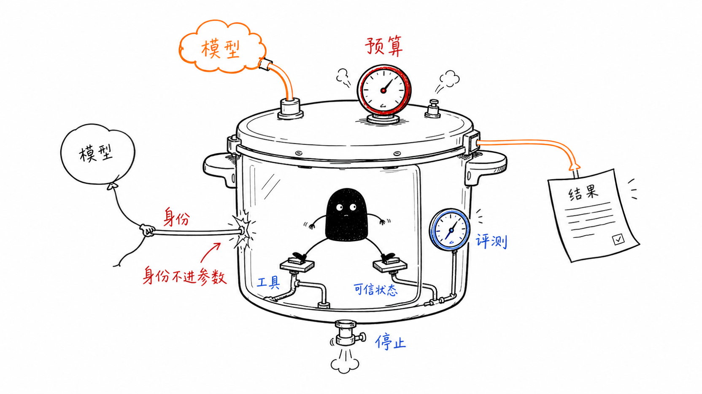
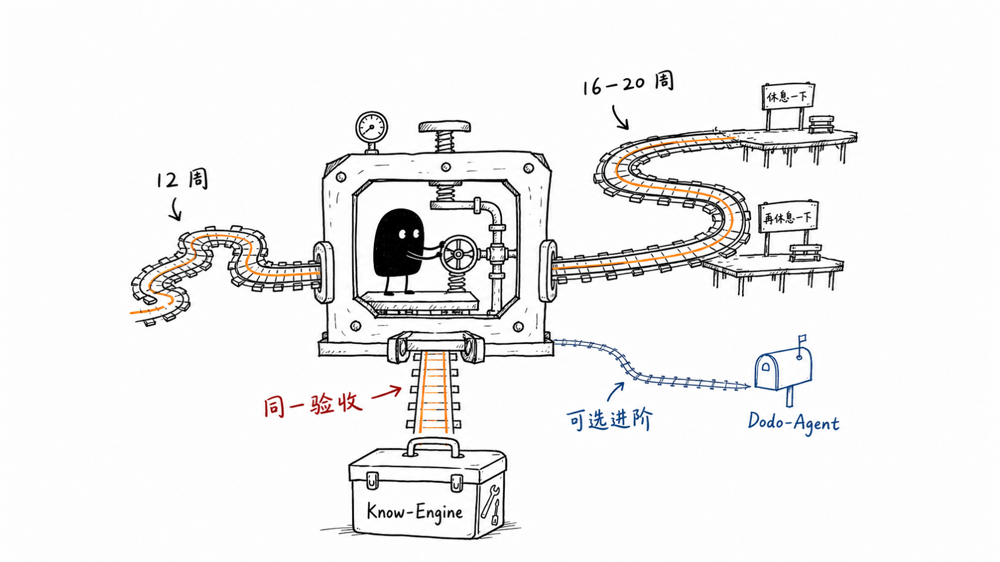

# AI Agent 工程课程

一门面向后端、全栈与 AI 应用工程师的项目制课程：从模型调用出发，逐步构建可评估、可观测、可恢复、可部署的企业级 Agent 系统。课程不把框架演示当作终点，而是要求你用明确的身份、工具、状态、预算与评估边界交付可复现的工程证据。

**主线使用 Python，Go 是可选扩展。** Python 负责模型、Agent、RAG、Workflow 与评估；Go 适合在边界稳定后承接 MCP Server、工具服务、网关或 worker。完整取舍见 [Python / Go 可行性说明](docs/python-go-feasibility.md)。



## 你将交付什么

- **Know-Engine Core（必修）**：带权限过滤、引用、拒答、受控工具、持久化 Workflow、MCP 与离线评估的企业知识系统。
- **Dodo-Agent（可选进阶）**：在 Core 验收完成后，用职责明确的 specialist 验证多 Agent 是否带来可测收益。
- **工程证据**：可重复命令、自动化检查、失败注入、脱敏 trace、权限矩阵、架构与威胁模型，而不只是演示截图。

详细的章节、实验、检查和作品证据对应关系见 [课程成果地图](docs/course-map.md)。

## 快速开始

默认路径使用确定性 **Fake Model**，不需要 API key，也不会发起模型网络请求：

```bash
cd reference-implementation
uv sync --group dev --extra live
uv run --group dev --extra live pytest -q
```

`live` extra 只安装可选适配器，以便默认测试验证它们在未配置时保持关闭；课程 Core 仍是离线 Fake。运行方式、固定 fixtures 与架构边界见 [参考实现说明](reference-implementation/README.md)。

### 可选 Live 模式

Live 会产生费用，不能替代 Core 验收。先确认账户限额，再同时提供显式开关、非空 key 和显式模型名；缺少任一项都必须在请求前失败：

```bash
cd reference-implementation
export AGENT_COURSE_LIVE_TESTS=1
export OPENAI_API_KEY="your-key"
export OPENAI_MODEL="your-explicit-model"
uv run --group dev --extra live pytest tests/test_live_gates.py -q \
  -k successful_live_gate_construction
```

这条检查只验证 Live adapter 的显式配置与本地构造，不发送模型请求。真实调用应按 [参考实现的 Live 说明](reference-implementation/README.md#optional-paid-live-runs) 单独执行、记录成本上限，并避免保存密钥或原始敏感内容。

## 选择路线

两条教学节奏共享 A0-A12 验收，不因延长学习时间而降低标准：

- [12 周教师带领路线](teaching/12-week-syllabus.md)：完成课程准备、Core 章节与 Know-Engine；第 11、12、15 章不占用必修时间。
- [16-20 周自学路线](teaching/16-20-week-self-study.md)：加入恢复周、复盘和可选实验，仍以同一套 Core 验收收束。



### Core 与 Advanced

| 路线 | 章节 | 完成定义 |
| --- | --- | --- |
| Core | 课程准备、1-10、13-14 | A0-A12 通过，Know-Engine M1-M7 可从干净环境重放 |
| Optional Advanced | 11、12、15 | Core 完成后提交独立 baseline、收益、风险与 fallback；不能补偿 Core 失败 |

## 章节导航

| 单元 | 章节 | 路线 |
| --- | --- | --- |
| 准备 | [环境、运行模式与教学项目](chapters/00-course-setup.md) | Prerequisite |
| 1 | [AI Agent 全景与学习路线](chapters/01-ai-agent-overview.md) | Core |
| 2 | [大模型应用基础](chapters/02-llm-application-basics.md) | Core |
| 3 | [Prompt Engineering 与 Context Engineering](chapters/03-prompt-and-context-engineering.md) | Core |
| 4 | [Python AI 应用工程栈](chapters/04-python-ai-application-stack.md) | Core |
| 5 | [Tool Calling / Function Calling](chapters/05-tool-calling.md) | Core |
| 6 | [单 Agent Runtime：执行循环、工具、记忆与 Trace](chapters/06-agent-runtime.md) | Core |
| 7 | [RAG 核心：从文档到可信答案](chapters/07-rag-core.md) | Core |
| 8 | [Workflow 与持久化执行](chapters/08-workflow-durable-execution.md) | Core |
| 9 | [Agent 评估、可观测性与安全](chapters/09-agent-evaluation-observability-security.md) | Core |
| 10 | [MCP 集成与信任治理](chapters/10-mcp-integration.md) | Core |
| 11 | [高级 RAG 与受治理的数据路由](chapters/11-advanced-rag-and-data-routing.md) | Advanced |
| 12 | [多 Agent 设计与互操作](chapters/12-agent-interoperability.md) | Advanced |
| 13 | [产品体验、企业集成与生产治理](chapters/13-product-experience-and-production.md) | Core |
| 14 | [Know-Engine 毕业项目](chapters/14-know-engine-capstone.md) | Core |
| 15 | [Dodo-Agent 进阶项目](chapters/15-dodo-agent-capstone.md) | Advanced |

章节清单的机器可读版本在 [course manifest](docs/course-manifest.json)。

## 学习与验收入口

| 需要 | 入口 |
| --- | --- |
| 教师授课 | [Instructor guide](teaching/instructor-guide.md)、[12 周 syllabus](teaching/12-week-syllabus.md) |
| 自学与恢复 | [16-20 周路线](teaching/16-20-week-self-study.md) |
| 实验 | [Labs 索引](labs/README.md) |
| 参考代码 | [Reference implementation](reference-implementation/README.md) |
| 评估数据与 runner | [`evals/`](evals/) |
| 评分与讲解 | [Assessment rubrics](teaching/assessment-rubrics.md)、[Answer key](teaching/answer-key.md) |
| 课程成果地图 | [Course map](docs/course-map.md) |
| Python / Go 决策 | [Feasibility](docs/python-go-feasibility.md) |
| 生态选择与状态 | [Ecosystem maturity](docs/ecosystem-maturity.md) |

## 维护

最后验证：**2026-07-11**。

升级依赖或修改课程承诺时，运行 `python3 scripts/validate_course.py`、根 validator 测试、参考实现完整离线 suite 与 Ruff；新增路径或命令必须先在仓库中存在并可执行。生态状态是有日期的维护记录，不是兼容性保证；采用框架或协议前重新核对 [成熟度矩阵](docs/ecosystem-maturity.md) 的具体 artifact 与主来源。
