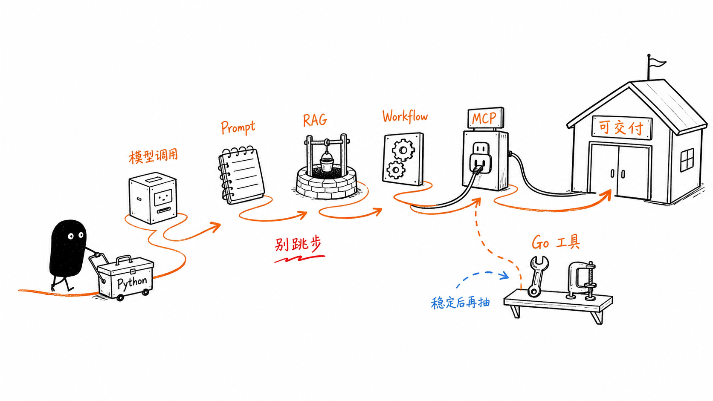

# AI Agent 学习大纲与课程设计

更新时间：2026-07-09
适用对象：想系统学习企业级 AI Agent、RAG、MCP 与多智能体应用开发，并希望快速落地项目的后端/全栈工程师。

## 课程定位

本课程从原来的 Java / Spring Boot 主线调整为 **Python 主线，Go 可选扩展**。

调整原因很简单：AI Agent、RAG、Prompt/Context Engineering、评估、MCP 和多智能体编排仍在快速演进，Python 生态的官方 SDK、示例、社区组件和实验速度更适合学习与原型验证。Go 仍然很有价值，但更适合承担稳定、高并发、边界清晰的工程服务，例如 MCP Server、工具服务、API 网关、异步任务 worker 和企业系统集成。

课程主线不追逐某个框架名，而是围绕一个能力路径展开：

> 从“能调用大模型”到“能构建可评估、可观测、可部署的企业级 AI Agent 系统”。

最终建议沉淀两个作品，但实施优先级不同：

1. **Know-Engine：企业级知识库问答系统**，作为 12 周主项目。
2. **Dodo-Agent：企业级端到端通用智能体平台**，作为进阶 MVP 和后续扩展方向。



## 技术路线结论

| 选择 | 结论 | 原因 |
| --- | --- | --- |
| Python 作为主线 | 推荐 | OpenAI Agents SDK、Pydantic AI、LangGraph、LlamaIndex、Haystack、FastAPI、MCP Python SDK 等生态更完整，适合学习、实验和快速交付 |
| Go 作为主线 | 暂不推荐 | Go SDK 可以稳定调用模型，也有 MCP Go SDK 和 Genkit 等工具，但 Agent 编排、RAG 教学资料、评估工具和示例丰富度不如 Python |
| Python + Go 混合 | 推荐进阶路线 | Python 负责 Agent/RAG/Workflow 编排，Go 负责企业工具服务、MCP Server、网关、后台任务和高并发接口 |

本课程默认使用 Python 完成核心学习任务；每个关键阶段会标注 Go 的可选落地点。

详细论证见：[Python / Go 技术路线可行性说明](docs/python-go-feasibility.md)。

## 2026 生态更新判断

截至 2026-07-09，Agent 生态已经从“单框架能力比拼”进入“运行时、工具协议、评估与互操作”并重的阶段。本资料需要吸收这些变化，但不改变课程主线：

- **OpenAI 方向**：Responses API、Agents SDK、内置工具、remote MCP、Background mode 和 Apps SDK 已经成为 OpenAI Agent 应用的重要组合。
- **MCP 方向**：MCP 当前稳定规范应以 `2025-11-25` 为准，学习时要同时关注 Inspector、Authorization、Streamable HTTP、MCP Apps 和可信 Server 管理。
- **MCP 观察项**：`2026-07-28` MCP Specification Release Candidate 已经发布为候选方向，但截至本资料更新日不作为课程稳定基线。
- **框架方向**：Pydantic AI、LangGraph 仍适合 Python 主线；Google ADK、Microsoft Agent Framework、Claude Agent SDK 更适合作为进阶对比和企业生态视野。
- **互操作方向**：MCP 解决工具和上下文接入，A2A 解决 Agent 间协作，Apps SDK / MCP Apps 解决交互式结果展示。它们是扩展层，不应抢走前 8 周的基础训练。
- **评估方向**：RAGAS、DeepEval 之外，应补充 Pydantic Evals、Logfire、OpenTelemetry 和 trace 回放，让学习者从第一版就建立可验证意识。

## 学习目标

学完后应具备以下能力：

- 理解 AI Agent、RAG、Workflow、MCP、多 Agent 的边界与适用场景。
- 使用 Python、FastAPI、OpenAI SDK / Agents SDK 构建大模型应用。
- 使用 Pydantic 定义结构化输出、工具参数、业务 DTO 和校验边界。
- 实现文档解析、切片、向量化、混合检索、重排、引用溯源等 RAG 核心能力。
- 设计可控的 Tool Calling / Function Calling 机制，让模型安全调用业务能力。
- 使用 MCP 将企业内部工具、知识库、数据库和外部 API 标准化接入 Agent。
- 设计单 Agent、多 Agent、Plan-Execute、ReAct、State Machine 等执行模式。
- 建立评估、日志、追踪、权限、成本控制、异常恢复等生产级工程能力。

## 技术栈建议

| 层级 | 推荐技术 |
| --- | --- |
| 主语言与 Web 框架 | Python 3.12+、FastAPI、Uvicorn、Pydantic |
| 模型接入 | OpenAI Responses API / SDK、兼容 OpenAI 协议的模型服务、本地模型服务 |
| Agent 编排 | OpenAI Agents SDK、Pydantic AI、LangGraph；进阶比较 Google ADK、Microsoft Agent Framework、Claude Agent SDK |
| RAG 框架 | 优先先自研最小链路；进阶比较 LlamaIndex、LangChain、Haystack |
| Agent 协议 | MCP，重点学习 stdio 与 Streamable HTTP；A2A 作为多 Agent 互操作扩展；旧 HTTP+SSE 作为兼容知识 |
| MCP 实现 | MCP Python SDK；Go 扩展使用 MCP Go SDK |
| 检索与存储 | PostgreSQL + pgvector、Elasticsearch / OpenSearch、Neo4j、SQLite、MySQL |
| 文件与对象存储 | MinIO 或 S3 兼容存储 |
| 缓存与并发控制 | Redis、RQ / Celery / Dramatiq，或 Go worker |
| 文档处理 | pypdf、python-docx、openpyxl、pandas、BeautifulSoup、unstructured |
| 任务与调度 | APScheduler、Celery Beat、Temporal；Go 可选 Asynq / cron |
| 观测与评估 | OpenTelemetry、structlog、pytest、RAGAS / DeepEval、Pydantic Evals / Logfire、Agent trace |
| 交互体验 | SSE / WebSocket 流式输出、任务进度、会话管理、引用来源展示；进阶学习 Apps SDK / MCP Apps |
| Go 扩展位置 | MCP Server、工具微服务、API 网关、批处理 worker、企业系统适配器 |

## 课程结构总览

| 阶段 | 章节 | 核心产出 |
| --- | --- | --- |
| 课程准备 | 前置单元 | 配置环境、理解 Fake / Live 模式、运行默认验证 |
| 基础篇 | 1-4 章 | 会调用模型、写 Prompt、做结构化输出、搭建 Python AI 服务骨架 |
| 工具与 Agent 篇 | 5-6 章 | 完成可信工具调用和受控单 Agent Runtime |
| RAG 与 Workflow 篇 | 7-8 章 | 完成核心 RAG 和持久化 Workflow |
| 评估与协议篇 | 9-10 章 | 建立评估、安全、可观测性和 MCP 接入 |
| 进阶与生产篇 | 11-13 章 | 完成高级 RAG、多 Agent 互操作与生产治理 |
| 实战篇 | 14-15 章 | 优先完整交付 Know-Engine，进阶完成 Dodo-Agent MVP |

课程开始前先完成：[课程准备：环境、运行模式与教学项目](chapters/00-course-setup.md)

## 第 1 章：AI Agent 全景与学习路线

详细学习文档：[第 1 章：AI Agent 全景与学习路线](chapters/01-ai-agent-overview.md)

### 学习目标

- 区分 Chatbot、RAG 应用、Workflow、Agent、多 Agent。
- 理解 Know-Engine 与 Dodo-Agent 分别解决什么问题。
- 建立“先稳定工作流，再引入 Agent 自主性”的工程判断。
- 明确 Python 主线与 Go 扩展的技术边界。

### 实战任务

- 画出自己要做的 Agent 系统架构图。
- 列出 3 个适合用 RAG 的场景，3 个适合用 Agent 的场景，3 个更适合固定 Workflow 的场景。
- 写一张技术路线选择卡：哪些模块用 Python，哪些模块未来可以用 Go。

## 第 2 章：大模型应用基础

详细学习文档：[第 2 章：大模型应用基础](chapters/02-llm-application-basics.md)

### 学习目标

- 掌握模型调用、消息格式、结构化输出、流式响应。
- 理解 token、上下文窗口、温度、采样、输出约束对结果的影响。
- 使用 FastAPI + OpenAI SDK 实现最小可用 AI 服务。

### 实战任务

- 实现一个 FastAPI 接口：输入问题，返回模型回答。
- 增加结构化输出：让模型返回 `answer`、`confidence`、`citations`。
- 增加 SSE 流式响应。
- 为每次调用记录请求 ID、模型、token、耗时、错误信息。

## 第 3 章：Prompt Engineering 与 Context Engineering

详细学习文档：[第 3 章：Prompt Engineering 与 Context Engineering](chapters/03-prompt-and-context-engineering.md)

### 学习目标

- 从“写提示词”升级到“管理上下文”。
- 学会为企业应用设计稳定、可复用、可测试的提示词模板。
- 使用 Markdown / YAML 管理 prompt 版本，使用 pytest 做提示词回归测试。

### 实战任务

- 为企业知识库问答设计系统提示词。
- 为数据分析 Agent 设计结构化输出模板。
- 建立提示词变更记录表和最小测试集。

## 第 4 章：Python AI 应用工程栈

详细学习文档：[第 4 章：Python AI 应用工程栈](chapters/04-python-ai-application-stack.md)

### 学习目标

- 掌握 Python 生态下构建 AI 应用的常见路线。
- 理解 OpenAI SDK、OpenAI Agents SDK、Pydantic AI、LangGraph、LlamaIndex 的定位差异。
- 了解 Google ADK、Microsoft Agent Framework、Claude Agent SDK 这类进阶框架为什么不是前期主线。
- 能根据项目阶段选择“少框架自研”还是“引入编排框架”。

### 实战任务

- 用 OpenAI SDK 实现一个问答接口。
- 用 OpenAI Agents SDK 实现同样的概念解释 Agent。
- 用 Pydantic 定义输入、输出和工具参数。
- 写一份框架取舍报告。

## 第 5 章：Tool Calling / Function Calling

详细学习文档：[第 5 章：Tool Calling / Function Calling](chapters/05-tool-calling.md)

### 学习目标

- 让模型能够安全调用业务函数、外部 API、数据库查询能力。
- 理解工具定义、参数校验、权限控制和调用回放。
- 使用 Python function tool 与 Pydantic schema 管理工具边界。
- 了解 remote MCP、内置工具、tool search 等工具生态演进方向。

### 实战任务

- 实现 3 个工具：天气查询、订单查询、知识库搜索。
- 给工具增加参数校验和用户权限校验。
- 记录一次完整工具调用轨迹。
- 可选：用 Go 实现一个只读订单查询 MCP Server，让 Python Agent 调用。

## 第 6 章：单 Agent Runtime：执行循环、工具、记忆与 Trace

详细学习文档：[第 6 章：单 Agent Runtime：执行循环、工具、记忆与 Trace](chapters/06-agent-runtime.md)

### 学习目标

- 从一次性问答升级到能够“思考、调用工具、观察结果、继续行动”的 Agent。
- 理解 Agent 的不稳定性，并学会用限制条件控制它。
- 记录 Agent run、step、工具调用和最终状态。

### 推荐实现

- 先用 OpenAI Agents SDK 实现单 Agent。
- 限制最大工具调用次数、最大运行时长、最大 token。
- 工具失败时返回结构化错误，让 Agent 决定追问、重试或失败退出。

### 实战任务

- 实现一个可以查询知识库和天气的 ReAct Agent。
- 增加最多 5 轮工具调用限制。
- 实现工具调用失败后的重试与兜底回答。

## 第 7 章：RAG 核心：从文档到可信答案

详细学习文档：[第 7 章：RAG 核心：从文档到可信答案](chapters/07-rag-core.md)

### 学习目标

- 搭建企业知识库问答系统的最小可用版本。
- 理解 RAG 的关键链路：加载、解析、切片、向量化、检索、生成、引用。

### 推荐实现

- FastAPI 提供文档上传与问答接口。
- `pypdf`、`python-docx`、`openpyxl` 解析多格式文件。
- PostgreSQL + pgvector 存储向量和文档元数据。
- 先自研 `Loader -> Chunker -> Embedder -> Retriever -> Generator`，再比较 LlamaIndex / LangChain。

### 实战任务

- 上传企业制度文档，完成自动解析和入库。
- 实现“问题 -> 检索 -> 生成答案 -> 返回引用来源”。
- 加入文档列表、文档删除、重新索引能力。

## 第 8 章：Workflow 与持久化执行

详细学习文档：[第 8 章：Workflow 与持久化执行](chapters/08-workflow-durable-execution.md)

### 学习目标

- 学会把不稳定的 Agent 任务拆成更稳定的工作流。
- 选择何时使用 Workflow，何时使用 Agent。
- 掌握状态持久化、人工确认、幂等和失败恢复。

### 推荐实现

- 简单流程先用 Python 函数组合。
- 复杂状态用 LangGraph、Temporal 或数据库状态机。
- 高风险步骤必须加入人工确认和可恢复状态。

### 实战任务

- 实现一个“市场情报分析”工作流。
- 实现一个“研究主题 -> 报告大纲 -> 资料检索 -> 报告生成”的流程。
- 给每一步记录状态和耗时。

## 第 9 章：Agent 评估、可观测性与安全

详细学习文档：[第 9 章：Agent 评估、可观测性与安全](chapters/09-agent-evaluation-observability-security.md)

### 学习目标

- 建立 Agent 数据集、确定性断言、trace 指标和人工校准方法。
- 覆盖工具、参数、轨迹、权限、延迟、成本和安全红队场景。

### 实战任务

- 为 Know-Engine 建立离线评估集和统一回归报告。
- 把提示词注入、越权、循环和预算耗尽加入安全测试。

## 第 10 章：MCP 集成与信任治理

详细学习文档：[第 10 章：MCP 集成与信任治理](chapters/10-mcp-integration.md)

### 学习目标

- 理解 MCP 的作用：把外部工具和数据源标准化提供给模型应用。
- 掌握 MCP Server 与 MCP Client 的基本实现。
- 明确 MCP 的安全边界、可信 Server 列表和 Go 扩展时机。

### 推荐实现

- 用 MCP Python SDK 实现第一个 stdio MCP Server。
- 用 MCP Inspector 调试工具列表和调用结果。
- 使用 MCP Authorization 思路区分协议授权、业务权限和工具风险控制。
- 可选用 Go 实现高性能 MCP Server，暴露订单查询、库存查询、权限查询等只读工具。

### 实战任务

- 实现一个 MCP Server：暴露订单查询、知识库检索两个工具。
- 实现一个 MCP Client：从 Python Agent 应用调用 MCP 工具。
- 使用 MCP Inspector 调试工具列表和调用结果。

## 第 11 章：高级 RAG 与受治理的数据路由

详细学习文档：[第 11 章：高级 RAG 与受治理的数据路由](chapters/11-advanced-rag-and-data-routing.md)

### 学习目标

- 解决核心 RAG 的常见问题：召回差、答案虚、表格难查、多数据源难融合。
- 设计企业级知识检索增强链路。
- 建立可重复运行的 RAG 评估集和回归报告。

### 推荐实现

- 使用查询改写提升召回。
- 使用 pgvector + Elasticsearch / OpenSearch 做混合检索。
- 使用 rerank 模型或 cross-encoder 做重排。
- 对结构化数据使用 Text2SQL，但 SQL 权限与审计必须由后端控制。
- 对关系数据使用 Neo4j / Cypher，但先做固定模板，再考虑模型生成查询。

### 实战任务

- 为知识库增加全文检索。
- 为销售数据增加受控 Text2SQL 查询。
- 为组织/产品关系增加图谱查询。
- 实现检索路由：让系统判断该查文档、数据库还是图谱。
- 输出评估报告，对比每次检索策略调整的效果。

## 第 12 章：多 Agent 设计与互操作

详细学习文档：[第 12 章：多 Agent 设计与互操作](chapters/12-agent-interoperability.md)


### 学习目标

- 设计一个可扩展的多智能体平台，而不是把所有能力塞进一个 Agent。
- 掌握 BaseAgent、Agent Registry、任务路由、Agent 协作。
- 理解 MCP、A2A、Apps SDK / MCP Apps 各自解决哪一层问题。
- 能比较 OpenAI Agents SDK、Pydantic AI、LangGraph、Google ADK、Microsoft Agent Framework 的适用边界。

### 推荐实现

- 使用 OpenAI Agents SDK 的 handoff 或自定义 registry 实现 Agent 路由。
- 每个 Agent 只负责一个清晰能力：知识库问答、Web 搜索、报告生成、文件分析。
- Agent 之间传递结构化结果，而不是整段自由文本。
- 可选：调研 A2A 作为跨 Agent 协作协议，但不在 12 周主线里强制实现。

### 实战任务

- 实现 `BaseAgent` 抽象。
- 实现 3 个 Agent：知识库问答、Web 搜索、报告生成。
- 实现简单任务路由：根据用户意图选择 Agent。

## 第 13 章：产品体验、企业集成与生产治理

详细学习文档：[第 13 章：产品体验、企业集成与生产治理](chapters/13-product-experience-and-production.md)

### 产品体验与企业集成

#### 学习目标

- 让 AI 应用从“能跑”变成“可用、可感知、可协作”。
- 实现流式输出、进度感知、富媒体卡片和企业 IM 集成。

#### 推荐实现

- FastAPI 使用 SSE 或 WebSocket 输出模型 token、工具状态、任务进度。
- 前端展示引用、工具调用轨迹、失败原因和可重试入口。
- 企业 IM 入口只做鉴权、消息适配和任务提交，不承载复杂 Agent 逻辑。
- 进阶：使用 Apps SDK / MCP Apps 思路，把结构化工具结果渲染成可交互组件。

#### 实战任务

- 为 Know-Engine 增加流式输出和进度条。
- 为 Agent 工具调用增加前端可视化轨迹。
- 接入一个企业 IM 机器人，实现问答入口。

### 生产治理

#### 学习目标

- 掌握 AI Agent 上生产所需的安全、稳定、可观测、可评估能力。
- 避免“Demo 很惊艳，线上不可控”的常见问题。

#### 推荐实现

- 用 PostgreSQL 记录 conversation、agent_run、tool_call、retrieval_hit、evaluation_case。
- 用 pytest 固化 RAG 与 tool calling 回归测试。
- 用 OpenTelemetry / structlog 追踪请求链路。
- 用限流、超时、幂等 key、人工确认保护高风险工具。

#### 实战任务

- 建立 Agent Run 日志表。
- 为每次回答保存检索结果和引用来源。
- 实现用户级知识库权限过滤。
- 增加 RAG 回归测试集。

## 第 14 章：Know-Engine 毕业项目

详细学习文档：[第 14 章：Know-Engine 毕业项目](chapters/14-know-engine-capstone.md)

### 项目目标

构建一个基于 RAG 的企业级知识库问答系统，支持多格式文档接入、智能切片、混合检索、多源路由、流式问答和引用溯源。

### 核心功能

- 文档上传：PDF、Word、Excel、CSV、Markdown、HTML。
- 文档解析：文本、表格、标题层级、元数据。
- 智能切片：固定切片、父子切片、表格保留。
- 知识存储：对象存储 + 元数据表 + 向量库。
- 检索增强：查询改写、向量检索、全文检索、Rerank。
- 多源路由：文档、SQL、图谱、外部 API。
- 问答体验：SSE 流式输出、进度展示、引用来源。
- 管理能力：文档版本、重新索引、删除、权限。

### 建议里程碑

| 里程碑 | 内容 | 验收标准 |
| --- | --- | --- |
| M1 | 文档上传与解析 | 能上传 PDF/Word/Excel/CSV 并抽取文本 |
| M2 | 基础 RAG | 能基于文档回答问题并返回引用 |
| M3 | 混合检索 | 支持向量 + 全文检索 |
| M4 | 多源路由 | 能选择查文档、SQL 或图谱 |
| M5 | 企业化 | 权限、日志、评估、流式进度完整 |

## 第 15 章：Dodo-Agent 进阶项目

详细学习文档：[第 15 章：Dodo-Agent 进阶项目](chapters/15-dodo-agent-capstone.md)

### 项目目标

构建一个企业级端到端通用智能体平台，支持多个 Agent 协作完成问答、文件分析、深度研究、报告生成和 PPT 生成。

### 核心功能

- BaseAgent 抽象：统一输入输出、工具、上下文、日志。
- 智能问答 Agent：WebSearch + ReAct。
- 文件问答 Agent：File RAG + ReAct。
- 深度研究 Agent：Plan-Execute + 多轮搜索与总结。
- PPT 生成 Agent：大纲、页面规划、内容生成、文件导出。
- Agent Registry：注册、发现、路由、版本管理。
- MCP 工具接入：通过 MCP Server 调用企业工具。
- 会话与文件管理：会话历史、上传文件、任务记录。
- 可观测性：展示 Agent 步骤、工具调用和失败原因。

### 建议里程碑

| 里程碑 | 内容 | 验收标准 |
| --- | --- | --- |
| M1 | BaseAgent 与工具系统 | 所有 Agent 使用统一执行接口 |
| M2 | 单 Agent 能力 | 完成问答、文件问答、研究 Agent |
| M3 | Workflow 编排 | 深度研究任务可分阶段执行 |
| M4 | MCP 接入 | 至少 2 个企业工具通过 MCP 调用 |
| M5 | 多 Agent 平台 | 用户输入任务后能自动路由和协作 |

## 项目实施优先级

12 周内建议把 **Know-Engine 作为主项目完整交付**，把 **Dodo-Agent 作为进阶 MVP**。这样更符合学习和工程落地节奏。

| 优先级 | 项目 | 12 周目标 | 不建议在 12 周内承诺 |
| --- | --- | --- | --- |
| P0 | Know-Engine | 完成企业知识库问答 MVP，并具备混合检索、引用、权限、评估、流式输出 | 覆盖所有复杂文档格式、完整企业权限平台 |
| P1 | Dodo-Agent | 完成单 Agent + Workflow + MCP 的可演示平台雏形 | 完整多 Agent 平台、PPT 生成、复杂企业 IM 全量集成 |
| P2 | Go 扩展 | 实现 1 个只读 MCP Server 或工具微服务 | 大规模 Go 化所有工具和网关 |

每个项目都按三层验收推进：

| 层级 | 含义 | 验收方式 |
| --- | --- | --- |
| MVP | 功能链路跑通 | 能演示核心流程，有基础日志 |
| 进阶 | 效果和稳定性提升 | 有评估集、失败处理、权限过滤 |
| 生产化 | 接近真实企业部署 | 有审计、观测、限流、回放、CI 回归 |

## 12 周学习安排

| 周次 | 学习主题 | 产出 |
| --- | --- | --- |
| 第 1 周 | AI Agent 全景、大模型调用、Prompt | 一个 FastAPI 基础问答 API |
| 第 2 周 | Python AI 工程栈、结构化输出、流式响应 | 一个 Python AI 服务骨架 |
| 第 3 周 | Tool Calling、工具权限、调用日志 | 3 个可调用业务工具 |
| 第 4 周 | RAG 基础、文档解析、切片、向量库 | 知识库问答 MVP |
| 第 5 周 | 高级 RAG、混合检索、Rerank | 检索增强版本 |
| 第 6 周 | 多源路由、Text2SQL、Text2Cypher | 文档 + SQL + 图谱问答 |
| 第 7 周 | ReAct Agent、记忆、失败恢复 | 单 Agent 执行循环 |
| 第 8 周 | Workflow、Plan-Execute、报告生成 | 深度研究工作流 |
| 第 9 周 | MCP Server / Client | 企业工具 MCP 化 |
| 第 10 周 | 多 Agent 架构与互操作 | BaseAgent + 任务路由雏形，完成 MCP / A2A / Apps 的边界说明 |
| 第 11 周 | 企业级工程化 | 权限、日志、评估、追踪 |
| 第 12 周 | 项目整合与答辩 | Know-Engine 完整演示 + Dodo-Agent MVP 演示 |

## Go 扩展学习安排

Go 不作为前 12 周主线，但可以在以下节点接入：

| 阶段 | Go 适合承担 | 原因 |
| --- | --- | --- |
| 第 5 周后 | 只读工具服务 | 工具边界清晰，适合稳定部署 |
| 第 9 周 | MCP Server | MCP Go SDK 可用于企业系统适配 |
| 第 11 周 | 高并发 API / Worker | Go 在并发、部署和资源占用上有优势 |
| 项目实战 | 网关、权限服务、审计服务 | 业务边界稳定，适合和 Python Agent 解耦 |

建议先完整走通 Python MVP，再把最稳定、最清晰的模块抽到 Go。不要在学习早期同时维护两套 Agent 编排逻辑。

## 学习资料总清单

### 官方文档

- [OpenAI API Documentation](https://developers.openai.com/api/docs)
- [OpenAI Responses API - Tools](https://developers.openai.com/api/docs/guides/tools)
- [OpenAI Responses API - Remote MCP](https://developers.openai.com/api/docs/guides/tools-connectors-mcp)
- [OpenAI Background Mode](https://developers.openai.com/api/docs/guides/background)
- [OpenAI Agents SDK Documentation](https://openai.github.io/openai-agents-python/)
- [OpenAI Apps SDK](https://developers.openai.com/apps-sdk)
- [OpenAI SDKs](https://developers.openai.com/api/docs/libraries)
- [Pydantic AI Documentation](https://ai.pydantic.dev/)
- [Pydantic AI Durable Execution](https://pydantic.dev/docs/ai/integrations/durable_execution/overview/)
- [Pydantic Evals](https://pydantic.dev/docs/ai/evals/evals/)
- [LangGraph Documentation](https://docs.langchain.com/oss/python/langgraph/overview)
- [FastAPI Documentation](https://fastapi.tiangolo.com/)
- [Model Context Protocol Documentation](https://modelcontextprotocol.io/docs/getting-started/intro)
- [MCP Specification 2025-11-25](https://modelcontextprotocol.io/specification/2025-11-25)
- [MCP Specification 2026-07-28 Release Candidate](https://blog.modelcontextprotocol.io/posts/2026-07-28-release-candidate/)
- [MCP SDKs](https://modelcontextprotocol.io/docs/sdk)
- [MCP Authorization](https://modelcontextprotocol.io/docs/tutorials/security/authorization)
- [MCP Apps](https://blog.modelcontextprotocol.io/posts/2026-01-26-mcp-apps/)
- [Google Agent Development Kit](https://adk.dev/)
- [Google A2A Protocol](https://adk.dev/a2a/)
- [Microsoft Agent Framework](https://learn.microsoft.com/en-us/agent-framework/overview/)
- [Claude Agent SDK](https://code.claude.com/docs/en/agent-sdk/overview)
- [Temporal Documentation](https://docs.temporal.io/)

### RAG 与检索组件

- [LlamaIndex Documentation](https://docs.llamaindex.ai/)
- [LlamaIndex Evaluating](https://developers.llamaindex.ai/python/framework/module_guides/evaluating/)
- [Haystack Documentation](https://docs.haystack.deepset.ai/)
- [RAGAS](https://docs.ragas.io/)
- [DeepEval](https://docs.confident-ai.com/)
- [pgvector](https://github.com/pgvector/pgvector)
- [Elasticsearch kNN Search](https://www.elastic.co/guide/en/elasticsearch/reference/current/knn-search.html)
- [Neo4j Vector Indexes](https://neo4j.com/docs/cypher-manual/current/indexes/semantic-indexes/vector-indexes/)
- [MinIO Documentation Repository](https://github.com/minio/docs)

### 论文与工程文章

- [Retrieval-Augmented Generation for Knowledge-Intensive NLP Tasks](https://arxiv.org/abs/2005.11401)
- [ReAct: Synergizing Reasoning and Acting in Language Models](https://arxiv.org/abs/2210.03629)
- [Anthropic - Building Effective Agents](https://www.anthropic.com/engineering/building-effective-agents)

## 课程设计重点

### 重点一：不要把 Agent 当万能解法

如果任务步骤明确、失败成本高、需要审计，优先用 Workflow。Agent 适合开放问题、工具选择不固定、需要多轮探索的任务。

### 重点二：RAG 是企业 AI 应用的地基

多数企业场景不是缺 Agent，而是缺可用数据链路。文档解析、切片、检索、权限、引用溯源，比“让 Agent 自主思考”更早决定系统质量。

### 重点三：MCP 是工具接入层，不是业务系统本身

MCP 的价值是标准化工具、资源和提示词的接入方式。企业真实权限、审计、限流、幂等、数据隔离仍然要在业务系统中实现。

### 重点四：必须从第一天建立评估意识

每一个 RAG / Agent 功能都要能回答：

- 检索到了哪些材料？
- 为什么选择这个工具？
- 工具参数是什么？
- 回答引用来自哪里？
- 失败时系统如何恢复？
- 本次调用花了多少 token 和时间？

## 建议作业与考核

| 类型 | 内容 | 权重 |
| --- | --- | --- |
| 基础作业 | 模型调用、Prompt、结构化输出、Tool Calling | 20% |
| RAG 作业 | 文档解析、切片、检索、引用溯源 | 25% |
| Agent 作业 | ReAct、Workflow、失败恢复、MCP 调用 | 25% |
| 工程化作业 | 权限、日志、评估、观测、成本控制 | 15% |
| 最终项目 | Know-Engine 或 Dodo-Agent 完整演示 | 15% |

## 推荐学习顺序

建议按以下顺序推进：

```text
大模型调用
  -> Prompt / Context Engineering
  -> 结构化输出
  -> Tool Calling
  -> RAG 基础
  -> 高级 RAG
  -> 单 Agent
  -> Workflow
  -> MCP
  -> 多 Agent
  -> 企业级工程化
  -> 综合项目
```

不要一开始就做多 Agent。先把一个 Agent 做稳定，再把工具、数据、流程、权限、评估补齐，最后再拆成多 Agent 协作。

## 常见误区

- **误区 1：只学框架 API。** 正确做法是理解数据链路、工具边界、评估方法和生产约束。
- **误区 2：所有任务都交给 Agent。** 正确做法是高确定性流程用 Workflow，不确定探索才用 Agent。
- **误区 3：RAG 只做向量检索。** 企业场景通常需要全文检索、元数据过滤、权限过滤、重排和多源路由。
- **误区 4：MCP 等于 Agent。** MCP 是工具协议，Agent 是执行策略，两者可以结合但不是同一层。
- **误区 5：一开始就 Python 和 Go 双主线。** 正确做法是先用 Python 跑通 Agent/RAG，再把稳定边界抽到 Go。
- **误区 6：上线后再做观测。** AI 应用从第一版就要记录检索、工具、Prompt、token、耗时和失败原因。
- **误区 7：看到新协议就改主线。** MCP、A2A、Apps SDK 都很重要，但前提是你已经有稳定工具、清晰状态和可验证结果。

## 最终作品集建议

完成课程后，建议沉淀以下材料：

- 一份 Know-Engine 架构图。
- 一份 Dodo-Agent 架构图。
- 一套 RAG 测试集和评估报告。
- 一套 MCP Server 工具清单。
- 一套 Agent 运行轨迹示例。
- 一份 Agent 框架与协议选型说明。
- 一份 Python 主线与 Go 扩展的工程边界说明。
- 一份线上部署与安全说明。

这些材料比单纯代码更能体现你真正理解了企业级 AI Agent 的设计与落地。
