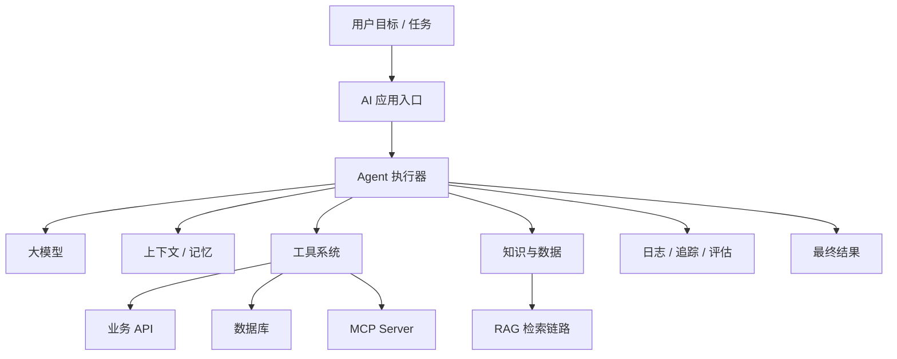
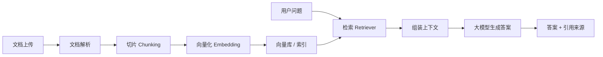
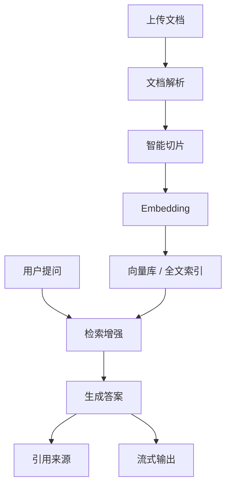
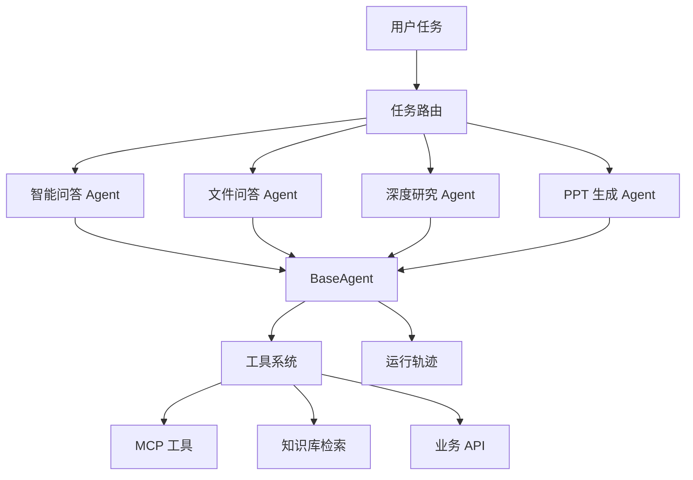
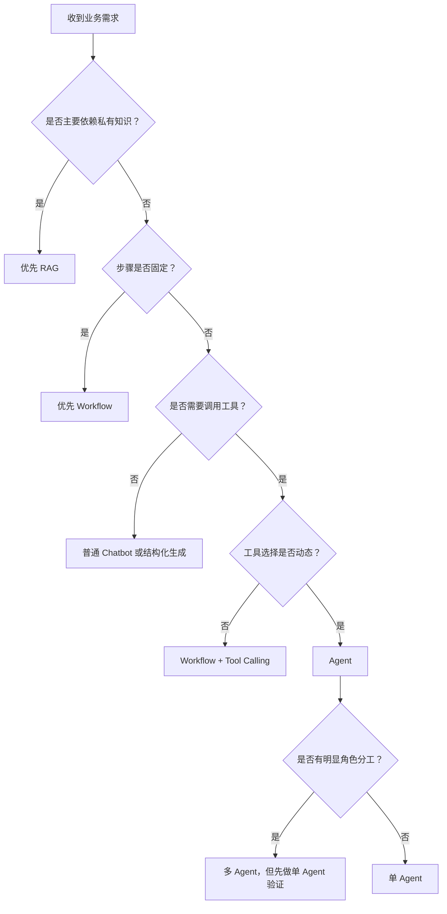
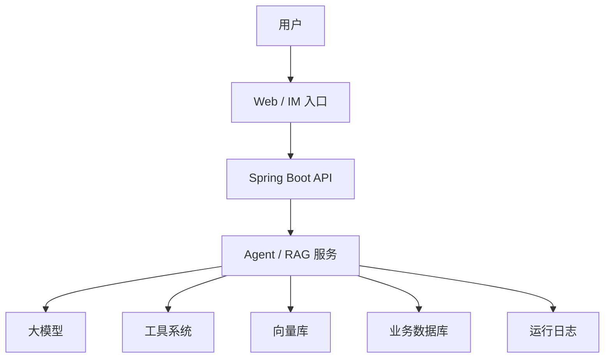

# 第 1 章：AI Agent 全景与学习路线

更新时间：2026-05-26  
建议学习时间：1-2 天  
适合阶段：开始学习 AI Agent 前的第一个完整学习单元  
本章产出：一份 Agent 概念笔记、一张系统架构图、一份场景分类表、一份 12 周个人学习计划

## 1.1 本章学习目标

学完本章后，你应该能够独立回答下面 8 个问题：

1. AI Agent 和普通聊天机器人有什么区别？
2. RAG 应用、Workflow、Agent、多 Agent 分别适合解决什么问题？
3. 一个 Agent 系统通常由哪些部分组成？
4. 为什么企业项目里不能一上来就追求“完全自主 Agent”？
5. MCP 在 Agent 系统里解决的是哪一层问题？
6. Know-Engine 和 Dodo-Agent 这两个课程项目分别对应什么能力？
7. 面对一个业务需求时，如何判断该用 RAG、Workflow 还是 Agent？
8. 接下来 12 周应该按什么顺序学习，才不容易变成只会调框架 API？

本章不要求你马上写代码，但要求你完成设计、判断和拆解练习。AI Agent 学习的第一个门槛不是框架，而是分清楚“问题类型”和“系统边界”。

## 1.2 学前准备

### 你需要具备的基础

- 会阅读 Java / Spring Boot 项目代码。
- 理解 HTTP API、数据库、缓存、消息队列、对象存储这些后端基础概念。
- 知道大模型可以根据 prompt 生成文本，但不要求已经熟悉模型 API。
- 能使用 Markdown 记录学习笔记。

### 本章建议创建的学习文件

可以在自己的学习目录中创建下面 4 个文件：

```text
notes/chapter-01-agent-concepts.md
notes/chapter-01-scenario-classification.md
notes/chapter-01-system-architecture.md
notes/chapter-01-12-week-plan.md
```

如果你后面要把学习过程放进仓库，也可以建立类似结构：

```text
learning-notes/
  chapter-01/
    agent-concepts.md
    scenario-classification.md
    system-architecture.md
    12-week-plan.md
```

## 1.3 先建立一张全景图

AI Agent 不是单个技术点，而是一类系统设计方式。它通常把大模型、工具、上下文、数据、记忆、执行循环、评估和权限组合在一起，让系统能够围绕一个目标持续完成任务。

可以先用下面这张图建立直觉：



这张图背后的核心思想是：

- 大模型负责理解、生成、推理和决策，但不应该直接拥有真实业务权限。
- 工具负责执行动作，例如查询订单、搜索知识库、读取文件、调用内部系统。
- RAG 负责把外部知识安全、可追溯地提供给模型。
- MCP 负责用标准协议把工具和资源暴露给模型应用。
- 评估和追踪负责让每一次模型回答、工具调用和失败原因可检查。

学习 Agent 时，不要只盯着“模型有多聪明”。真正的工程能力在于：你能否把模型限制在一个可控系统里，让它正确使用数据、工具和流程。

## 1.4 核心概念一：什么是 AI Agent

在工程语境里，可以把 AI Agent 理解为：

> 一个以大模型为核心决策组件，能够基于目标、上下文和工具，进行多步推理、行动、观察和调整的软件系统。

它不是单次问答，而是一个执行过程。

一个最小 Agent 通常包含 6 个部分：

| 组成 | 作用 | 例子 |
| --- | --- | --- |
| Instructions | 告诉 Agent 角色、目标、约束和输出格式 | 你是企业知识库助手，只能基于检索资料回答 |
| Model | 负责理解、推理、规划和生成 | GPT、Claude、DeepSeek、Qwen、Llama 等 |
| Tools | Agent 可以调用的外部能力 | 搜索知识库、查数据库、发起 HTTP 请求 |
| Context | 当前任务需要的上下文 | 用户问题、会话历史、用户权限、工具返回 |
| Memory | 可跨轮次或跨任务保存的信息 | 用户偏好、历史摘要、长期知识 |
| Run Loop | 多步执行循环 | 思考 -> 调工具 -> 观察结果 -> 决定下一步 |

### Agent 的典型执行过程

```text
用户提出目标
  -> Agent 理解目标
  -> 判断是否需要工具
  -> 如果需要，选择工具并生成参数
  -> 应用程序执行工具
  -> 工具结果返回给 Agent
  -> Agent 判断是否已经完成
  -> 如果未完成，继续下一轮
  -> 输出最终答案或执行结果
```

### 一个具体例子

用户说：

```text
帮我分析一下 Q1 销售数据，找出增长最快的产品，并生成一段汇报摘要。
```

普通聊天机器人可能直接猜一个答案。Agent 应该做的是：

1. 判断需要查询销售数据。
2. 调用 `query_sales_data` 工具。
3. 检查返回结果是否包含 Q1 和产品维度。
4. 如果缺少同比数据，再调用 `query_sales_growth` 工具。
5. 根据结果计算增长最快的产品。
6. 生成汇报摘要。
7. 返回数据来源和分析过程。

这就是 Agent 和普通问答的差别：Agent 不只是回答，它会围绕目标采取行动。

## 1.5 核心概念二：Chatbot、RAG、Workflow、Agent、多 Agent 的区别

初学者最容易混淆这几个概念。本章先给出一个实用判断表。

| 类型 | 主要能力 | 自主性 | 适合场景 | 典型风险 |
| --- | --- | --- | --- | --- |
| Chatbot | 对话与文本生成 | 低 | FAQ、陪聊、写作辅助 | 容易幻觉，不能可靠使用私有数据 |
| RAG 应用 | 基于外部知识回答 | 低到中 | 企业知识库、制度问答、文档问答 | 检索不到、引用不准、权限过滤缺失 |
| Workflow | 按固定步骤执行 | 中 | 审批、报告生成、数据分析流水线 | 灵活性较低，流程设计成本高 |
| Agent | 自主选择工具并多步完成任务 | 中到高 | 深度研究、开放式问题、复杂任务执行 | 不稳定、成本高、循环调用、权限风险 |
| 多 Agent | 多个 Agent 分工协作 | 高 | 研究、写作、审查、PPT 生成、复杂办公自动化 | 协作成本高，责任边界不清 |

### 判断原则

当你看到一个业务需求时，可以这样判断：

1. **只是通用聊天或写作**：优先 Chatbot。
2. **主要问题是“基于资料回答”**：优先 RAG。
3. **步骤明确、结果要求稳定、失败成本高**：优先 Workflow。
4. **任务开放、步骤不固定、需要模型判断下一步**：考虑 Agent。
5. **任务明显包含多个角色和专业分工**：考虑多 Agent，但要谨慎。

### 练习 1：给场景分类

把下面 10 个需求分别归类为 Chatbot、RAG、Workflow、Agent 或多 Agent，并写出理由。

| 场景 | 推荐类型 | 理由 |
| --- | --- | --- |
| 员工问“公司年假制度是什么？” |  |  |
| 用户上传合同，要求指出风险条款 |  |  |
| 每天早上自动生成销售日报 |  |  |
| 帮我调研 5 家竞品并输出对比报告 |  |  |
| 根据用户问题查询订单状态 |  |  |
| 自动生成一份 20 页融资路演 PPT |  |  |
| 回答产品说明书中的安装步骤 |  |  |
| 根据异常日志定位可能原因并建议修复步骤 |  |  |
| 审批一笔退款申请 |  |  |
| 对一个研究主题进行搜索、阅读、总结、复核 |  |  |

参考答案不是唯一的。重点是你能解释为什么。

## 1.6 核心概念三：RAG 是什么，解决什么问题

RAG 是 Retrieval-Augmented Generation，通常翻译为“检索增强生成”。它解决的是：大模型本身不知道、记不准、不能直接访问的外部知识，如何可靠地提供给模型。

企业里最常见的问题不是模型不会说话，而是模型没有你的企业数据。RAG 的目标就是把企业文档、知识库、制度、产品手册、报表等资料接入回答过程。

### RAG 的基本流程



### RAG 适合什么

- 企业制度问答。
- 产品手册问答。
- 研发文档问答。
- 法务/合同条款检索。
- 客服知识库。
- 内部培训资料问答。

### RAG 不适合什么

- 需要主动执行很多动作的复杂任务。
- 需要长期规划和动态调整的任务。
- 需要实时操作外部系统的任务。
- 单靠检索资料无法完成的业务审批或决策。

### RAG 的工程关键点

| 问题 | 为什么重要 |
| --- | --- |
| 文档解析 | PDF、Word、Excel、网页结构不同，解析质量直接影响答案 |
| 切片策略 | 切太碎会丢上下文，切太大检索不准 |
| 检索策略 | 只靠向量检索不一定够，企业场景常需要全文检索和元数据过滤 |
| 权限过滤 | 用户只能看到自己有权限的文档 |
| 引用溯源 | 企业应用必须知道答案来自哪里 |
| 评估 | 需要知道检索是否命中、答案是否忠实于资料 |

本课程的 Know-Engine 项目就是围绕 RAG 展开。

## 1.7 核心概念四：Workflow 是什么，为什么重要

Workflow 是工作流。它不是让模型自由发挥，而是把任务拆成明确步骤，每一步都有输入、输出和状态。

例如“生成销售日报”可以设计为：

```text
读取昨日销售数据
  -> 校验数据完整性
  -> 计算核心指标
  -> 生成趋势分析
  -> 生成风险提示
  -> 输出日报
  -> 发送给指定群组
```

这里模型可能只负责“生成趋势分析”和“写自然语言摘要”，但整个流程不是由模型随意决定的。

### Workflow 的优势

- 稳定，步骤清楚。
- 容易测试和回放。
- 容易做权限和审计。
- 成本更可控。
- 适合生产环境。

### Workflow 的不足

- 灵活性不如 Agent。
- 流程设计需要先验经验。
- 遇到开放问题时可能需要大量分支。

### 什么时候优先 Workflow

如果一个任务满足下面任意条件，优先考虑 Workflow：

- 业务步骤明确。
- 输出格式固定。
- 需要审批或人工确认。
- 错误成本高。
- 需要审计和合规。
- 需要稳定重复执行。

### 练习 2：把 Agent 任务改成 Workflow

选择一个你感兴趣的任务，例如“生成竞品分析报告”，尝试拆成 Workflow：

```text
任务名称：

步骤 1：
输入：
输出：
失败处理：

步骤 2：
输入：
输出：
失败处理：

步骤 3：
输入：
输出：
失败处理：
```

完成后思考：哪些步骤必须固定？哪些步骤可以交给 Agent 自主判断？

## 1.8 核心概念五：Agent 是什么，什么时候值得用

Agent 的价值在于处理“开放、动态、多步骤”的任务。它可以根据当前观察结果决定下一步，而不是完全按照固定流程执行。

### Agent 适合的任务特征

- 用户目标明确，但执行路径不确定。
- 需要根据中间结果调整下一步。
- 需要在多个工具之间选择。
- 需要多轮搜索、阅读、比较和总结。
- 允许一定探索成本。

例如：

```text
帮我调研一家公司的 AI 产品战略，整理成一页高管简报。
```

这个任务可能需要：

- 搜索官网。
- 查新闻。
- 查产品文档。
- 对比竞品。
- 提炼战略重点。
- 过滤不可靠信息。
- 组织成高管简报。

很难提前把每一步写死，因此适合 Agent 或 Agent + Workflow 混合模式。

### Agent 不适合的任务特征

- 一步查询就能解决。
- 规则固定，不需要模型判断。
- 失败代价高，例如自动转账、自动删除数据。
- 强合规场景，需要确定性流程。
- 用户不允许系统自主调用外部工具。

### Agent 的风险

| 风险 | 表现 | 应对方式 |
| --- | --- | --- |
| 工具误用 | 选择了错误工具或传错参数 | 工具描述清晰、参数校验、权限检查 |
| 循环调用 | 一直搜索、一直重试 | 最大轮数、超时、预算限制 |
| 上下文膨胀 | 塞入太多历史和工具结果 | 摘要、裁剪、结构化上下文 |
| 成本失控 | 多轮调用导致 token 和费用飙升 | 预算、缓存、小模型路由 |
| 幻觉行动 | 没有证据却执行或回答 | 强制引用、工具结果校验、人类确认 |
| 权限越界 | 访问不该访问的数据 | 后端权限系统，不依赖 prompt |

本课程的原则是：先让系统可控，再逐步增加自主性。

## 1.9 核心概念六：多 Agent 是什么

多 Agent 是把复杂任务拆给多个不同职责的 Agent 协作完成。每个 Agent 有自己的角色、工具和输出边界。

例如 Dodo-Agent 可以包含：

| Agent | 职责 | 主要工具 |
| --- | --- | --- |
| 智能问答 Agent | 回答开放问题，必要时搜索网页 | WebSearch、ReAct |
| 文件问答 Agent | 基于上传文件问答 | File RAG、文档解析 |
| 深度研究 Agent | 多轮搜索、阅读、总结、复核 | 搜索、网页读取、报告生成 |
| PPT 生成 Agent | 生成大纲、页面结构、内容草稿 | PPT Builder、文件导出 |
| 审查 Agent | 检查事实、引用、格式和风险 | 检索、规则检查、评估工具 |

### 多 Agent 的好处

- 职责更清楚。
- 每个 Agent 可以有专门工具。
- 可以复用已有 Agent。
- 复杂任务可以分阶段处理。

### 多 Agent 的代价

- 协作逻辑变复杂。
- 上下文传递成本变高。
- 容易出现重复工作。
- 需要更强的日志和追踪。
- 需要定义谁对最终结果负责。

### 初学者建议

不要一开始做多 Agent。正确顺序是：

```text
单次模型调用
  -> Tool Calling
  -> RAG
  -> 单 Agent
  -> Workflow + Agent
  -> 多 Agent
```

如果单 Agent 都无法稳定运行，多 Agent 只会把问题放大。

## 1.10 核心概念七：MCP 在 Agent 系统中的位置

MCP 是 Model Context Protocol。它的作用不是替代 Agent，而是标准化外部工具和上下文资源的接入方式。

可以这样理解：

- Agent 是“怎么决策和执行任务”。
- RAG 是“怎么把知识检索出来给模型”。
- Workflow 是“怎么把任务按稳定流程编排”。
- MCP 是“怎么把工具、资源、提示词标准化暴露给模型应用”。

### MCP 的基本角色

| 角色 | 作用 | 类比 |
| --- | --- | --- |
| Host | 使用 MCP 的应用，例如 IDE、Agent 平台 | 总入口 |
| Client | Host 内部连接 MCP Server 的组件 | 连接器 |
| Server | 提供工具、资源、提示词的服务 | 工具服务 |

### MCP 能暴露什么

- Tools：可调用动作，例如查询订单、搜索文档、生成报表。
- Resources：可读取资源，例如文件、数据库记录、知识库条目。
- Prompts：可复用提示词模板。

### 在本课程里的使用方式

在 Dodo-Agent 项目中，可以把企业内部能力包装成 MCP Server：

```text
订单系统 MCP Server
  -> query_order
  -> query_refund
  -> query_logistics

知识库 MCP Server
  -> search_documents
  -> get_document
  -> list_collections

报表系统 MCP Server
  -> query_sales
  -> generate_report
```

Agent 平台通过 MCP Client 发现和调用这些工具。

### 需要注意

MCP 只是协议层。它不会自动帮你解决所有企业工程问题。下面这些仍然要在业务系统里实现：

- 用户身份认证。
- 数据权限。
- 操作审计。
- 限流。
- 幂等。
- 危险操作确认。
- 敏感信息脱敏。

## 1.11 课程项目一：Know-Engine 的定位

Know-Engine 是企业级知识库问答系统。它主要训练 RAG 能力，也会涉及少量工具调用和流式交互。

### 它解决的问题

企业内部有大量文档：

- 制度文档。
- 产品手册。
- 技术文档。
- 销售资料。
- 客服知识库。
- Excel / CSV 报表。

员工或客户希望直接提问，而不是自己翻文档。

### 系统核心能力



### 学习价值

通过 Know-Engine，你会学到：

- RAG 基础流程。
- 文档处理。
- 向量检索。
- 混合检索。
- 引用溯源。
- 权限过滤。
- SSE 流式输出。
- RAG 评估。

### 第一阶段不要做太复杂

MVP 版本只需要：

1. 上传一个 Markdown 或 PDF 文档。
2. 切片并向量化。
3. 输入问题。
4. 检索相关片段。
5. 让模型基于片段回答。
6. 返回引用来源。

等这个链路稳定后，再加 Excel、Neo4j、Text2SQL、多源路由。

## 1.12 课程项目二：Dodo-Agent 的定位

Dodo-Agent 是企业级多智能体平台。它主要训练 Agent、Workflow、MCP 和多 Agent 协作能力。

### 它解决的问题

企业里很多任务不是简单问答，而是多步骤任务：

- 调研一个行业。
- 整理一份报告。
- 分析一批文件。
- 生成 PPT。
- 根据问题调用多个系统。
- 自动完成办公流程的一部分。

Dodo-Agent 要做的是把这些任务放到统一 Agent 平台里。

### 系统核心能力



### 学习价值

通过 Dodo-Agent，你会学到：

- Agent 抽象设计。
- 工具系统。
- 任务路由。
- ReAct 执行循环。
- Plan-Execute 工作流。
- 多 Agent 协作。
- MCP Server / Client。
- 运行轨迹与调试。
- 企业级权限和观测。

### 第一阶段不要做太复杂

MVP 版本只需要：

1. 一个统一的 `BaseAgent` 接口。
2. 一个知识库问答 Agent。
3. 一个 Web 搜索 Agent。
4. 一个简单路由器。
5. 一张 Agent Run 日志表。

等单 Agent 稳定后，再做多 Agent 协作。

## 1.13 如何判断业务需求该用什么方案

下面是一套实用决策流程。



### 实践模板：需求判断卡

每遇到一个需求，先填这张卡：

```markdown
## 需求名称

## 用户目标

## 是否依赖私有知识
- 是 / 否
- 需要哪些资料：

## 是否需要调用外部工具
- 是 / 否
- 需要哪些工具：

## 步骤是否明确
- 明确 / 不明确
- 已知步骤：

## 失败成本
- 低 / 中 / 高
- 为什么：

## 权限要求
- 是否涉及用户数据：
- 是否涉及企业敏感数据：
- 是否需要人工确认：

## 推荐方案
- Chatbot / RAG / Workflow / Agent / 多 Agent

## 推荐理由

## MVP 范围
```

完成这个判断卡，比直接写代码更重要。

## 1.14 本章完整实践任务

本章实践分为 4 个任务。全部完成后，你就算真正完成第 1 章。

### 任务 1：整理 Agent 概念笔记

创建文件：

```text
notes/chapter-01-agent-concepts.md
```

写入以下内容：

```markdown
# Agent 概念笔记

## 我对 AI Agent 的定义

## Agent 的 6 个组成部分

| 组成 | 我的理解 | 例子 |
| --- | --- | --- |
| Instructions |  |  |
| Model |  |  |
| Tools |  |  |
| Context |  |  |
| Memory |  |  |
| Run Loop |  |  |

## Chatbot、RAG、Workflow、Agent、多 Agent 的区别

## 我认为最容易混淆的 3 个点

## 读完本章后我更新的理解
```

验收标准：

- 你能用自己的话解释 Agent。
- 不是复制定义，而是能写出具体例子。
- 能说清楚 Agent 和 RAG 的区别。

### 任务 2：完成 10 个场景分类

创建文件：

```text
notes/chapter-01-scenario-classification.md
```

填表：

```markdown
# 场景分类练习

| 场景 | 推荐方案 | 理由 | 可能风险 |
| --- | --- | --- | --- |
| 员工问公司年假制度 |  |  |  |
| 用户上传合同并要求指出风险条款 |  |  |  |
| 每天生成销售日报 |  |  |  |
| 调研 5 家竞品并输出报告 |  |  |  |
| 查询订单状态 |  |  |  |
| 自动生成 20 页 PPT |  |  |  |
| 回答产品安装步骤 |  |  |  |
| 根据异常日志建议修复步骤 |  |  |  |
| 审批退款申请 |  |  |  |
| 对研究主题搜索、阅读、总结、复核 |  |  |  |
```

参考判断：

| 场景 | 推荐方案 | 原因 |
| --- | --- | --- |
| 员工问公司年假制度 | RAG | 主要基于制度文档回答，需要引用来源 |
| 用户上传合同并要求指出风险条款 | RAG + Workflow | 需要基于文件分析，并按固定检查项输出 |
| 每天生成销售日报 | Workflow | 定时、固定步骤、固定格式 |
| 调研 5 家竞品并输出报告 | Agent / Workflow + Agent | 路径不固定，需要搜索、比较、总结 |
| 查询订单状态 | Tool Calling / Workflow | 一次工具查询即可，不需要 Agent 自主循环 |
| 自动生成 20 页 PPT | Workflow + Agent | 有流程，也需要生成和调整 |
| 回答产品安装步骤 | RAG | 基于产品手册回答 |
| 根据异常日志建议修复步骤 | Agent / RAG + Tool | 可能需要检索文档、分析日志、调用诊断工具 |
| 审批退款申请 | Workflow + 人工确认 | 高风险，不适合完全自主 Agent |
| 对研究主题搜索、阅读、总结、复核 | 多 Agent 或 Workflow + Agent | 有明显分工和多轮探索 |

验收标准：

- 每个场景都写出推荐方案。
- 每个推荐都写出理由。
- 至少指出 3 个场景的风险。

### 任务 3：画出你的课程项目架构图

创建文件：

```text
notes/chapter-01-system-architecture.md
```

选择 Know-Engine 或 Dodo-Agent，画出一版架构图。

可以使用 Mermaid：



然后补充说明：

```markdown
## 我选择的项目

## 用户是谁

## 核心场景

## 系统模块

## 数据从哪里来

## Agent 能调用哪些工具

## 哪些地方需要权限控制

## 哪些地方需要日志和评估
```

验收标准：

- 架构图至少包含用户入口、模型、工具、数据、日志。
- 能解释每个模块的作用。
- 能指出至少 3 个权限或安全风险。

### 任务 4：制定个人 12 周学习计划

创建文件：

```text
notes/chapter-01-12-week-plan.md
```

填入：

```markdown
# 12 周 AI Agent 学习计划

## 我的目标

## 每周可投入时间

## 我的技术基础

## 12 周安排

| 周次 | 学习主题 | 本周产出 | 验收方式 |
| --- | --- | --- | --- |
| 第 1 周 | AI Agent 全景、大模型调用、Prompt |  |  |
| 第 2 周 | Spring AI / LangChain4j、结构化输出、流式响应 |  |  |
| 第 3 周 | Tool Calling、工具权限、调用日志 |  |  |
| 第 4 周 | RAG 基础、文档解析、切片、向量库 |  |  |
| 第 5 周 | 高级 RAG、混合检索、Rerank |  |  |
| 第 6 周 | 多源路由、Text2SQL、Text2Cypher |  |  |
| 第 7 周 | ReAct Agent、记忆、失败恢复 |  |  |
| 第 8 周 | Workflow、Plan-Execute、报告生成 |  |  |
| 第 9 周 | MCP Server / Client |  |  |
| 第 10 周 | 多 Agent 架构 |  |  |
| 第 11 周 | 企业级工程化 |  |  |
| 第 12 周 | 项目整合与演示 |  |  |

## 我最担心的 3 个难点

## 我准备如何解决
```

验收标准：

- 每周都有明确产出。
- 每周产出都能被检查。
- 计划符合你的时间投入，不是空泛口号。

## 1.15 本章阅读资料

建议按下面顺序阅读。第 1 遍只建立直觉，不需要记住所有 API。

### 必读资料

1. [OpenAI Agents SDK - Agents](https://openai.github.io/openai-agents-python/agents/)  
   重点看 Agent 的核心组成，尤其是 instructions、tools、handoffs、guardrails、context、output types。

2. [Anthropic - Building Effective Agents](https://www.anthropic.com/engineering/building-effective-agents)  
   重点理解 Workflow 和 Agent 的区别。文章里对“什么时候该用简单方案，什么时候才需要 Agent”讲得很清楚。

3. [Model Context Protocol Documentation](https://modelcontextprotocol.io/docs/getting-started/intro)  
   重点理解 MCP 的 Host、Client、Server，以及 Tools、Resources、Prompts。

4. [LangChain4j Documentation](https://docs.langchain4j.dev/)  
   重点建立 Java 生态下 LLM 应用、RAG、Tools、AI Services 的整体印象。

### 扩展资料

1. [ReAct: Synergizing Reasoning and Acting in Language Models](https://arxiv.org/abs/2210.03629)  
   重点理解“推理 + 行动”的 Agent 基本思想。

2. [Retrieval-Augmented Generation for Knowledge-Intensive NLP Tasks](https://arxiv.org/abs/2005.11401)  
   重点理解 RAG 为什么能缓解模型知识缺失问题。

3. [Spring AI Reference Documentation](https://docs.spring.io/spring-ai/reference/)  
   暂时只浏览目录，知道后续会用它学习 Chat Client、Tool Calling、RAG 和 MCP。

## 1.16 本章自测题

完成学习后，尝试不看资料回答。

### 概念题

1. 为什么说 Agent 不是普通聊天机器人？
2. RAG 的输入和输出分别是什么？
3. Workflow 和 Agent 最大的区别是什么？
4. Tool Calling 为什么必须做参数校验？
5. MCP 解决的是工具接入问题，还是 Agent 决策问题？
6. 为什么多 Agent 不适合作为初学者第一步？

### 判断题

1. 只要使用了大模型，就是 Agent。  
   答案：错误。

2. RAG 可以让模型基于企业私有文档回答问题。  
   答案：正确。

3. Workflow 的自主性通常高于 Agent。  
   答案：错误。

4. Agent 调用工具时，权限可以完全依赖 Prompt 控制。  
   答案：错误。

5. MCP 可以用来标准化工具和资源接入。  
   答案：正确。

### 场景题

给出你的方案选择和理由：

```text
公司希望做一个 AI 助手。员工可以问制度问题，也可以上传 Excel 分析销售数据，还可以让助手生成周报。
```

你需要回答：

1. 哪些部分用 RAG？
2. 哪些部分用 Workflow？
3. 哪些部分可能需要 Agent？
4. 哪些工具需要权限控制？
5. 第一版 MVP 应该先做什么？

参考思路：

- 制度问题适合 RAG。
- 周报生成适合 Workflow。
- Excel 分析可以先做 Workflow + Tool Calling，复杂探索再引入 Agent。
- 查询销售数据、读取文件、发送周报都需要权限控制。
- MVP 先做制度文档问答和引用来源，不要一上来做全功能 Agent。

## 1.17 本章完成标准

你完成第 1 章的标准不是“看完了”，而是交付下面 4 个文件：

```text
notes/chapter-01-agent-concepts.md
notes/chapter-01-scenario-classification.md
notes/chapter-01-system-architecture.md
notes/chapter-01-12-week-plan.md
```

并且你能做到：

- 用 3 分钟讲清楚 Agent、RAG、Workflow、多 Agent 的区别。
- 面对一个业务需求，能先判断方案类型，而不是直接开始写代码。
- 能画出 Know-Engine 或 Dodo-Agent 的第一版架构图。
- 能说出 Agent 系统最重要的 5 个工程风险。
- 能制定符合自己时间投入的 12 周学习计划。

如果这些都能做到，再进入第 2 章“大模型应用基础”会顺很多。

## 1.18 本章复盘模板

学习结束后，建议写一段复盘：

```markdown
# 第 1 章复盘

## 我以前对 Agent 的理解

## 现在更新后的理解

## 我认为 RAG、Workflow、Agent 的区别

## 我最想做的项目

## 我当前最大的疑问

## 下一章学习前要准备的东西
```

复盘的价值不在于写得漂亮，而在于把模糊的直觉变成明确的判断。
