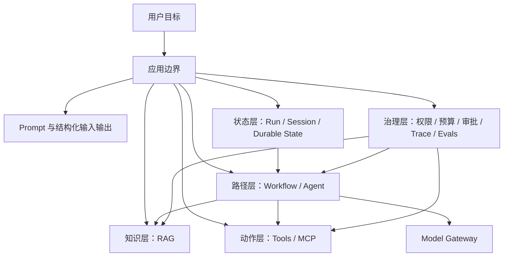

# 第 1 章：AI Agent 全景与学习路线

更新时间：2026-07-10<br>
建议学习时间：1-2 天<br>
适合阶段：开始学习 AI Agent 前的第一个完整学习单元<br>
本章产出：一张五轴决策卡、一张组合式系统架构图、一份场景判断记录、一份可运行证据清单

## 1.1 本章学习目标

学完本章后，你应该能够独立完成下面 8 件事：

1. 解释普通模型调用、RAG、工具、Workflow、Agent 和多 Agent 的职责边界。
2. 不再把 RAG、Workflow、Agent 当成互斥选项，而是把它们组合成系统层。
3. 用知识、动作、路径、状态、风险五个轴分析业务需求。
4. 说明为什么真实身份、权限、预算和审批不能交给模型决定。
5. 把方案判断映射到课程离线参考实现中的可运行模块和测试。
6. 区分课程的确定性离线基线与需要额外基础设施的生产扩展。
7. 解释 MCP 在工具接入层的位置，以及它不能替代的业务治理能力。
8. 为一个场景给出最小可验证方案，而不是直接选择“最自主”的方案。

本章不要求你马上写完整 Agent，但要求每个架构判断都能回答两个问题：它由哪个边界负责？你准备用什么证据证明它有效？

## 1.2 学前准备

你需要会阅读 Python Web 项目代码，理解 HTTP、JSON、数据库、缓存和消息队列等基础概念，并能使用 Markdown 记录判断。Go 不是本章前置条件。

先按 [参考实现 README](../reference-implementation/README.md) 完成离线环境同步。后文出现的 `uv run pytest` 命令都从 `reference-implementation/` 目录执行，默认不需要 API Key，也不会调用真实模型。

建议创建下面 4 个学习文件：

```text
notes/chapter-01-five-axis-card.md
notes/chapter-01-scenario-classification.md
notes/chapter-01-system-architecture.md
notes/chapter-01-evidence.md
```

## 核心知识

本章核心知识由 1.3-1.11 节组成：先建立组合式全景，再用知识、动作、路径、状态和风险五轴选择最小可验证方案，并明确 RAG、Tools、Workflow、Agent、MCP 与多 Agent 的边界。

## 1.3 先建立组合式全景图

AI Agent 不是一个替代所有架构的盒子。更实用的理解是：普通模型调用之上，可以按需要组合知识、动作、流程和开放决策能力；状态、权限、预算、审批和 trace 则由应用持续治理。



这张图有四个关键结论：

- RAG 提供知识，不自动产生业务动作。
- Tool Calling 提供动作，不自动决定完整路径。
- Workflow 固定或约束路径，局部节点仍可使用 RAG、工具或 Agent。
- Agent 在边界内动态选择下一步；身份、权限、预算和最终副作用仍属于应用。

课程离线参考实现已经把这些边界拆开：`ModelGateway` 负责下一步模型结果，`InMemoryRetriever` 负责授权后的检索，`ToolRegistry` 负责工具分发，`BoundedAgentRunner` 负责有界循环，`ResearchWorkflow` 负责版本化状态与审批。它们可以组合，不要求只能选一个。

> **课程离线基线**：Fake Model、内存检索器、内存会话和 trace、确定性 Workflow，用于学习合同和回归测试。<br>
> **生产扩展**：真实模型、持久化数据库、队列、外部搜索、集中式策略、密钥管理和监控。生产扩展不是本章默认命令的隐含能力。

## 1.4 什么是 AI Agent

在本课程的工程语境里，可以把 Agent 理解为：

> 一个由应用控制边界、由模型在边界内选择下一步、能够使用上下文和工具完成多步任务的运行过程。

“自主”不是无限权限。最小 Agent 通常包含下面 7 个部分：

| 组成 | 职责 | 课程合同 |
| --- | --- | --- |
| Instructions | 描述任务、可用能力和输出要求 | `Message` |
| Model | 产生回答或请求工具调用 | `ModelGateway.next_step(...)` |
| Tools | 执行受校验、受授权的外部动作 | `ToolRegistry.execute(...)` |
| Context | 携带可信身份、权限和请求信息 | `RunContext` |
| State | 保存消息、会话或可恢复运行状态 | `SessionKey`、Workflow state |
| Run Loop | 在模型和工具之间推进，并设置停止条件 | `BoundedAgentRunner` |
| Evidence | 记录结果、停止原因、工具结果和 trace | `AgentResult`、`InMemoryTraceSink` |

典型执行过程是：

```text
接收用户目标
  -> 应用构造可信 RunContext
  -> 输入 guardrail 检查
  -> 模型返回最终内容或结构化工具调用
  -> 应用校验参数并检查权限
  -> 应用执行工具并记录脱敏结果
  -> 模型基于新结果继续，或运行器因预算停止
  -> 返回带 stop_reason 和 trace_id 的 AgentResult
```

例如“查询订单 O1001”并不需要开放式研究 Agent。课程 Fake Model 会产生 `query_order_status` 调用，模型可见参数只有 `{"order_id": "O1001"}`；租户、用户和 `orders:read` 权限来自可信 `RunContext`。这是一层工具调用加一个有界循环，不等于给模型订单系统权限。

## 1.5 RAG、Tools、Workflow、Agent 是可组合层

旧式分类常问“这个需求到底是 RAG 还是 Agent”。更准确的问题是：这个需求需要哪些层，每一层承担什么责任？

| 层 | 回答的问题 | 可以单独使用吗 | 常见组合 |
| --- | --- | --- | --- |
| 结构化模型调用 | 如何理解或生成内容 | 可以 | 分类、抽取、摘要 |
| RAG | 回答需要哪些外部知识 | 可以 | RAG + 引用；Agent + RAG |
| Tools | 是否需要读取或改变外部系统 | 可以 | Workflow + Tools；Agent + Tools |
| Workflow | 哪些步骤和状态转换应预先确定 | 可以 | Workflow + RAG + Tools |
| Agent | 哪些局部路径需要根据观察动态决定 | 可以，但必须有边界 | Workflow 包住 Agent 节点 |
| 多 Agent | 是否真的需要多个独立职责和上下文边界 | 很少作为第一步 | 主 Workflow + 专门 Agent |

几个反例能帮助你摆脱互斥思维：

- 企业制度问答可以是“RAG + 结构化输出”，不需要 Agent 循环。
- 查询订单可以是“一次 Tool Calling”，不需要 RAG，也不需要开放路径。
- 生成销售日报可以由 Workflow 固定数据读取、校验、摘要和发布步骤，其中摘要节点使用模型。
- 深度研究可以由 Workflow 固定“收集、审阅、批准、发布”的大阶段，在收集阶段让 Agent 动态搜索。
- 高风险退款即使使用 Agent 收集证据，执行退款仍应由确定性策略和人工审批控制。

因此，架构复杂度应该按证据逐层增加：先证明单次调用，再证明检索或工具，再证明固定流程，最后才证明开放式循环确有收益。

## 1.6 五轴决策卡

面对需求时，不用互斥决策树，改用下面五个轴同时描述。

```text
Knowledge: public / private / real-time
Action: none / read / write / irreversible
Path: fixed / branching / open-ended
State: one-shot / session / durable
Risk: low / controlled / high
```

### 轴一：Knowledge，知识来源

| 取值 | 含义 | 常见实现 |
| --- | --- | --- |
| public | 模型已有常识或公开输入足够 | 普通模型调用；必要时显式 Web 工具 |
| private | 依赖企业或用户私有资料 | 授权过滤后的 RAG |
| real-time | 依赖此刻的业务状态 | 只读工具、数据库/API 查询 |

知识轴决定“给模型什么证据”。私有知识不是把所有文档塞进 prompt；实时知识也不应靠模型参数中的旧知识猜测。

### 轴二：Action，动作副作用

| 取值 | 含义 | 最低控制 |
| --- | --- | --- |
| none | 只生成或分析 | 输出 schema、事实验证 |
| read | 读取外部系统 | 身份、权限、租户过滤、最小字段 |
| write | 改变可恢复状态 | 校验、幂等、审计、重试分类 |
| irreversible | 删除、付款、发布等难以撤销动作 | 服务端策略、内容绑定审批、人工确认 |

动作轴决定“模型建议”与“应用执行”的分界。Prompt 中写“不要越权”只能影响模型行为，`RunContext.require(...)`、参数模型和审批状态才是可执行控制。

### 轴三：Path，执行路径

| 取值 | 含义 | 推荐起点 |
| --- | --- | --- |
| fixed | 步骤预先知道 | 普通代码或 Workflow |
| branching | 分支有限且可枚举 | 状态机 / Workflow |
| open-ended | 下一步依赖中间观察，难以穷举 | 有界 Agent，常放在 Workflow 节点内 |

路径轴不是“模型越聪明越开放”。如果步骤能够写清楚，Workflow 通常更容易测试、恢复和审计。

### 轴四：State，状态寿命

| 取值 | 含义 | 课程证据 |
| --- | --- | --- |
| one-shot | 一次请求内完成 | `ModelStep`、RAG answer |
| session | 多轮会话内延续 | `SessionKey(tenant_id, user_id, session_id)` |
| durable | 跨进程、等待审批后继续 | `WorkflowRun` 的版本和审批状态 |

课程 `InMemorySessionStore` 和 `ResearchWorkflow` 用于离线演示状态合同，不提供生产持久化保证。生产环境需要数据库、并发控制、过期策略、备份和恢复演练。

### 轴五：Risk，失败后果

| 取值 | 含义 | 设计要求 |
| --- | --- | --- |
| low | 错误可快速发现并轻易撤销 | 基础校验和日志 |
| controlled | 有业务影响但可通过权限、预算、回滚控制 | 服务端策略、trace、回归测试 |
| high | 涉及资金、隐私、合规或不可逆动作 | 缩小自动化范围、审批、双人复核或禁止自动执行 |

风险轴会反向限制另外四个轴。开放路径加不可逆动作加高风险，不是“高级 Agent”，而是必须拆分和降权的设计信号。

## 1.7 从五轴映射到组合方案

填写五轴后，再选择组合层。下面不是唯一答案，而是可验证的起点。

| 场景 | 五轴摘要 | 推荐组合 | 第一份证据 |
| --- | --- | --- | --- |
| 公司年假问答 | private / none / fixed / one-shot / controlled | 授权 RAG + 引用 | `tests/test_rag.py` 的命中、隔离、拒答 |
| 查询订单状态 | real-time / read / fixed / one-shot / controlled | Tool Calling | `tests/test_tools.py` 的严格参数与权限拒绝 |
| 每日销售日报 | real-time / write / fixed / durable / controlled | Workflow + 只读工具 + 摘要模型 | Workflow 状态、幂等、超时测试 |
| 竞品研究 | public / read / open-ended / durable / controlled | Workflow + 有界 Agent + 搜索工具 | 最大轮数、工具选择、参数准确率 |
| 自动退款 | real-time / irreversible / branching / durable / high | Workflow + 策略 + 内容绑定审批；Agent 只收集证据 | 权限拒绝、审批哈希、幂等测试 |

### 实践模板：五轴需求判断卡

```markdown
# 需求名称

## 用户目标与成功证据

## 五轴
| 轴 | 取值 | 证据 / 理由 |
| --- | --- | --- |
| Knowledge | public / private / real-time |  |
| Action | none / read / write / irreversible |  |
| Path | fixed / branching / open-ended |  |
| State | one-shot / session / durable |  |
| Risk | low / controlled / high |  |

## 组合层
- 结构化模型调用：
- RAG：
- Tools / MCP：
- Workflow：
- Agent：

## 应用强制边界
- 可信身份与权限：
- 参数校验：
- 预算与停止条件：
- 审批与幂等：
- Trace 与评估：

## 课程离线证据

## 生产扩展

## MVP 明确不做什么
```

## 1.8 四个核心层的工程边界

### RAG：把授权后的知识交给生成过程

RAG 适合私有知识、长文档和需要引用的回答。课程离线 `InMemoryRetriever.search(query, context, top_k)` 先按 `tenant_id`、允许用户和权限过滤，再做确定性词项重叠评分；`RagCitation.quote` 必须来自真实命中片段，没有足够证据时返回“根据当前资料无法确认”。

这能验证“授权先于相关性”“引用来自源文本”“无证据拒答”三条合同。它不声称等同于生产级向量检索。生产扩展可以加入解析、Embedding、混合检索、重排、持久化索引和内容安全扫描，但仍要保留相同的权限与引用断言。

### Tools：让应用执行动作

工具定义向模型暴露名称、描述和输入 schema。模型只提出调用请求；应用使用严格 Pydantic 模型拒绝未知字段，从可信 `RunContext` 读取用户、租户和权限，再执行处理器。

课程订单工具证明模型不能通过参数覆盖 `tenant_id` 或 `user_id`，缺少 `orders:read` 时返回结构化 `PERMISSION_DENIED`。生产扩展还要按副作用类型补充幂等键、重试策略、审批、限流和审计存储。

### Workflow：控制路径和可恢复状态

Workflow 把步骤、分支、状态版本、审批和恢复条件写进应用。课程 `ResearchWorkflow` 能验证等待审批、审批内容哈希、重复幂等键、超时、取消、租户和所有者边界。

生产环境要把内存状态替换为持久化存储，并处理并发、租约、任务队列和灾难恢复；不要因为课程对象名为 Workflow 就假定这些能力已经自动存在。

### Agent：在预算内选择下一步

课程 `BoundedAgentRunner` 接收 `RunLimits(max_turns, max_tool_calls, max_output_tokens, timeout_seconds)`，检测重复工具调用，保留显式 `ModelContinuation`，并返回带 `stop_reason`、工具结果和 `trace_id` 的 `AgentResult`。

这使“Agent 能完成任务”变成可测试命题：它选了什么工具、参数是否准确、执行了几轮、为何停止、敏感参数是否进入 trace。生产扩展还需要持久化运行、队列、分布式追踪、配额和告警。

## 1.9 多 Agent：最后增加的协调层

多 Agent 只有在职责、工具集、上下文可见性或评估标准确实不同的时候才值得引入。例如研究、事实审查和版式生成可能由不同 specialist 承担，但主流程仍应决定交接顺序、最大 handoff 次数和最终责任人。

初学顺序建议保持为：

```text
结构化模型调用
  -> RAG 或单次 Tool Calling
  -> 固定 Workflow
  -> 有界单 Agent
  -> Workflow + Agent
  -> 有明确证据后再拆多 Agent
```

多 Agent 不是五轴中的第六个风险消除器。它会增加上下文传递、权限配置、成本和故障定位难度。

## 1.10 MCP 在组合架构中的位置

MCP 是 Model Context Protocol。它标准化 Host、Client、Server 之间发现和调用 Tools、Resources、Prompts 的方式，但不替代 Agent 决策、RAG 检索质量或业务权限。

| 角色 | 作用 |
| --- | --- |
| Host | 承载用户体验和 Agent / Workflow 的应用 |
| Client | 连接并调用指定 MCP Server |
| Server | 暴露工具、资源和提示模板 |

课程参考实现包含可运行的 stdio MCP server/client smoke test，用于证明工具可发现、可调用并返回结构化结果。MCP 传输成功不等于业务授权成功；身份认证、租户过滤、权限、限流、幂等、审批、审计和可信 Server 白名单仍由应用与服务端实现。

## 1.11 两个课程项目如何使用这些层

### Know-Engine

Know-Engine 的核心不是“做一个聊天框”，而是验证私有知识问答合同：解析和索引资料，按可信身份过滤，检索相关片段，生成带真实引用的回答，无证据时拒答，再用固定数据集评估。

第一版可以只做 Markdown 样例、确定性检索和引用。向量库、PDF/Excel、多源路由、Neo4j 和 Text2SQL 属于后续扩展，只有在核心评估稳定后再加入。

### Dodo-Agent

Dodo-Agent 训练工具、运行循环、Workflow、MCP 和多 Agent 协作。第一版先做一个 `ModelGateway`、一个受限订单工具、一个 `BoundedAgentRunner` 和 trace；证明权限拒绝、重复调用停止、超时与会话隔离，再扩大工具和 specialist 数量。

两个项目共享同一原则：模型输出是候选决策，应用合同才是执行边界。

## 1.12 教师演示

教师用同一个“查询订单 O1001”场景完成三段演示：

1. 展示 Fake Model 只产生 `{"order_id": "O1001"}`，可信身份不在模型参数中。
2. 分别使用有权限和无权限的 `RunContext`，展示成功与 `PERMISSION_DENIED`。
3. 切换到重复调用 fixture，展示运行器以 `REPEATED_TOOL_CALL` 停止，并在 trace 中看不到原始工具参数。

随后教师用年假资料演示 RAG：可见片段返回真实引用；错误租户、错误用户或缺少权限的片段在评分前被排除；无证据问题返回拒答。最后把两个场景分别填入五轴卡，说明它们为何不需要同一种“Agent 架构”。

## 1.13 学员实验

### 实验 A：为 10 个场景填写五轴卡

对下面场景逐一填写五轴、组合层、强制边界和第一份验证证据：

| 场景 | 不可遗漏的判断 |
| --- | --- |
| 员工询问年假制度 | 私有知识、权限过滤、引用 |
| 上传合同并指出风险条款 | 私有知识、固定审查项、人工复核 |
| 每天生成销售日报 | 实时读取、固定路径、持久状态 |
| 调研 5 家竞品 | 开放路径、搜索预算、来源质量 |
| 查询订单状态 | 只读工具、可信身份、单次任务 |
| 自动生成 20 页 PPT | 固定阶段与局部生成、可恢复状态 |
| 回答安装步骤 | 私有或公开手册、引用、拒答 |
| 根据日志建议修复步骤 | 工具结果污染、开放探索、受控风险 |
| 审批退款 | 不可逆动作、高风险、内容绑定审批 |
| 搜索、阅读、总结、复核研究主题 | Workflow 包住有界 Agent |

### 实验 B：把判断绑定到可运行证据

从 `reference-implementation/` 运行：

```bash
uv run --group dev --extra live pytest \
  tests/test_tools.py \
  tests/test_agent_runner.py \
  tests/test_rag.py \
  tests/test_workflow.py \
  tests/test_evals.py -q
```

在 `notes/chapter-01-evidence.md` 中记录每组测试证明了什么，以及它没有证明什么。至少覆盖严格工具参数、可信身份、权限拒绝、预算停止、RAG 引用、租户隔离、Workflow 审批和 eval 参数准确率。

### 实验 C：画组合式架构图

选择 Know-Engine 或 Dodo-Agent，图中至少包含应用入口、`RunContext`、Model Gateway、RAG 或工具、Workflow 或 Agent、状态、trace 和评估。每条跨边界箭头都标注数据类型，并写明哪一侧负责校验。

## 1.14 失败注入与排错

按顺序注入三类失败，每次记录现象、根因、控制点和回归命令：

1. 给订单工具增加模型不应提供的 `tenant_id`，确认在处理器执行前得到 `INVALID_ARGUMENTS`。
2. 移除 `orders:read`，确认权限失败不会被模型重试成成功。
3. 使用 `[fixture:repeated-order-call]`，确认第二次相同调用执行前停止。

排错时不要先改 prompt。先判断失败属于知识、动作、路径、状态还是风险控制，再查看对应测试和 trace。参数错误要修 schema 或调用生成；权限错误要修可信上下文或授权配置；循环错误要检查停止预算和重复调用指纹。

## 1.15 自动验证

本章的结构与离线行为使用下面两组命令验证：

```bash
python3 scripts/validate_course.py
```

```bash
cd reference-implementation
uv lock --check
uv run --group dev --extra live pytest -q -m "not live"
uv run --group dev --extra live ruff check .
```

根目录结构验证不运行模型。参考实现测试默认使用 Fake Model，不需要凭据。真实模型只属于显式 Live 对比：必须同时设置 `AGENT_COURSE_LIVE_TESTS=1`、非空 `OPENAI_API_KEY` 和显式 `OPENAI_MODEL`，并先确认费用；没有默认模型。

## 1.16 作业与评分

提交四个学习文件，总分 100 分：

| 评分项 | 分值 | 满分证据 |
| --- | ---: | --- |
| 五轴判断 | 25 | 取值有依据，风险会约束方案 |
| 组合式架构 | 25 | RAG、Tools、Workflow、Agent 职责没有混淆 |
| 强制边界 | 25 | 身份、权限、参数、预算、审批和 trace 有明确归属 |
| 可运行证据 | 25 | 命令、测试名、结果和“未证明事项”完整 |

只写“建议使用 Agent”而没有五轴分析、边界和验证证据，不能获得对应项分数。

## 1.17 Core / Advanced / Production 完成标准

- **Core**：能为 10 个场景填写五轴卡，选择最小组合层，并运行工具、Agent、RAG 和 Workflow 的离线测试。
- **Advanced**：能设计 Workflow 包住有界 Agent 的方案，给出预算、会话/持久状态、审批和评估合同。
- **Production**：能在不改变核心合同的前提下，提出持久化、队列、集中策略、密钥管理、监控和恢复方案，并明确验证与回滚步骤。

## 1.18 本章资料

建议按下面顺序阅读：

1. [OpenAI Agents SDK - Agents](https://openai.github.io/openai-agents-python/agents/)：理解 instructions、tools、handoffs、guardrails、context 和 output types。
2. [Anthropic - Building Effective Agents](https://www.anthropic.com/engineering/building-effective-agents)：理解 Workflow 与 Agent 的工程边界。
3. [Model Context Protocol Documentation](https://modelcontextprotocol.io/docs/getting-started/intro)：理解 Host、Client、Server 与 Tools、Resources、Prompts。
4. [OpenAI Agents SDK Documentation](https://openai.github.io/openai-agents-python/)：建立 Agent、Tools、Handoff 和 Tracing 的整体印象。
5. [Pydantic AI Documentation](https://ai.pydantic.dev/)：观察类型化 Agent 接口；它不是课程参考实现的必选运行时。
6. [ReAct: Synergizing Reasoning and Acting in Language Models](https://arxiv.org/abs/2210.03629)：理解推理与行动循环的研究背景。
7. [Retrieval-Augmented Generation for Knowledge-Intensive NLP Tasks](https://arxiv.org/abs/2005.11401)：理解 RAG 的原始问题设定。
8. [FastAPI Documentation](https://fastapi.tiangolo.com/)：了解如何承载 API 与流式接口。
9. [Model Context Protocol SDKs](https://modelcontextprotocol.io/docs/sdk)：了解 Python 与 Go 的协议实现入口。

外部资料用于理解生态，仓库中的合同和测试才是本课程离线行为的可执行依据。

## 1.19 复盘模板

```markdown
# 第 1 章复盘

## 我以前把哪些层误认为互斥方案

## 我的一个需求的五轴取值

## 我选择了哪些组合层，为什么

## 哪些决定由模型提出，哪些由应用强制

## 哪条离线测试最改变我的判断

## 课程参考实现没有证明哪些生产能力

## 下一章我要验证的最小模型调用是什么
```

完成本章后，你不必记住所有框架名称，但应该养成一个稳定习惯：先描述五个轴，再组合能力层，最后为每个边界指定可运行证据。
