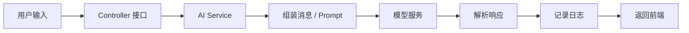

# 第 2 章：大模型应用基础

更新时间：2026-06-03  
建议学习时间：3-5 天  
适合阶段：已经理解 AI Agent 全景，准备开始动手调用大模型  
本章产出：一个 Spring Boot 大模型问答 API、一个结构化输出接口、一个 SSE 流式响应接口、一份调用日志与错误处理清单

## 2.1 本章学习目标

学完本章后，你应该能做到：

1. 解释大模型应用的一次完整调用链路。
2. 区分 system、user、assistant、tool 消息的职责。
3. 理解 temperature、top_p、max tokens、上下文窗口、流式输出的作用。
4. 使用 Spring AI `ChatClient` 完成一次基础模型调用。
5. 让模型按固定 JSON 结构返回结果。
6. 使用 SSE 把模型输出实时推送给前端。
7. 为模型调用增加基础错误处理、超时、日志和成本意识。
8. 知道哪些参数和输出不能盲目信任。

本章不是 Agent，也不是 RAG。它只解决一个基础问题：如何把大模型稳定接入到后端应用里。

## 2.2 本章先学什么

建议按下面顺序学习：

```text
大模型调用链路
  -> 消息结构
  -> 模型参数
  -> Spring AI ChatClient
  -> 普通问答 API
  -> 结构化输出
  -> SSE 流式响应
  -> 错误处理与日志
```

不要一开始就做工具调用或 RAG。先把最基础的模型调用做稳定，后面章节才有地基。

## 2.3 大模型应用的一次完整调用链路

一个最小的大模型应用调用链路如下：



真实项目里还会增加：

- 用户身份识别。
- 请求参数校验。
- 敏感信息脱敏。
- 模型路由。
- 超时控制。
- 重试策略。
- token 与费用统计。
- 审计日志。

### 最小请求示例

用户输入：

```text
请用 3 句话解释什么是 RAG。
```

后端要做的事情：

1. 接收用户问题。
2. 加入系统约束，例如“你是 AI 学习助手”。
3. 调用模型。
4. 读取模型响应。
5. 返回答案。

### 最小响应示例

```json
{
  "answer": "RAG 是检索增强生成，用来让大模型基于外部资料回答问题。它通常先从知识库检索相关内容，再把内容交给模型生成答案。这样可以减少幻觉，并让回答可以追溯到资料来源。"
}
```

## 2.4 消息角色：System、User、Assistant、Tool

大模型对话通常不是只传一段字符串，而是传一组消息。不同角色有不同职责。

| 角色 | 作用 | 示例 |
| --- | --- | --- |
| system | 定义模型身份、任务边界、规则和输出约束 | 你是企业知识库助手，只能基于资料回答 |
| user | 用户提出的问题或任务 | 请解释什么是 MCP |
| assistant | 模型之前的回答 | MCP 是一种工具和上下文接入协议 |
| tool | 工具调用结果 | 搜索知识库返回了 5 条结果 |

### System 消息

System 消息用于定义长期规则。它应该写清楚：

- 模型扮演什么角色。
- 可以做什么。
- 不能做什么。
- 如何处理不确定信息。
- 输出格式是什么。

示例：

```text
你是 AI Agent 课程助教。
请用准确、清晰、适合初学者的方式回答。
如果你不确定，请明确说“不确定”，不要编造。
回答中优先使用课程中的术语：RAG、Workflow、Agent、MCP。
```

### User 消息

User 消息是用户的本次输入。它通常包含：

- 问题。
- 任务目标。
- 上传文件的摘要。
- 额外约束。

示例：

```text
请比较 RAG 和 Agent 的区别，并给一个企业应用例子。
```

### Assistant 消息

Assistant 消息通常来自历史对话，用于保持上下文。它不应该无限制塞入请求里，否则会浪费 token 并引入旧信息干扰。

### Tool 消息

Tool 消息在第 5 章会详细学习。本章先记住：工具结果必须来自后端真实执行，不应该让模型自己假装调用了工具。

## 2.5 模型参数：先理解影响结果的旋钮

常见参数如下：

| 参数 | 作用 | 建议 |
| --- | --- | --- |
| model | 选择使用哪个模型 | 根据任务复杂度、成本、速度选择 |
| temperature | 控制随机性 | 问答/结构化任务偏低，创意任务可适当提高 |
| top_p | 控制采样范围 | 通常不要和 temperature 同时大幅调整 |
| max_tokens | 限制最大输出长度 | 根据输出需求设置，避免无限生成 |
| stop | 停止生成标记 | 特定格式任务可用 |
| stream | 是否流式返回 | 长回答、聊天体验、任务进度建议开启 |
| response_format / schema | 输出格式约束 | 结构化输出任务应使用 |

### 参数建议

| 场景 | temperature | 说明 |
| --- | --- | --- |
| 企业知识库问答 | 0-0.3 | 要求稳定、少发散 |
| 数据分析摘要 | 0.2-0.5 | 允许表达变化，但不能编造 |
| 写营销文案 | 0.6-0.9 | 需要创意 |
| 结构化 JSON 输出 | 0-0.2 | 越稳定越好 |
| 代码生成 | 0.1-0.4 | 兼顾稳定和修正能力 |

### 上下文窗口

上下文窗口指模型一次请求能看到的最大内容长度。它包括：

- system prompt。
- 用户问题。
- 历史对话。
- 检索资料。
- 工具返回。
- 模型要生成的答案。

初学者常犯的错误是把所有历史记录和所有文档都塞进上下文。正确做法是：

- 只放本次任务需要的信息。
- 长历史先摘要。
- 文档用 RAG 检索后再放。
- 工具结果要压缩成结构化摘要。

## 2.6 Spring Boot 项目骨架建议

本章建议先用 Spring Boot 做一个最小服务。目录可以这样设计：

```text
src/main/java/com/example/agentcourse/
  AgentCourseApplication.java
  ai/
    AiChatController.java
    AiChatService.java
    dto/
      ChatRequest.java
      ChatResponse.java
      LessonAnswer.java
  config/
    AiProperties.java
```

### 配置原则

不要把 API Key 写进代码或提交到仓库。

推荐使用环境变量：

```text
OPENAI_API_KEY=你的密钥
```

`application.yml` 示例：

```yaml
spring:
  ai:
    openai:
      api-key: ${OPENAI_API_KEY}
      chat:
        options:
          model: gpt-4.1-mini
          temperature: 0.2
```

模型名会随时间变化，实际项目要以官方文档和你当前账号可用模型为准。

## 2.7 实践一：普通问答 API

### 目标

实现一个接口：

```text
POST /api/ai/chat
```

输入：

```json
{
  "message": "请解释什么是 AI Agent"
}
```

输出：

```json
{
  "answer": "AI Agent 是..."
}
```

### DTO 设计

```java
package com.example.agentcourse.ai.dto;

public record ChatRequest(
    String message
) {
}
```

```java
package com.example.agentcourse.ai.dto;

public record ChatResponse(
    String answer
) {
}
```

### Service 示例

```java
package com.example.agentcourse.ai;

import org.springframework.ai.chat.client.ChatClient;
import org.springframework.stereotype.Service;

@Service
public class AiChatService {

    private final ChatClient chatClient;

    public AiChatService(ChatClient.Builder chatClientBuilder) {
        this.chatClient = chatClientBuilder
            .defaultSystem("""
                你是 AI Agent 课程助教。
                请用准确、清晰、适合初学者的中文回答。
                如果不确定，请明确说明，不要编造。
                """)
            .build();
    }

    public String chat(String message) {
        return chatClient.prompt()
            .user(message)
            .call()
            .content();
    }
}
```

### Controller 示例

```java
package com.example.agentcourse.ai;

import com.example.agentcourse.ai.dto.ChatRequest;
import com.example.agentcourse.ai.dto.ChatResponse;
import org.springframework.web.bind.annotation.PostMapping;
import org.springframework.web.bind.annotation.RequestBody;
import org.springframework.web.bind.annotation.RequestMapping;
import org.springframework.web.bind.annotation.RestController;

@RestController
@RequestMapping("/api/ai")
public class AiChatController {

    private final AiChatService aiChatService;

    public AiChatController(AiChatService aiChatService) {
        this.aiChatService = aiChatService;
    }

    @PostMapping("/chat")
    public ChatResponse chat(@RequestBody ChatRequest request) {
        String answer = aiChatService.chat(request.message());
        return new ChatResponse(answer);
    }
}
```

### 验收方式

用 curl 测试：

```bash
curl -X POST http://localhost:8080/api/ai/chat \
  -H 'Content-Type: application/json' \
  -d '{"message":"请用三句话解释什么是 RAG"}'
```

你应该看到一个中文回答。

## 2.8 实践二：结构化输出

### 为什么需要结构化输出

企业应用不能只拿到一段自然语言。很多时候需要固定字段，例如：

- 答案。
- 置信度。
- 风险级别。
- 下一步建议。
- 引用来源。
- 是否需要人工确认。

结构化输出能让后端更容易处理模型结果。

### 输出对象设计

```java
package com.example.agentcourse.ai.dto;

import java.util.List;

public record LessonAnswer(
    String answer,
    String concept,
    String difficulty,
    List<String> keyPoints,
    List<String> nextSteps
) {
}
```

### Service 示例

```java
package com.example.agentcourse.ai;

import com.example.agentcourse.ai.dto.LessonAnswer;
import org.springframework.ai.chat.client.ChatClient;
import org.springframework.stereotype.Service;

@Service
public class LessonAnswerService {

    private final ChatClient chatClient;

    public LessonAnswerService(ChatClient.Builder chatClientBuilder) {
        this.chatClient = chatClientBuilder
            .defaultSystem("""
                你是 AI Agent 课程助教。
                请把回答组织成结构化学习建议。
                difficulty 只能取：beginner、intermediate、advanced。
                """)
            .build();
    }

    public LessonAnswer explain(String question) {
        return chatClient.prompt()
            .user(question)
            .call()
            .entity(LessonAnswer.class);
    }
}
```

### Controller 示例

```java
@PostMapping("/lesson-answer")
public LessonAnswer lessonAnswer(@RequestBody ChatRequest request) {
    return lessonAnswerService.explain(request.message());
}
```

### 测试输入

```json
{
  "message": "我刚开始学习 AI Agent，请解释 Tool Calling 是什么"
}
```

### 期望输出

```json
{
  "answer": "Tool Calling 是让模型选择并调用外部工具的机制...",
  "concept": "Tool Calling",
  "difficulty": "beginner",
  "keyPoints": [
    "模型本身不直接执行工具",
    "后端负责执行工具并返回结果",
    "工具参数必须校验"
  ],
  "nextSteps": [
    "先学习普通模型调用",
    "再实现一个查询类工具"
  ]
}
```

### 结构化输出注意事项

- 字段名要清楚。
- 枚举值要限制。
- 不要让模型返回过深嵌套结构。
- 对模型返回结果仍然要做后端校验。
- 失败时要有兜底，例如重新请求或返回错误。

## 2.9 实践三：SSE 流式响应

### 为什么需要流式输出

如果模型需要生成长回答，用户等 10 秒才看到结果，体验会很差。流式输出可以让前端边生成边展示。

适合流式输出的场景：

- 长篇解释。
- 报告生成。
- 聊天对话。
- Agent 执行进度。
- RAG 回答。

不一定适合流式输出的场景：

- 很短的分类任务。
- 严格 JSON 结构化输出。
- 后端需要完整结果后才能处理的任务。

### Controller 示例

```java
import org.springframework.http.MediaType;
import org.springframework.web.bind.annotation.PostMapping;
import reactor.core.publisher.Flux;

@PostMapping(value = "/stream", produces = MediaType.TEXT_EVENT_STREAM_VALUE)
public Flux<String> stream(@RequestBody ChatRequest request) {
    return aiChatService.stream(request.message());
}
```

### Service 示例

```java
import reactor.core.publisher.Flux;

public Flux<String> stream(String message) {
    return chatClient.prompt()
        .user(message)
        .stream()
        .content();
}
```

### 前端接收方式

如果使用浏览器原生 `EventSource`，通常是 GET 请求更方便。对于 POST SSE，可以使用 `fetch` 读取流。

简化示例：

```javascript
const response = await fetch("/api/ai/stream", {
  method: "POST",
  headers: { "Content-Type": "application/json" },
  body: JSON.stringify({ message: "请解释什么是 Workflow" })
});

const reader = response.body.getReader();
const decoder = new TextDecoder("utf-8");

while (true) {
  const { value, done } = await reader.read();
  if (done) break;
  console.log(decoder.decode(value));
}
```

### 流式输出注意事项

- 需要设置合理超时。
- 前端要处理断流。
- 后端要处理用户取消请求。
- 日志中最好记录完整输出，但不要泄露敏感信息。
- 如果需要审计，流式结束后要保存完整结果。

## 2.10 错误处理

大模型调用常见错误：

| 错误 | 表现 | 处理方式 |
| --- | --- | --- |
| API Key 缺失 | 启动失败或调用 401 | 启动时检查配置 |
| 模型不可用 | 返回模型不存在或权限不足 | 模型名配置化，保留备选模型 |
| 超时 | 请求长时间无响应 | 设置超时，提示用户重试 |
| 限流 | 返回 429 | 指数退避、队列、限流 |
| 输出格式错误 | JSON 解析失败 | 结构化输出重试，后端校验 |
| 内容安全拦截 | 返回安全错误 | 给用户解释原因 |
| 网络失败 | 连接失败 | 重试或降级 |

### 错误响应建议

不要把供应商原始错误完整暴露给用户。建议统一错误格式：

```json
{
  "code": "MODEL_TIMEOUT",
  "message": "模型响应超时，请稍后重试",
  "requestId": "req-20260603-001"
}
```

### 后端日志建议

至少记录：

- requestId。
- userId。
- model。
- 输入长度。
- 输出长度。
- 耗时。
- 是否流式。
- 是否成功。
- 错误类型。

不要记录：

- 明文 API Key。
- 用户敏感隐私。
- 未脱敏的企业机密。

## 2.11 成本与性能意识

从第一天就要建立 token 成本意识。后面做 RAG 和 Agent 时，多轮调用会让成本迅速增加。

### 成本来自哪里

- 输入 token。
- 输出 token。
- 多次模型调用。
- Embedding 调用。
- Rerank 调用。
- 工具调用中的外部服务成本。

### 优化方向

| 方法 | 说明 |
| --- | --- |
| 控制上下文长度 | 不把无关历史塞进 prompt |
| 使用小模型处理简单任务 | 分类、改写、格式化不一定需要大模型 |
| 缓存重复问题 | FAQ、固定解释可以缓存 |
| 流式输出 | 改善体感延迟 |
| 批量处理 | Embedding 等任务可批量 |
| 监控 token | 每个请求记录成本 |

### 延迟来源

| 来源 | 说明 |
| --- | --- |
| 模型首 token 时间 | 流式输出也需要等待首 token |
| 输出长度 | 生成越长越慢 |
| 网络 | 供应商服务与本地网络 |
| 上下文长度 | 输入越长，处理越慢 |
| 工具调用 | 后续 Agent 会更明显 |

## 2.12 安全注意事项

本章虽然只是基础调用，但已经涉及安全。

### API Key 安全

- 不要写进代码。
- 不要提交到 Git。
- 不要放在前端。
- 用环境变量或密钥管理系统。
- 泄露后立即轮换。

### 输入安全

用户输入可能包含：

- Prompt Injection。
- 恶意链接。
- 敏感信息。
- 超长文本。

基础处理：

- 限制输入长度。
- 对日志脱敏。
- 对特殊场景做内容安全检查。
- 不能让用户输入覆盖系统规则。

### 输出安全

模型输出可能：

- 编造事实。
- 泄露上下文。
- 返回不合规建议。
- 不符合 JSON 格式。

基础处理：

- 后端校验。
- 高风险任务加人工确认。
- 企业知识问答必须引用来源。
- 不确定时允许模型说不知道。

## 2.13 本章完整实践任务

完成下面 4 个任务，才算完成第 2 章。

### 任务 1：基础问答接口

实现：

```text
POST /api/ai/chat
```

要求：

- 输入 `message`。
- 返回 `answer`。
- 设置 system prompt。
- 处理空输入。

验收：

- 能回答“什么是 AI Agent”。
- 空输入返回明确错误。
- API Key 不在代码中。

### 任务 2：结构化输出接口

实现：

```text
POST /api/ai/lesson-answer
```

要求返回：

```json
{
  "answer": "...",
  "concept": "...",
  "difficulty": "beginner",
  "keyPoints": [],
  "nextSteps": []
}
```

验收：

- 字段完整。
- `difficulty` 在允许范围内。
- JSON 可被后端对象正常接收。

### 任务 3：流式输出接口

实现：

```text
POST /api/ai/stream
```

要求：

- 使用 SSE 或可读流。
- 前端或 curl 能看到逐步输出。
- 断流时不会让后端异常崩溃。

验收：

- 长回答能边生成边展示。
- 服务端日志能看到请求开始和结束。

### 任务 4：调用日志

为每次模型调用记录：

```text
requestId
userId
model
inputLength
outputLength
durationMs
success
errorType
```

验收：

- 成功请求有日志。
- 失败请求有日志。
- 日志不包含 API Key。

## 2.14 本章自测题

### 概念题

1. system prompt 和 user prompt 有什么区别？
2. 为什么结构化输出仍然需要后端校验？
3. temperature 调高后可能带来什么变化？
4. 为什么不要把所有历史对话都塞进上下文？
5. SSE 流式输出和普通同步响应的区别是什么？
6. 大模型调用日志至少应该记录哪些字段？

### 判断题

1. API Key 可以放到前端，只要接口隐藏就安全。  
   答案：错误。

2. 结构化输出可以帮助后端稳定处理模型结果。  
   答案：正确。

3. 流式输出能减少模型实际计算量。  
   答案：不一定。它主要改善用户体感延迟。

4. 模型输出 JSON 后就不需要校验了。  
   答案：错误。

5. 上下文越长，回答一定越好。  
   答案：错误。

### 实战题

设计一个“AI 学习助手”的接口，要求：

- 用户输入一个概念。
- 模型返回概念解释、难度、学习步骤和练习题。
- 输出必须是 JSON。
- 支持普通响应即可，不需要流式。

请写出：

1. 请求 JSON。
2. 响应 JSON。
3. Java record。
4. system prompt。

## 2.15 本章完成标准

你完成第 2 章的标准：

- 能启动一个 Spring Boot AI 服务。
- 能完成一次普通模型调用。
- 能完成一次结构化输出。
- 能完成一次流式输出。
- 能解释主要模型参数。
- 能处理空输入、超时、输出格式错误等基础问题。
- 能记录基础调用日志。

如果你还不能稳定完成结构化输出，不建议进入 Tool Calling。因为工具调用本质上也是一种结构化输出，只是输出变成了“工具名 + 参数”。

## 2.16 本章学习资料

### 必读资料

- [Spring AI Reference Documentation](https://docs.spring.io/spring-ai/reference/)
- [Spring AI Chat Client API](https://docs.spring.io/spring-ai/reference/api/chatclient.html)
- [Spring AI Structured Output Converter](https://docs.spring.io/spring-ai/reference/api/structured-output-converter.html)
- [OpenAI API Documentation](https://platform.openai.com/docs)
- [OpenAI Structured Outputs Guide](https://platform.openai.com/docs/guides/structured-outputs)

### 扩展资料

- [Spring WebFlux Reference](https://docs.spring.io/spring-framework/reference/web/webflux.html)
- [LangChain4j Documentation](https://docs.langchain4j.dev/)
- [OpenAI Streaming Guide](https://platform.openai.com/docs/guides/streaming-responses)

## 2.17 本章复盘模板

```markdown
# 第 2 章复盘

## 我完成的接口

## 我对 system / user / assistant 消息的理解

## 我对结构化输出的理解

## 我在流式输出中遇到的问题

## 我记录了哪些调用日志

## 进入第 3 章前仍然不清楚的问题
```

本章的关键不是写出多复杂的功能，而是建立“模型调用也需要工程化”的意识。
