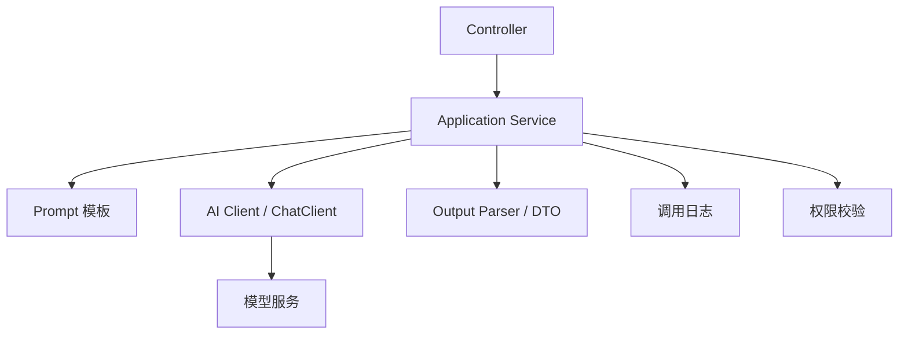
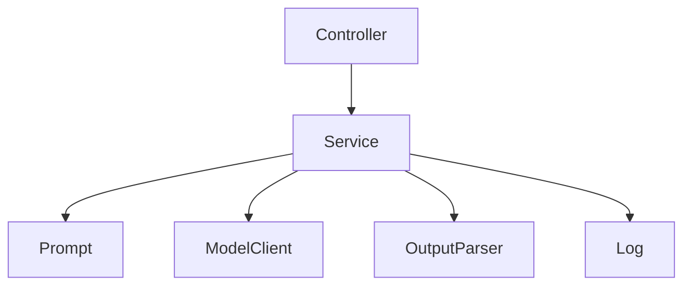

# 第 4 章：Spring AI 与 LangChain4j 入门

更新时间：2026-06-03  
建议学习时间：4-6 天  
适合阶段：已经能调用模型、能写基础 Prompt，希望进入 Java AI 应用框架  
本章产出：一个 Spring AI 问答服务、一个 LangChain4j 问答服务、一份两者对比报告、一套 AI 应用分层设计

## 4.1 本章学习目标

学完本章后，你应该能做到：

1. 说明 Spring AI 和 LangChain4j 的定位差异。
2. 使用 Spring AI `ChatClient` 封装一个 AI 服务。
3. 使用 LangChain4j `AiServices` 封装一个 AI 服务。
4. 理解 Chat Model、Prompt、Memory、Tool、Embedding、Vector Store 的框架抽象。
5. 设计 Java AI 应用中的 Controller、Service、Prompt、Tool、Repository 分层。
6. 知道什么时候用 Spring AI，什么时候用 LangChain4j。
7. 避免把框架 API 当作 Agent 能力本身。

本章的重点不是“哪个框架更好”，而是学会用 Java 工程方式组织 AI 应用。

## 4.2 Spring AI 和 LangChain4j 是什么

### Spring AI

Spring AI 是 Spring 生态里的 AI 应用框架。它适合已经使用 Spring Boot 的项目，把模型调用、Prompt、Embedding、Vector Store、Tool Calling、RAG、MCP 等能力纳入 Spring 风格的配置和 Bean 管理。

适合场景：

- 企业 Java / Spring Boot 项目。
- 希望和 Spring 配置、依赖注入、观测体系结合。
- 希望统一管理模型、工具、向量库和 MCP。
- 后续要做企业级工程化。

### LangChain4j

LangChain4j 是 Java 生态中面向 LLM 应用组合的框架。它提供 LLM、Embedding、Memory、Tools、RAG、AI Services 等抽象，适合快速搭建大模型应用，并用接口化方式封装 AI 能力。

适合场景：

- 想快速组合 LLM、RAG、Tools、Memory。
- 喜欢通过 Java interface 定义 AI Service。
- 想快速验证一个 AI 应用原型。
- 项目不一定完全依赖 Spring AI。

## 4.3 两者对比

| 维度 | Spring AI | LangChain4j |
| --- | --- | --- |
| 生态定位 | Spring 官方生态 | Java LLM 应用框架 |
| 核心风格 | Spring Boot 配置、Bean、自动装配 | Java 接口、服务组合、声明式 AI Services |
| Chat 调用 | `ChatClient` | `ChatLanguageModel`、`AiServices` |
| Prompt | Prompt Template、ChatClient DSL | 注解、模板、接口方法 |
| Tool | `@Tool`、`ToolCallback` | `@Tool`、ToolSpecification |
| RAG | ETL、VectorStore、Advisors | Document、EmbeddingStore、ContentRetriever |
| Spring 集成 | 很强 | 支持 Spring Boot starter |
| MCP | Spring AI 有较完整支持 | 可通过集成或自定义接入 |
| 学习建议 | 作为主工程栈 | 作为对照和快速组合工具 |

课程建议：

- 主线使用 Spring AI，因为它更贴近截图里的 Java / Spring 企业级架构。
- 同时学习 LangChain4j，因为它的 AI Services、Tools、RAG 抽象有助于理解 Java 生态通用模式。

## 4.4 AI 应用中的核心抽象

无论使用哪个框架，都绕不开下面这些抽象：

| 抽象 | 作用 |
| --- | --- |
| Chat Model | 和大模型对话 |
| Prompt | 组织指令和上下文 |
| Output Parser | 把模型输出转成结构化对象 |
| Memory | 管理会话历史 |
| Tool | 让模型调用外部能力 |
| Embedding Model | 把文本转为向量 |
| Vector Store | 存储和检索向量 |
| Retriever | 根据问题检索资料 |
| Advisor / Middleware | 在调用前后增强上下文或记录日志 |

学习框架时，不要只记类名。你要把类名映射到这些核心抽象上。

## 4.5 推荐项目分层

无论用 Spring AI 还是 LangChain4j，建议按下面方式组织代码：

```text
src/main/java/com/example/agentcourse/
  ai/
    controller/
      AiChatController.java
    service/
      AiChatService.java
      ConceptExplainService.java
    prompt/
      PromptTemplateLoader.java
    tool/
      CourseToolService.java
    memory/
      ConversationMemoryService.java
    dto/
      ChatRequest.java
      ChatResponse.java
      ConceptExplanation.java
  common/
    exception/
    logging/
    security/
```

### 分层原则

- Controller 只处理 HTTP 输入输出。
- Service 负责业务编排和模型调用。
- Prompt 不要散落在 Controller 里。
- Tool 单独封装，方便权限和日志。
- DTO 明确输入输出。
- 日志和错误处理抽到通用层。

## 4.6 Spring AI 实践一：基础 ChatClient

### 目标

实现一个服务：

```java
String ask(String question)
```

根据用户问题返回课程助教回答。

### Service 示例

```java
package com.example.agentcourse.ai.service;

import org.springframework.ai.chat.client.ChatClient;
import org.springframework.stereotype.Service;

@Service
public class SpringAiChatService {

    private final ChatClient chatClient;

    public SpringAiChatService(ChatClient.Builder builder) {
        this.chatClient = builder
            .defaultSystem("""
                你是 AI Agent 课程助教。
                回答时请面向有 Java / Spring Boot 基础的学习者。
                请优先给出工程例子。
                """)
            .build();
    }

    public String ask(String question) {
        return chatClient.prompt()
            .user(question)
            .call()
            .content();
    }
}
```

### Controller 示例

```java
package com.example.agentcourse.ai.controller;

import com.example.agentcourse.ai.dto.ChatRequest;
import com.example.agentcourse.ai.dto.ChatResponse;
import com.example.agentcourse.ai.service.SpringAiChatService;
import org.springframework.web.bind.annotation.PostMapping;
import org.springframework.web.bind.annotation.RequestBody;
import org.springframework.web.bind.annotation.RequestMapping;
import org.springframework.web.bind.annotation.RestController;

@RestController
@RequestMapping("/api/spring-ai")
public class SpringAiChatController {

    private final SpringAiChatService chatService;

    public SpringAiChatController(SpringAiChatService chatService) {
        this.chatService = chatService;
    }

    @PostMapping("/chat")
    public ChatResponse chat(@RequestBody ChatRequest request) {
        return new ChatResponse(chatService.ask(request.message()));
    }
}
```

## 4.7 Spring AI 实践二：结构化输出

### DTO

```java
package com.example.agentcourse.ai.dto;

import java.util.List;

public record ConceptExplanation(
    String concept,
    String definition,
    String javaExample,
    List<String> misunderstandings,
    String practice
) {
}
```

### Service

```java
package com.example.agentcourse.ai.service;

import com.example.agentcourse.ai.dto.ConceptExplanation;
import org.springframework.ai.chat.client.ChatClient;
import org.springframework.stereotype.Service;

@Service
public class SpringAiConceptService {

    private final ChatClient chatClient;

    public SpringAiConceptService(ChatClient.Builder builder) {
        this.chatClient = builder
            .defaultSystem("""
                你是 AI Agent 课程助教。
                请把概念解释成结构化结果。
                javaExample 必须贴近 Java / Spring Boot 工程。
                misunderstandings 返回 3 条。
                """)
            .build();
    }

    public ConceptExplanation explain(String concept) {
        return chatClient.prompt()
            .user("请解释概念：" + concept)
            .call()
            .entity(ConceptExplanation.class);
    }
}
```

### 验收

输入：

```text
RAG
```

输出应包含：

- `concept` 为 RAG。
- `definition` 是一句清晰定义。
- `javaExample` 提到知识库、检索、Spring Boot 服务。
- `misunderstandings` 至少 3 条。
- `practice` 是一个可执行小练习。

## 4.8 Spring AI 实践三：流式输出

```java
package com.example.agentcourse.ai.service;

import org.springframework.ai.chat.client.ChatClient;
import org.springframework.stereotype.Service;
import reactor.core.publisher.Flux;

@Service
public class SpringAiStreamService {

    private final ChatClient chatClient;

    public SpringAiStreamService(ChatClient.Builder builder) {
        this.chatClient = builder
            .defaultSystem("你是 AI Agent 课程助教，请分步骤解释。")
            .build();
    }

    public Flux<String> stream(String question) {
        return chatClient.prompt()
            .user(question)
            .stream()
            .content();
    }
}
```

Controller：

```java
@PostMapping(value = "/stream", produces = MediaType.TEXT_EVENT_STREAM_VALUE)
public Flux<String> stream(@RequestBody ChatRequest request) {
    return streamService.stream(request.message());
}
```

## 4.9 LangChain4j 实践一：基础 ChatLanguageModel

LangChain4j 可以直接使用 `ChatLanguageModel` 发起调用。

示例：

```java
import dev.langchain4j.model.chat.ChatLanguageModel;
import dev.langchain4j.model.openai.OpenAiChatModel;

public class LangChain4jBasicDemo {

    public static void main(String[] args) {
        ChatLanguageModel model = OpenAiChatModel.builder()
            .apiKey(System.getenv("OPENAI_API_KEY"))
            .modelName("gpt-4.1-mini")
            .temperature(0.2)
            .build();

        String answer = model.chat("请用三句话解释什么是 AI Agent");
        System.out.println(answer);
    }
}
```

这个方式适合快速验证，但真实项目中更推荐封装成服务或使用 `AiServices`。

## 4.10 LangChain4j 实践二：AI Services

AI Services 可以把 Java interface 变成 AI 服务。

### 定义接口

```java
package com.example.agentcourse.ai.service;

import dev.langchain4j.service.SystemMessage;
import dev.langchain4j.service.UserMessage;

public interface CourseAssistant {

    @SystemMessage("""
        你是 AI Agent 课程助教。
        请使用中文回答，并给出 Java / Spring Boot 工程例子。
        """)
    @UserMessage("请解释概念：{{concept}}")
    String explain(String concept);
}
```

### 创建服务

```java
import dev.langchain4j.model.chat.ChatLanguageModel;
import dev.langchain4j.model.openai.OpenAiChatModel;
import dev.langchain4j.service.AiServices;

ChatLanguageModel model = OpenAiChatModel.builder()
    .apiKey(System.getenv("OPENAI_API_KEY"))
    .modelName("gpt-4.1-mini")
    .temperature(0.2)
    .build();

CourseAssistant assistant = AiServices.builder(CourseAssistant.class)
    .chatLanguageModel(model)
    .build();

String answer = assistant.explain("Tool Calling");
```

### AI Services 的价值

- 接口就是业务能力定义。
- Prompt 可以放在注解中。
- 支持返回结构化对象。
- 可以接入 Memory、Tools、RAG。

## 4.11 LangChain4j 实践三：结构化返回

### DTO

```java
package com.example.agentcourse.ai.dto;

import java.util.List;

public class ConceptExplanationDto {
    public String concept;
    public String definition;
    public String javaExample;
    public List<String> misunderstandings;
    public String practice;
}
```

### 接口

```java
import dev.langchain4j.service.SystemMessage;
import dev.langchain4j.service.UserMessage;

public interface StructuredCourseAssistant {

    @SystemMessage("""
        你是 AI Agent 课程助教。
        请返回结构化对象。
        misunderstandings 必须包含 3 条。
        """)
    @UserMessage("请解释概念：{{concept}}")
    ConceptExplanationDto explain(String concept);
}
```

### 验收

测试：

```java
ConceptExplanationDto dto = assistant.explain("MCP");
assert dto.concept != null;
assert dto.misunderstandings.size() == 3;
```

真实项目里仍然建议使用 Bean Validation 或手写校验确认字段完整。

## 4.12 两套实现做同一个功能

本章最重要的实践是：用 Spring AI 和 LangChain4j 分别实现“概念解释”功能。

### 功能要求

接口：

```text
POST /api/concepts/explain
```

输入：

```json
{
  "concept": "RAG"
}
```

输出：

```json
{
  "concept": "RAG",
  "definition": "...",
  "javaExample": "...",
  "misunderstandings": [],
  "practice": "..."
}
```

### Spring AI 实现关注点

- `ChatClient` 如何配置。
- system prompt 如何设置。
- `.entity()` 如何转结构化对象。
- 如何接入 Spring Boot Controller。

### LangChain4j 实现关注点

- `AiServices` 如何创建。
- interface 如何定义。
- 注解 prompt 如何写。
- 返回对象如何校验。

### 对比维度

写一份对比报告：

| 维度 | Spring AI | LangChain4j | 我的判断 |
| --- | --- | --- | --- |
| 依赖配置 |  |  |  |
| 代码复杂度 |  |  |  |
| Prompt 管理 |  |  |  |
| 结构化输出 |  |  |  |
| Spring 集成 |  |  |  |
| 后续接 Tool |  |  |  |
| 后续接 RAG |  |  |  |

## 4.13 如何选择框架

### 优先 Spring AI 的情况

- 项目本来就是 Spring Boot。
- 需要统一配置和自动装配。
- 需要接入 Spring Observability。
- 需要 Spring 风格的 VectorStore、Advisor、Tool、MCP。
- 目标是企业级后端应用。

### 优先 LangChain4j 的情况

- 想快速用 Java interface 定义 AI 服务。
- 想更轻量地组合模型、工具、RAG。
- 项目不是强 Spring AI 路线。
- 团队喜欢声明式接口风格。

### 可以混用吗

可以，但要谨慎。

混用时要明确：

- 谁负责模型配置。
- 谁负责工具定义。
- 谁负责会话记忆。
- 谁负责 RAG 检索。
- 谁负责日志和观测。

不要在一个项目里无边界地混用，否则后期很难维护。

## 4.14 常见工程误区

### 误区 1：框架等于能力

用了 Spring AI 或 LangChain4j，不代表你的应用就是 Agent。Agent 需要工具、上下文、执行循环、停止条件和观测。

### 误区 2：Prompt 到处散落

把 prompt 写在 Controller、Service、Tool 里，会很快失控。应该集中管理。

### 误区 3：没有 DTO 边界

直接返回字符串不利于后续扩展。结构化输出和 DTO 是 AI 应用工程化的基础。

### 误区 4：没有错误处理

模型调用可能失败、超时、限流、输出格式错误。框架不会替你设计业务兜底。

### 误区 5：忘记日志和观测

只看最终回答，无法定位问题。至少要记录请求、模型、耗时、输入输出长度、错误类型。

## 4.15 推荐分层设计示例



### 每一层职责

| 层 | 职责 |
| --- | --- |
| Controller | HTTP 入参校验、返回响应 |
| Application Service | 编排 prompt、模型调用、结构化转换 |
| Prompt 模板 | 管理提示词版本 |
| AI Client | 调用模型 |
| DTO | 定义输入输出结构 |
| Log | 记录调用轨迹 |
| Security | 用户权限和敏感信息处理 |

## 4.16 本章完整实践任务

完成下面 5 个任务，才算完成第 4 章。

### 任务 1：Spring AI 概念解释服务

实现：

```text
POST /api/spring-ai/concepts/explain
```

要求：

- 使用 `ChatClient`。
- 返回结构化对象。
- system prompt 面向 AI Agent 课程。
- 至少能解释 RAG、Agent、Workflow、MCP。

验收：

- 字段完整。
- 返回内容不是空。
- Prompt 不写在 Controller 里。

### 任务 2：LangChain4j 概念解释服务

实现同样功能：

```text
POST /api/langchain4j/concepts/explain
```

要求：

- 使用 `AiServices`。
- 使用 Java interface 定义 AI 服务。
- 返回结构化对象或稳定文本。

验收：

- 能正常调用。
- 和 Spring AI 版本输出字段一致。
- 可以对比两者代码结构。

### 任务 3：两者对比报告

创建文件：

```text
notes/chapter-04-framework-comparison.md
```

内容：

```markdown
# Spring AI 与 LangChain4j 对比

## 我的实现功能

## Spring AI 实现感受

## LangChain4j 实现感受

## 两者代码结构对比

## 后续做 Tool Calling 我会选择

## 后续做 RAG 我会选择

## 我的结论
```

验收：

- 不少于 800 字。
- 至少从 6 个维度比较。
- 给出自己的选型理由。

### 任务 4：AI 应用分层图

创建文件：

```text
notes/chapter-04-ai-service-architecture.md
```

画出你的服务分层：



验收：

- 至少包含 Controller、Service、Prompt、Model Client、DTO、Log。
- 每层有职责说明。
- 标注 API Key 存放位置。

### 任务 5：错误处理清单

列出框架调用中可能发生的错误：

| 错误 | Spring AI 处理 | LangChain4j 处理 | 业务兜底 |
| --- | --- | --- | --- |
| API Key 缺失 |  |  |  |
| 模型超时 |  |  |  |
| 输出格式错误 |  |  |  |
| 限流 |  |  |  |
| 用户输入为空 |  |  |  |

验收：

- 至少 5 类错误。
- 每类错误有业务提示语。
- 不暴露底层敏感错误。

## 4.17 本章自测题

### 概念题

1. Spring AI 和 LangChain4j 的核心定位有什么不同？
2. `ChatClient` 主要解决什么问题？
3. `AiServices` 的好处是什么？
4. 为什么 Prompt 不应该散落在 Controller 中？
5. 为什么框架不能替代业务错误处理？
6. 混用 Spring AI 和 LangChain4j 时最容易混乱的是什么？

### 判断题

1. 使用 Spring AI 后，应用自动变成 Agent。  
   答案：错误。

2. LangChain4j 的 AI Services 可以用接口定义 AI 能力。  
   答案：正确。

3. 框架会自动处理所有权限问题。  
   答案：错误。

4. 结构化输出仍然需要 DTO 校验。  
   答案：正确。

5. 企业级项目中 Prompt 应该有版本管理。  
   答案：正确。

## 4.18 本章完成标准

你完成第 4 章的标准：

- 能用 Spring AI 完成一个问答接口。
- 能用 Spring AI 完成结构化输出。
- 能用 LangChain4j 完成一个 AI Service。
- 能说清楚两者差异。
- 能画出 AI 应用分层图。
- 能说明后续做 Tool Calling 和 RAG 时各框架如何扩展。

完成后，你就可以进入第 5 章 Tool Calling。因为 Tool Calling 是从“模型生成文本”进入“模型选择动作”的关键一步。

## 4.19 本章学习资料

### 必读资料

- [Spring AI Reference Documentation](https://docs.spring.io/spring-ai/reference/)
- [Spring AI Chat Client API](https://docs.spring.io/spring-ai/reference/api/chatclient.html)
- [Spring AI Prompt API](https://docs.spring.io/spring-ai/reference/api/prompt.html)
- [LangChain4j Documentation](https://docs.langchain4j.dev/)
- [LangChain4j AI Services](https://docs.langchain4j.dev/tutorials/ai-services/)

### 扩展资料

- [Spring AI Structured Output Converter](https://docs.spring.io/spring-ai/reference/api/structured-output-converter.html)
- [LangChain4j Tools Tutorial](https://docs.langchain4j.dev/tutorials/tools/)
- [LangChain4j RAG Tutorial](https://docs.langchain4j.dev/tutorials/rag/)

## 4.20 本章复盘模板

```markdown
# 第 4 章复盘

## 我完成了哪些接口

## Spring AI 的优点和不足

## LangChain4j 的优点和不足

## 我更适合用哪个作为主线

## 我对 AI 应用分层的理解

## 进入 Tool Calling 前我还不清楚的问题
```

这一章学完后，你应该开始把大模型应用当作 Java 后端工程来组织，而不是把所有逻辑写成一个 demo 方法。
