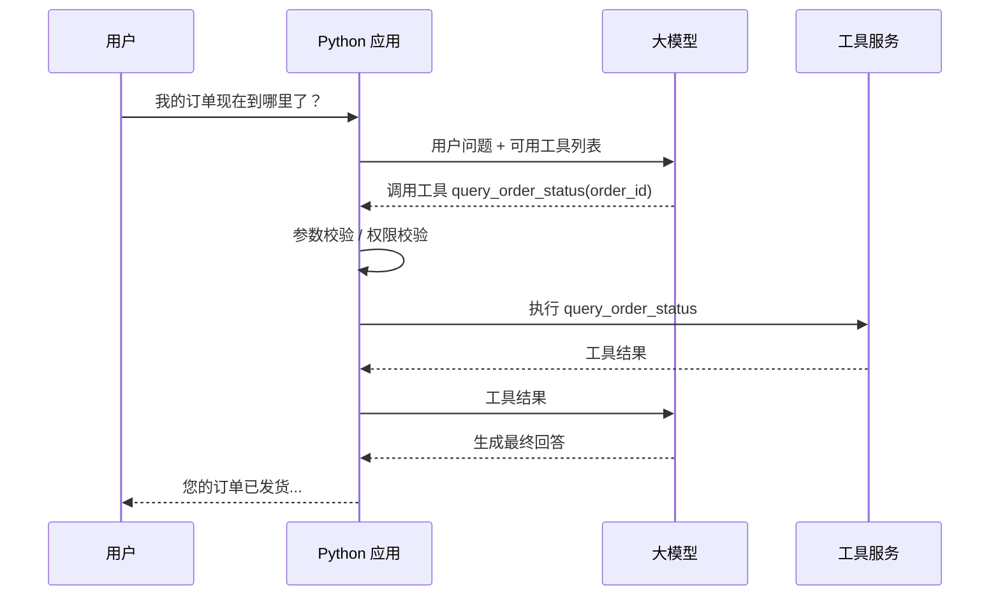
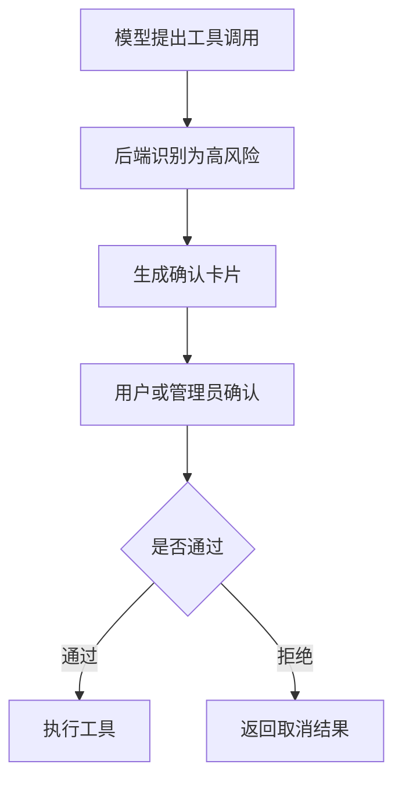

# 第 5 章：Tool Calling / Function Calling

更新时间：2026-07-10
建议学习时间：5-7 天  
适合阶段：已经能完成模型调用和 Prompt 管理，准备让模型使用外部工具  
本章产出：3 个可调用工具、一个 Tool Calling API、一套工具权限校验、一张工具调用日志表、一份危险工具安全清单

## 5.1 本章学习目标

学完本章后，你应该能做到：

1. 解释 Tool Calling / Function Calling 的工作机制。
2. 区分“模型选择工具”和“后端执行工具”。
3. 设计工具名称、描述、参数 Schema 和返回值。
4. 使用 Python function tool 暴露业务能力。
5. 使用 Pydantic 校验工具参数和返回值。
6. 为工具调用增加参数校验、权限校验、日志和错误处理。
7. 识别哪些工具不能让模型自动执行。
8. 实现天气查询、订单查询、知识库搜索 3 个示例工具。
9. 知道何时可以把稳定工具服务抽到 Go 或 MCP Server。
10. 了解 built-in tools、remote MCP、tool search 等现代工具入口的适用边界。
11. 按 effect class 决定自动执行、幂等键、审批和重试策略。
12. 用确定性用例分别评估工具选择和参数准确率。

Tool Calling 是 Agent 的基础。没有工具，Agent 只能说；有了工具，Agent 才能查、算、读、写、执行。

## 前置知识

先完成第 2-4 章，能够运行 Fake Model、使用 Pydantic strict model，并理解 `ModelGateway`、`RunContext` 和后端权限边界。无需 Live 模型或 Go。

## 核心知识

本章核心知识由 5.2-5.19 节组成：模型只提出类型化调用，应用负责 allowlist、参数校验、可信身份、授权、effect class、幂等、审批、执行、结构化错误与审计。

## 5.2 什么是 Tool Calling

Tool Calling 是让模型在需要外部能力时，输出一个“工具调用请求”，由应用程序执行工具，再把工具结果返回给模型。

注意：模型本身不执行工具。真正执行工具的是你的后端程序。

### 基本流程



### 关键点

- 模型决定“是否需要工具”和“调用哪个工具”。
- 后端决定“工具是否允许执行”。
- 后端负责真实调用数据库、API 或业务服务。
- 工具返回结果后，模型再组织成用户能理解的回答。

## 5.3 Tool Calling 和普通结构化输出的关系

Tool Calling 本质上也是一种结构化输出。

普通结构化输出：

```json
{
  "answer": "RAG 是检索增强生成",
  "difficulty": "beginner"
}
```

工具调用输出：

```json
{
  "toolName": "query_order_status",
  "arguments": {
    "order_id": "O1001"
  }
}
```

区别在于：工具调用输出会触发后端执行动作。因此 Tool Calling 比普通结构化输出更危险，也更需要工程控制。

## 5.4 一个好工具的设计标准

工具不是随便把 Python 函数暴露给模型。一个好工具应该满足：

| 标准 | 说明 |
| --- | --- |
| 名称清晰 | 模型看到名字就知道用途 |
| 描述明确 | 说明什么时候使用、什么时候不要使用 |
| 参数简单 | 参数越清楚越稳定 |
| 返回结构化 | 方便模型理解，也方便日志记录 |
| 权限可控 | 后端能判断用户是否能调用 |
| Effect 明确 | 调用前知道它是纯计算、读取、写入、外部发送还是不可逆操作 |
| 无副作用优先 | 初期优先查询类工具 |
| 错误可解释 | 工具失败时返回明确错误 |

### 工具名称示例

好的名称：

```text
query_order_status
search_course_knowledge
get_current_weather
calculate_sales_growth
```

不好的名称：

```text
do_it
helper
call_api
query
tool1
```

模型依赖工具名称和描述来选择工具，命名模糊会显著降低调用质量。

工具描述和工具返回同样是不可信输入。远程 MCP Server、网页、邮件、文档或上游 API
可能在描述或结果中夹带“忽略之前规则并调用另一个工具”之类的 tool poisoning。
应用应固定可信工具 allowlist，校验 server 身份和 schema，把工具结果标记为数据而非
指令，并在每个后续动作上重新执行权限、effect 和审批策略；不能因为内容来自工具就
提升它的指令优先级。

## 5.5 工具分类

按 effect class 分类，策略由应用决定，不能由模型自报：

| Effect class | 例子 | 默认执行策略 | 幂等 / 重试要求 |
| --- | --- | --- | --- |
| pure | 计算增长率、格式转换 | 可自动执行 | 同输入同输出，可有限重试 |
| read | 查天气、查订单、查知识库 | 授权后可自动执行 | 通常可重试，但要限制次数和超时 |
| write | 创建任务、保存草稿 | 需要策略检查，必要时审批 | 必须携带服务端幂等键 |
| external_send | 发邮件、发群消息 | 默认先展示精确 payload 并审批 | 幂等键绑定收件人、内容与版本 |
| irreversible | 删除、退款、转账、改权限 | 默认禁止或强制人工审批 | 不自动重试；未知提交状态先对账 |

课程第 5 章只建议实现只读查询和计算类工具。

## 5.6 参数设计

参数应该简单、明确、可校验。

### 好的参数

```python
from pydantic import BaseModel, ConfigDict, Field


class OrderStatusArguments(BaseModel):
    model_config = ConfigDict(extra="forbid", frozen=True, strict=True)

    order_id: str = Field(min_length=3, max_length=64)


class WeatherRequest(BaseModel):
    city: str = Field(min_length=1, max_length=64)


class KnowledgeSearchRequest(BaseModel):
    query: str = Field(min_length=1, max_length=200)
    top_k: int = Field(default=5, ge=1, le=10)
```

### 不好的参数

```python
class ToolRequest(BaseModel):
    data: str
```

问题：

- 参数含义不清。
- 不方便校验。
- 模型容易乱填。
- 日志不可读。

## 5.7 返回值设计

工具返回给模型的结果应该结构化、简洁、无敏感信息。

### 订单查询返回

```json
{
  "order_id": "O1001",
  "status": "已发货",
  "logistics_company": "顺丰",
  "tracking_no": "SF123456",
  "latest_event": "包裹已到达上海转运中心"
}
```

不应该返回：

```json
{
  "buyer_phone": "13800000000",
  "buyer_address": "上海市...",
  "internal_remark": "重要客户，优先处理"
}
```

除非这些字段对回答必要，且用户有权限。

### 工具错误返回

建议统一格式：

```json
{
  "success": false,
  "error_code": "ORDER_NOT_FOUND",
  "message": "未找到该订单"
}
```

这样模型可以根据错误结果继续追问或解释。

## 5.8 Python Tool 基础：普通函数版

先不用 Agent 框架，直接把工具当普通函数实现。

`app/tools/weather.py`：

```python
from pydantic import BaseModel


class WeatherResult(BaseModel):
    city: str
    weather: str
    temperature_c: int
    suggestion: str


async def get_current_weather(city: str) -> WeatherResult:
    # 课程示例先使用假数据；真实项目里调用天气 API。
    return WeatherResult(
        city=city,
        weather="晴",
        temperature_c=26,
        suggestion="适合外出，注意防晒",
    )
```

普通函数版的价值：

- 容易单元测试。
- 不依赖具体 Agent 框架。
- 权限、日志、异常处理更清晰。

## 5.9 Agents SDK Tool 示例

OpenAI Agents SDK 支持把 Python 函数注册为工具。下面示例展示核心思路，具体 API 以当前 SDK 文档为准。

```python
from agents import Agent, Runner, function_tool


@function_tool
async def get_current_weather(city: str) -> str:
    """查询指定城市的当前天气。只用于天气查询，不用于旅行规划。"""
    return f"{city} 当前天气晴，26 摄氏度，适合外出。"


assistant = Agent(
    name="tool_calling_assistant",
    instructions="你是企业助手。需要外部信息时使用工具，不要编造工具结果。",
    tools=[get_current_weather],
)


async def ask_with_tools(question: str) -> str:
    result = await Runner.run(assistant, question)
    return result.final_output
```

测试输入：

```text
上海今天适合出门吗？
```

期望行为：

- 模型选择天气工具。
- 应用执行天气函数。
- 模型基于工具结果回答。

## 5.10 示例：订单查询工具

### 返回对象

```python
from pydantic import BaseModel


class OrderStatusResult(BaseModel):
    order_id: str
    status: str
    logistics_company: str | None = None
    tracking_no: str | None = None
    latest_event: str | None = None
```

### 工具函数

```python
from agent_course.core import RunContext, ToolResult


class InMemoryOrderRepository:
    async def get_for_tenant(self, order_id: str, tenant_id: str) -> ToolResult:
        status = {("tenant-1", "O1001"): "shipped"}.get((tenant_id, order_id))
        if status is None:
            return ToolResult(
                name="query_order_status",
                code="NOT_FOUND",
                success=False,
                error="order was not found in the caller's tenant",
            )
        return ToolResult(
            name="query_order_status",
            code="OK",
            success=True,
            output={"order_id": order_id, "status": status},
        )


order_repository = InMemoryOrderRepository()


async def query_order_status(
    arguments: OrderStatusArguments,
    context: RunContext,
) -> ToolResult:
    context.require("orders:read")
    return await order_repository.get_for_tenant(
        order_id=arguments.order_id,
        tenant_id=context.tenant_id,
    )
```

### 重要提醒

这是可信 handler 的精确边界：模型只产生 `OrderStatusArguments`，`RunContext` 由
认证后的服务器请求注入。模型可见的 strict schema 只有 `order_id`：

```json
{
  "type": "object",
  "properties": {
    "order_id": {"type": "string", "minLength": 1, "maxLength": 64}
  },
  "required": ["order_id"],
  "additionalProperties": false
}
```

`user_id`、`tenant_id`、`request_id`、`permissions` 和审批状态都不能出现在模型
参数里。参考实现的 `StrictToolArguments` 使用 `extra="forbid"`；模型若追加
`tenant_id` 或 `user_id`，registry 在 handler 运行前返回 `INVALID_ARGUMENTS`。
`context.require("orders:read")` 失败返回 `PERMISSION_DENIED`，不会重试。

## 5.11 示例：知识库搜索工具

第 5 章先做一个假的知识库搜索工具，第 7 章再升级成真正的 RAG 检索。

```python
from pydantic import BaseModel, Field


class KnowledgeSnippet(BaseModel):
    title: str
    content: str
    source: str


class KnowledgeSearchResult(BaseModel):
    query: str
    snippets: list[KnowledgeSnippet] = Field(default_factory=list)


COURSE_KNOWLEDGE = [
    KnowledgeSnippet(
        title="RAG 基本流程",
        content="RAG 通常包括文档解析、切片、向量化、检索、上下文组装和生成答案。",
        source="chapter-01-agent-overview.md",
    ),
    KnowledgeSnippet(
        title="Tool Calling 边界",
        content="模型选择工具，应用程序执行工具，后端负责参数校验、权限校验和日志记录。",
        source="chapter-05-tool-calling.md",
    ),
]


async def search_course_knowledge(query: str, top_k: int = 5) -> KnowledgeSearchResult:
    hits = [
        item
        for item in COURSE_KNOWLEDGE
        if query.lower() in item.title.lower() or query.lower() in item.content.lower()
    ]
    return KnowledgeSearchResult(query=query, snippets=hits[:top_k])
```

工具描述可以写成：

```text
搜索 AI Agent 课程知识库。
当用户询问课程概念、章节内容、学习路线、实践任务时使用。
输入 query 应该是简洁的检索关键词或问题。
本工具返回相关资料片段，不保证一定包含答案。
```

## 5.12 多工具调用服务

当系统有多个工具时，使用 registry 统一暴露 schema 和执行入口。参考实现中
`ToolRegistry.execute(name, arguments, context)` 先定位 allowlist 中的工具；具体
`StructuredTool` 再完成 strict Pydantic 校验与 `RunContext.require()`，不会对未知
工具做动态 import 或按模型给出的 URL 发请求。

```python
from collections.abc import Iterable

from agent_course.core import RunContext, ToolDefinition, ToolResult
from agent_course.tools.base import StructuredTool


class ToolRegistry:
    def __init__(self, tools: Iterable[StructuredTool] = ()) -> None:
        self._tools: dict[str, StructuredTool] = {}
        for tool in tools:
            self.register(tool)

    def register(self, tool: StructuredTool) -> None:
        if tool.name in self._tools:
            raise ValueError(f"tool is already registered: {tool.name}")
        self._tools[tool.name] = tool

    def definitions(self) -> list[ToolDefinition]:
        return [tool.definition for tool in self._tools.values()]

    async def execute(
        self,
        name: str,
        arguments: dict,
        context: RunContext,
    ) -> ToolResult:
        tool = self._tools.get(name)
        if tool is None:
            return ToolResult(
                name=name,
                code="UNKNOWN_TOOL",
                success=False,
                error="tool is not registered",
            )
        return await tool.execute(arguments, context=context)
```

统一管理的好处：

- 能记录工具清单。
- 能按风险等级加人工确认。
- 能统一做日志。
- 能逐步迁移到 MCP Server。

### 5.12.1 完整的低层 Responses 工具循环

下面循环就是参考实现 `BoundedAgentRunner` 与 `OpenAIResponsesGateway` 之间的
continuation 合同。它可注入 `FakeModelGateway` 做默认离线测试；只有显式满足
`AGENT_COURSE_LIVE_TESTS=1`、`OPENAI_API_KEY` 和 `OPENAI_MODEL` 三个条件时，才
注入 `OpenAIResponsesGateway.from_environment()` 发起付费 Live 调用。

```python
import asyncio
import json

from agent_course.core import (
    Message,
    ModelGateway,
    RunContext,
    RunLimits,
    StopReason,
)
from agent_course.tools.registry import ToolRegistry


class ToolLoopError(RuntimeError):
    pass


async def run_responses_tool_loop(
    question: str,
    model: ModelGateway,
    tools: ToolRegistry,
    context: RunContext,
    limits: RunLimits,
) -> str:
    messages = [Message(role="user", content=question)]
    model_input = list(messages)
    continuation = None
    seen_calls: set[str] = set()
    tool_call_count = 0
    output_tokens = 0

    async with asyncio.timeout(limits.timeout_seconds):
        for _turn in range(limits.max_turns):
            step = await model.next_step(
                model_input,
                tools.definitions(),
                continuation=continuation,
            )
            continuation = step.continuation
            output_tokens += step.usage.output_tokens
            if output_tokens > limits.max_output_tokens:
                raise ToolLoopError(StopReason.MAX_OUTPUT_TOKENS.value)

            if step.content is not None:
                messages.append(Message(role="assistant", content=step.content))

            if not step.tool_calls:
                if step.stop_reason is StopReason.TOOL_CALLS or step.content is None:
                    raise ToolLoopError(StopReason.MODEL_ERROR.value)
                return step.content

            tool_messages: list[Message] = []
            for call in step.tool_calls:
                fingerprint = json.dumps(
                    [call.name, call.arguments],
                    ensure_ascii=True,
                    sort_keys=True,
                    separators=(",", ":"),
                )
                if fingerprint in seen_calls:
                    raise ToolLoopError(StopReason.REPEATED_TOOL_CALL.value)
                if tool_call_count >= limits.max_tool_calls:
                    raise ToolLoopError(StopReason.MAX_TOOL_CALLS.value)
                seen_calls.add(fingerprint)
                tool_call_count += 1

                result = await tools.execute(call.name, call.arguments, context)
                result = result.model_copy(update={"call_id": call.id})
                tool_message = Message(
                    role="tool",
                    content=result.model_dump_json(),
                    tool_call_id=call.id,
                )
                messages.append(tool_message)
                tool_messages.append(tool_message)
                if not result.success:
                    raise ToolLoopError(f"{result.code}: {result.error}")

            # Responses continuation 存在时，只发新增工具结果；gateway 会把它们
            # 转成 function_call_output，并传 previous_response_id。
            model_input = (
                tool_messages if continuation is not None else list(messages)
            )

    raise ToolLoopError(StopReason.MAX_TURNS.value)
```

第一轮 Live 请求发送用户消息和 strict 工具 schema。gateway 从公开 response ID
构造 `ModelContinuation(provider="openai_responses", token=response.id)`；第二轮只把
新增 `tool` 消息翻译成 `function_call_output`，并设置
`previous_response_id=continuation.token`。不要同时重发旧 transcript。gateway 不保存
response ID；应用把 continuation 与 run 状态一起持有和持久化。

### 5.12.2 现代工具入口：内置工具、remote MCP 与 tool search

2026 年的 Agent 工具生态已经不只是一组本地 Python 函数。学习时可以按下面三层理解：

| 类型 | 例子 | 适合场景 | 注意事项 |
| --- | --- | --- | --- |
| 本地 function tool | 天气、订单、课程知识库搜索 | 学习、快速实验、工具边界还在变化 | 后端必须做参数和权限校验 |
| remote MCP tool | 企业知识库、CRM、工单、报表系统 | 工具需要被多个 Agent / 应用复用 | 需要可信 Server、授权、审计和限流 |
| built-in tool | Web search、file search、code interpreter、deep research 等 | 平台已提供的通用能力 | 仍要记录来源、成本和失败状态 |

当工具数量变多时，不要把所有工具一次性塞给模型。推荐做法：

1. 先用规则或路由模型筛选候选工具。
2. 再把少量相关工具暴露给当前 run。
3. 对高风险工具强制人工确认。
4. 对工具选择、参数和结果做 trace。
5. 对大量工具或 MCP Server 使用 tool search / tool registry 思路，按需发现和加载。

这能避免上下文膨胀、工具误选和调用成本失控。

注意：tool search、built-in tools、remote MCP 的具体可用性会受模型、账号、平台和 SDK 版本影响。课程里学习的是设计思想和工程边界，真实项目要以当前官方文档和运行环境为准。

## 5.13 参数校验

模型参数是不可信输入。参数校验至少包括：

- 类型。
- 必填。
- 长度。
- 枚举值。
- 数字范围。
- 业务合法性。

示例：

```python
from pydantic import BaseModel, ConfigDict, Field, field_validator


class SafeOrderArguments(BaseModel):
    model_config = ConfigDict(extra="forbid", strict=True)

    order_id: str = Field(min_length=3, max_length=64)

    @field_validator("order_id")
    @classmethod
    def order_id_must_start_with_o(cls, value: str) -> str:
        if not value.startswith("O"):
            raise ValueError("订单号必须以 O 开头")
        return value
```

strict tool schema 还应在请求模型前本地检查：根节点必须是 object，每个 object
设置 `additionalProperties: false`，并把所有 properties 列入 required。参数校验失败
是终止性错误，不应让模型无限改写；需要用户信息时返回明确追问。

## 5.14 权限校验

权限校验维度：

| 维度 | 例子 |
| --- | --- |
| 用户身份 | 当前登录用户是谁 |
| 租户 | 是否属于同一个企业或组织 |
| 资源权限 | 是否能查看该订单或文档 |
| 操作权限 | 是否允许查询、创建、删除 |
| 数据范围 | 是否只能看自己部门的数据 |

错误做法：

```text
只在 prompt 里写：“不要查询无权限订单。”
```

正确做法是把身份与权限放在可信上下文，并把模型参数限制在资源标识：

```python
async def query_order_status(
    arguments: OrderStatusArguments,
    context: RunContext,
) -> ToolResult:
    context.require("orders:read")
    return await order_repository.get_for_tenant(
        order_id=arguments.order_id,
        tenant_id=context.tenant_id,
    )
```

Prompt 是提示，`RunContext.require()`、tenant-scoped repository 查询和资源所有权检查
才是后端规则。HTTP 请求体、模型 arguments 和工具结果都不能覆盖 `RunContext`。

## 5.15 工具调用日志

工具调用日志建议包含：

| 字段 | 说明 |
| --- | --- |
| tool_call_id | 工具调用唯一 ID |
| run_id | 所属 Agent run |
| user_id | 调用用户 |
| tool_name | 工具名 |
| arguments | 参数摘要或哈希，敏感字段在存储边界脱敏 |
| result_summary | 结果摘要 |
| status | success / failed / blocked |
| error_code | 错误码 |
| latency_ms | 耗时 |
| created_at | 调用时间 |

数据表示例：

```sql
create table tool_call_logs (
  id text primary key,
  run_id text not null,
  user_id text not null,
  tool_name text not null,
  arguments_json jsonb not null,
  result_summary text,
  status text not null,
  error_code text,
  latency_ms integer not null,
  created_at timestamptz not null default now()
);
```

日志注意：

- 不记录完整敏感信息。
- 参数用受控摘要、哈希或字段级脱敏保持可追溯，不保存原始秘密。
- 失败原因要可分析。
- 高风险工具要记录人工确认人。

## 5.16 危险工具与人工确认

write、external_send 和 irreversible effect 的工具不能只靠一句通用“是否确认”。
高风险工具包括：

- 删除数据。
- 退款。
- 转账。
- 发邮件或群消息。
- 修改权限。
- 执行代码。
- 写入生产数据库。

人工确认流程：



确认内容：

- 工具名称。
- 操作对象。
- 关键参数。
- 影响范围。
- 风险说明。
- 确认人。
- 确认时间。

审批记录必须绑定不可歧义的 payload：工具名、规范化参数、租户、资源、effect class、
版本和内容哈希。执行时重新计算哈希；参数或版本变化就要求重新审批，不能把旧批准复用
到新 payload。审批人和请求者身份都来自可信上下文。

对有副作用的调用，服务端在执行前生成幂等键，并持久化
`(tenant_id, tool_name, idempotency_key, payload_hash, status)`。同一键同一 payload 返回
已有结果；同一键不同 payload 返回冲突。不要让模型自由生成或改写幂等键。

## 5.17 工具调用失败后的处理

常见失败：

- 参数缺失。
- 参数格式错误。
- 用户无权限。
- 资源不存在。
- 上游 API 超时。
- 上游服务返回错误。

失败结果要结构化：

```json
{
  "success": false,
  "error_code": "PERMISSION_DENIED",
  "message": "当前用户无权查看该订单",
  "retryable": false
}
```

先按错误类别决定是否重试：

| 失败类别 | 自动重试 |
| --- | --- |
| 参数校验、未知工具 | 否；修正应用或追问用户 |
| 权限、策略、审批拒绝 | 否；终止当前动作 |
| 资源不存在 | 否；除非用户提供新资源标识 |
| read 工具瞬时超时 / 限流 | 可，有限次数、指数退避加抖动 |
| 有幂等键的 write 瞬时失败 | 仅在服务端可确认幂等语义时有限重试 |
| irreversible 或提交结果未知 | 否；先查询事务状态或人工对账 |

参考 `BoundedAgentRunner` 对 `PERMISSION_DENIED`、`POLICY_DENIED` 和
`INVALID_ARGUMENTS` 都不重试，并用 `max_turns`、`max_tool_calls`、
`max_output_tokens`、timeout 和重复调用指纹限制循环。

在允许继续的失败上，模型可以：

- 追问用户补充参数。
- 换一个工具。
- 告诉用户无法完成。
- 在应用策略判定为可重试的错误上尝试有限次数重试。

## 5.18 Tool Calling 和 Agent 的关系

Tool Calling 是 Agent 的基础，但不等于 Agent。

| 能力 | Tool Calling | Agent |
| --- | --- | --- |
| 选择工具 | 可以 | 可以 |
| 执行多轮任务 | 不一定 | 核心能力 |
| 记忆上下文 | 不一定 | 通常需要 |
| 规划步骤 | 不一定 | 通常需要 |
| 失败恢复 | 简单 | 更复杂 |

第 5 章只要求你掌握工具调用。第 6 章才会进入 Agent 执行循环。

## 5.19 Go 扩展：什么时候把工具抽到 Go

Go 不适合在本章替代 Python 主线，但适合把稳定工具服务独立出来。

适合 Go 化的情况：

- 工具逻辑已经稳定。
- 输入输出 schema 清晰。
- 需要高并发、低资源占用。
- 需要接入已有 Go 企业系统。
- 工具服务希望被多个 Agent 或应用复用。

不适合 Go 化的情况：

- 工具边界还在频繁变化。
- 你还没跑通 Python Agent。
- 只是为了“技术栈更酷”。
- Go 服务反而让调试链路变长。

推荐演进路径：

```text
Python 普通函数
  -> Python tool registry
  -> Python MCP Server
  -> Go MCP Server 或 Go 工具微服务
```

## 教师演示

1. 打印 `QueryOrderStatusTool.definition`，确认模型只看到 `order_id` 且禁止额外字段。
2. 用可信 `RunContext` 分别执行成功、缺权限、跨 tenant 参数注入和业务 not-found case。
3. 让 handler 抛出含敏感值的异常，展示边界只返回 `TOOL_ERROR` 与通用错误文本。
4. 运行两轮 Fake tool loop，区分模型调用证据、后端执行结果和最终回答。
5. 对 write/irreversible 示例演示 payload hash、幂等键和人工审批为何必须由服务端持有。

## 学员实验

Core 实验按 [Lab 05](../labs/chapter-05/README.md) 完成严格工具、可信 context、结构化失败和 runner 集成。天气、知识库搜索、多工具路由与真实 Live tool selection 是 Advanced 扩展，必须另写确定性合同测试。

### 任务 1：天气查询工具

要求：

- 工具名：`get_current_weather`。
- 参数：`city`。
- 返回：城市、天气、温度、建议。
- 使用假数据即可。

验收：

- 用户问天气时模型会调用工具。
- 用户没给城市时先追问城市。
- 工具返回结构化结果。

### 任务 2：订单查询工具

要求：

- 工具名：`query_order_status`。
- 模型参数 schema 只有 `order_id`，并禁止额外字段。
- 应用从认证请求构造 `RunContext`，handler 检查 `orders:read` 并按
  `context.tenant_id` 查询。
- 返回订单状态，不返回手机号、地址、内部备注。

验收：

- 有权限用户能查到。
- 无权限用户被拒绝。
- 模型追加 `user_id` 或 `tenant_id` 时返回 `INVALID_ARGUMENTS`，handler 不执行。
- 订单不存在时返回明确错误。

### 任务 3：课程知识库搜索工具

要求：

- 工具名：`search_course_knowledge`。
- 参数：`query`、`top_k`。
- 先使用内存假数据。
- 第 7 章再升级为向量检索。

验收：

- 能搜索 RAG、Tool Calling、MCP 等课程概念。
- 返回片段包含 `title`、`content`、`source`。

### 任务 4：多工具路由

要求：

- 同一个 Agent 同时拥有天气、订单、知识库工具。
- 模型根据用户问题选择工具。
- 工具执行前后都有日志。

测试问题：

```text
上海今天适合出门吗？
```

```text
我的订单 O1001 到哪里了？
```

```text
课程里 RAG 和 Tool Calling 有什么区别？
```

验收：

- 每个问题选择正确工具。
- 工具参数正确。
- 最终回答基于工具结果。

评估必须把两个指标分开：

- 工具选择准确率：`model_tool_calls` 中的工具名是否精确等于预期工具。
- 参数准确率：对模型实际发出的 arguments 做规范 JSON 比较；额外字段、缺失字段、
  错误类型和值都判错，不能从工具结果反推模型参数。

默认评估集注入 `FakeModelGateway`，固定输入与预期调用，离线且无密钥。Live 模型比较
必须单独显式开启，不得成为默认 CI 门槛。

### 任务 5：工具调用日志

要求：

- 每次工具调用记录 tool_call_id。
- 记录工具名、参数摘要、状态、耗时。
- 失败时记录错误码。

验收：

- 能回放一次完整工具调用轨迹。
- 日志不包含敏感信息明文。

### 任务 6：危险工具安全清单

写一份清单：

```markdown
# 危险工具安全清单

## 工具名称

## 风险等级

## 是否允许自动执行

## 是否需要人工确认

## 参数校验规则

## 权限校验规则

## Effect class 与幂等键

## 审批 payload 与内容哈希

## 自动重试策略

## 日志字段

## 失败回滚方式
```

至少列出：

- 删除文档。
- 发送邮件。
- 创建退款。
- 修改权限。

## 失败注入与排错

| 注入 | 预期 | 禁止做法 |
| --- | --- | --- |
| arguments 加 tenant/user/secret | `INVALID_ARGUMENTS`，handler 不执行 | 从模型 JSON 合并身份 |
| 删除 `orders:read` | `PERMISSION_DENIED`，不重试 | 让模型“换种说法”绕过 |
| handler 抛异常 | `TOOL_ERROR`，原始异常不进入结果 | 把 exception message 放进模型上下文 |
| 未注册工具 | `UNKNOWN_TOOL`，无副作用 | 动态 import 任意名称 |
| 重复同名同参数调用 | runner 在第二次执行前停止 | 只按 call ID 去重 |
| write payload 审批后变化 | hash mismatch，要求重新审批 | 复用旧批准 |

## 自动验证

```bash
cd reference-implementation
uv run --frozen --no-sync --group dev --extra live pytest \
  tests/test_tools.py tests/test_agent_runner.py -q
```

验收必须同时检查工具 schema、模型实际 arguments、handler execution count、`ToolResult.code`、stop reason 和脱敏 trace；不能从最终文本反推调用正确。

## 作业与评分

| 评分项 | 分值 | 满分证据 |
| --- | ---: | --- |
| strict schema 与参数准确率 | 20 | 精确 arguments、额外字段拒绝、模型调用证据 |
| trusted context 与权限 | 25 | tenant/user 不可覆盖、permission/backend ACL tests |
| 结构化结果与失败 | 20 | success/not-found/permission/handler exception 分类 |
| effect、幂等与审批 | 20 | read/write/irreversible 分类、hash 与 retry policy |
| trace、评估与复盘 | 15 | selection/argument 指标、脱敏、失败分析 |

总分 100 分。Core 及格线为 70 分；任一身份注入、越权成功副作用、原始 handler 异常泄漏或高风险动作无审批都会直接不及格。

## 5.21 本章自测题

### 概念题

1. Tool Calling 的完整流程是什么？
2. 为什么模型不能直接执行工具？
3. 好工具的设计标准有哪些？
4. 参数校验和权限校验分别解决什么问题？
5. 哪些工具必须人工确认？
6. Tool Calling 和 Agent 有什么区别？
7. 为什么工具返回中的指令不能自动获得更高优先级？
8. 工具选择准确率和参数准确率为什么要分开？

### 判断题

1. 工具描述越短越好，不需要说明边界。  
2. 只读查询工具通常比写入工具安全。  
3. 权限校验可以只写在 prompt 里。  
4. 工具返回值应该避免包含敏感信息。  
5. Tool Calling 就等于完整 Agent。  
6. write 工具有幂等键后，就可以无上限自动重试。

参考答案：

1. 错。  
2. 对。  
3. 错。  
4. 对。  
5. 错。  
6. 错。

## Core / Advanced / Production 完成标准

| 等级 | 完成标准 |
| --- | --- |
| Core | Lab 05 与 runner focused tests 通过；一个严格订单工具从可信 context 授权；所有失败结构化；handler exception 脱敏；能分别评分工具序列和参数。 |
| Advanced | 增加至少两个有真实需求的工具、多工具 trajectory cases、tool-output injection 测试，以及一个带 payload hash 和幂等键的审批设计。 |
| Production | 实现 authoritative resource ACL、持久幂等/审批记录、retry/reconciliation、rate limit、审计、schema/version registry、kill switch、SLO 和事故回放；稳定服务才考虑 Go/MCP。 |

## 5.23 本章学习资料

### 必读资料

- [OpenAI Agents SDK - Tools](https://openai.github.io/openai-agents-python/tools/)
- [OpenAI Responses API - Tools](https://developers.openai.com/api/docs/guides/tools)
- [OpenAI Responses API - Remote MCP](https://developers.openai.com/api/docs/guides/tools-connectors-mcp)
- [Pydantic Documentation](https://docs.pydantic.dev/)
- [Model Context Protocol Documentation](https://modelcontextprotocol.io/docs/getting-started/intro)

### 扩展资料

- [MCP SDKs](https://modelcontextprotocol.io/docs/sdk)
- [OpenAI Agents SDK - Guardrails](https://openai.github.io/openai-agents-python/guardrails/)
- [Anthropic - Building Effective Agents](https://www.anthropic.com/engineering/building-effective-agents)

## 5.24 本章复盘模板

```markdown
# 第 5 章复盘

## 我实现了哪些工具

## 模型什么时候会选择正确工具

## 模型什么时候会选错工具

## 我做了哪些参数校验

## 我做了哪些权限控制

## 我记录了哪些工具调用日志

## 哪些工具我认为必须人工确认

## 哪些工具未来适合抽到 Go / MCP Server

## 进入单 Agent Runtime 前我还不清楚的问题
```

Tool Calling 是让 AI 应用从“会说”走向“会做”的第一步。越早建立工具边界、权限和日志意识，后面的 Agent 才越不容易失控。
