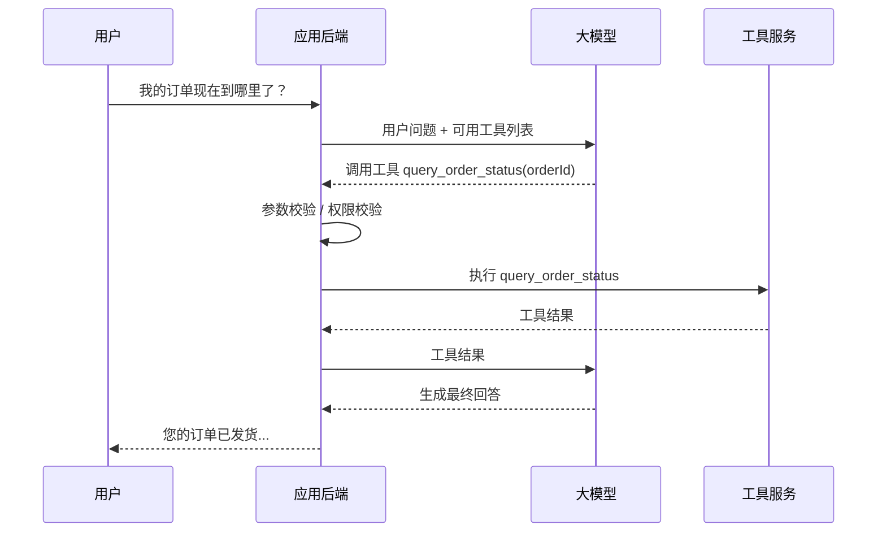
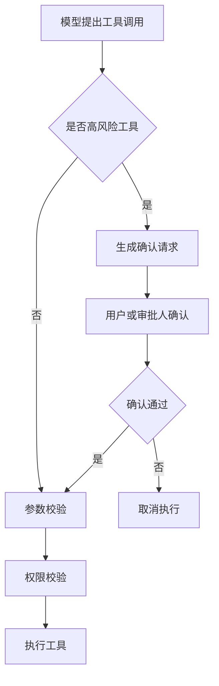

# 第 5 章：Tool Calling / Function Calling

更新时间：2026-06-03  
建议学习时间：5-7 天  
适合阶段：已经能完成模型调用和 Prompt 管理，准备让模型使用外部工具  
本章产出：3 个可调用工具、一个 Tool Calling API、一套工具权限校验、一张工具调用日志表、一份危险工具安全清单

## 5.1 本章学习目标

学完本章后，你应该能做到：

1. 解释 Tool Calling / Function Calling 的工作机制。
2. 区分“模型选择工具”和“后端执行工具”。
3. 设计工具名称、描述、参数 Schema 和返回值。
4. 使用 Spring AI `@Tool` 暴露 Java 方法。
5. 使用 LangChain4j `@Tool` 暴露 Java 方法。
6. 为工具调用增加参数校验、权限校验、日志和错误处理。
7. 识别哪些工具不能让模型自动执行。
8. 实现天气查询、订单查询、知识库搜索 3 个示例工具。

Tool Calling 是 Agent 的基础。没有工具，Agent 只能说；有了工具，Agent 才能查、算、读、写、执行。

## 5.2 什么是 Tool Calling

Tool Calling 是让模型在需要外部能力时，输出一个“工具调用请求”，由应用程序执行工具，再把工具结果返回给模型。

注意：模型本身不执行工具。真正执行工具的是你的后端程序。

### 基本流程



### 关键点

- 模型决定“是否需要工具”和“调用哪个工具”。
- 后端决定“工具是否允许执行”。
- 后端负责真实调用数据库、API 或业务服务。
- 工具返回结果后，模型再组织成用户能理解的回答。

## 5.3 Tool Calling 和普通结构化输出的关系

Tool Calling 本质上也是一种结构化输出。

普通结构化输出：

```json
{
  "answer": "RAG 是检索增强生成",
  "difficulty": "beginner"
}
```

工具调用输出：

```json
{
  "toolName": "query_order_status",
  "arguments": {
    "orderId": "O1001"
  }
}
```

区别在于：工具调用输出会触发后端执行动作。

因此，Tool Calling 比普通结构化输出更危险，也更需要工程控制。

## 5.4 一个好工具的设计标准

工具不是随便把 Java 方法暴露给模型。一个好工具应该满足：

| 标准 | 说明 |
| --- | --- |
| 名称清晰 | 模型看到名字就知道用途 |
| 描述明确 | 说明什么时候使用、什么时候不要使用 |
| 参数简单 | 参数越清楚越稳定 |
| 返回结构化 | 方便模型理解，也方便日志记录 |
| 权限可控 | 后端能判断用户是否能调用 |
| 无副作用优先 | 初期优先查询类工具 |
| 错误可解释 | 工具失败时返回明确错误 |

### 工具名称示例

好的名称：

```text
query_order_status
search_course_knowledge
get_current_weather
calculate_sales_growth
```

不好的名称：

```text
doIt
helper
callApi
query
tool1
```

模型依赖工具名称和描述来选择工具，命名模糊会显著降低调用质量。

## 5.5 工具分类

按风险分：

| 类型 | 例子 | 是否可自动执行 |
| --- | --- | --- |
| 只读查询 | 查天气、查订单、查知识库 | 通常可以 |
| 计算转换 | 计算增长率、格式化 JSON | 通常可以 |
| 写入操作 | 创建任务、保存草稿 | 需要谨慎 |
| 外部发送 | 发邮件、发群消息 | 建议人工确认 |
| 高风险操作 | 删除数据、退款、转账、改权限 | 必须人工确认或禁止 |

课程第 5 章只建议实现只读查询和计算类工具。

## 5.6 工具描述怎么写

工具描述要告诉模型：

- 这个工具能做什么。
- 什么时候应该使用。
- 需要哪些参数。
- 不适合什么情况。

### 示例：订单查询工具描述

```text
根据订单号查询订单状态。
当用户询问某个具体订单的物流、发货、签收状态时使用。
必须提供 orderId。
如果用户没有提供订单号，不要调用本工具，应先追问用户订单号。
本工具只用于查询，不会修改订单。
```

### 示例：知识库搜索工具描述

```text
搜索 AI Agent 课程知识库。
当用户询问课程概念、章节内容、学习路线、实践任务时使用。
输入 query 应该是简洁的检索关键词或问题。
本工具返回相关资料片段，不保证一定包含答案。
```

## 5.7 参数设计

参数应该简单、明确、可校验。

### 好的参数

```java
public record OrderStatusRequest(
    String orderId
) {
}
```

```java
public record WeatherRequest(
    String city
) {
}
```

```java
public record KnowledgeSearchRequest(
    String query,
    Integer topK
) {
}
```

### 不好的参数

```java
public record ToolRequest(
    String data
) {
}
```

问题：

- 参数含义不清。
- 不方便校验。
- 模型容易乱填。
- 日志不可读。

## 5.8 返回值设计

工具返回给模型的结果应该结构化、简洁、无敏感信息。

### 订单查询返回

```json
{
  "orderId": "O1001",
  "status": "已发货",
  "logisticsCompany": "顺丰",
  "trackingNo": "SF123456",
  "latestEvent": "包裹已到达上海转运中心"
}
```

不应该返回：

```json
{
  "buyerPhone": "13800000000",
  "buyerAddress": "上海市...",
  "internalRemark": "重要客户，优先处理"
}
```

除非这些字段对回答必要，且用户有权限。

### 工具错误返回

建议统一格式：

```json
{
  "success": false,
  "errorCode": "ORDER_NOT_FOUND",
  "message": "未找到该订单"
}
```

这样模型可以根据错误结果继续追问或解释。

## 5.9 Spring AI Tool Calling 基础

Spring AI 支持通过 `@Tool` 把 Java 方法暴露给模型。

### 示例：天气工具

```java
package com.example.agentcourse.ai.tool;

import org.springframework.ai.tool.annotation.Tool;
import org.springframework.ai.tool.annotation.ToolParam;
import org.springframework.stereotype.Component;

@Component
public class WeatherTools {

    @Tool(description = "根据城市名称查询当前天气。当用户询问某个城市天气时使用。")
    public WeatherResult getCurrentWeather(
        @ToolParam(description = "城市名称，例如：上海、北京") String city
    ) {
        if (city == null || city.isBlank()) {
            return new WeatherResult(city, false, "城市名称不能为空", null, null);
        }

        return new WeatherResult(city, true, null, "晴", "26°C");
    }
}
```

```java
package com.example.agentcourse.ai.tool;

public record WeatherResult(
    String city,
    boolean success,
    String errorMessage,
    String weather,
    String temperature
) {
}
```

### 在 ChatClient 中使用工具

```java
package com.example.agentcourse.ai.service;

import com.example.agentcourse.ai.tool.WeatherTools;
import org.springframework.ai.chat.client.ChatClient;
import org.springframework.stereotype.Service;

@Service
public class ToolCallingService {

    private final ChatClient chatClient;
    private final WeatherTools weatherTools;

    public ToolCallingService(ChatClient.Builder builder, WeatherTools weatherTools) {
        this.chatClient = builder
            .defaultSystem("""
                你是 AI 助手。
                当用户询问天气时，可以调用天气工具。
                工具结果不足时，请向用户说明。
                """)
            .build();
        this.weatherTools = weatherTools;
    }

    public String chat(String message) {
        return chatClient.prompt()
            .user(message)
            .tools(weatherTools)
            .call()
            .content();
    }
}
```

### 测试

输入：

```text
上海今天天气怎么样？
```

期望：

- 模型调用 `getCurrentWeather`。
- 工具返回天气结果。
- 模型组织成自然语言回答。

## 5.10 Spring AI 示例：订单查询工具

### 工具返回对象

```java
package com.example.agentcourse.ai.tool;

public record OrderStatusResult(
    String orderId,
    boolean success,
    String errorCode,
    String status,
    String logisticsCompany,
    String trackingNo,
    String latestEvent
) {
}
```

### 工具类

```java
package com.example.agentcourse.ai.tool;

import org.springframework.ai.tool.annotation.Tool;
import org.springframework.ai.tool.annotation.ToolParam;
import org.springframework.stereotype.Component;

@Component
public class OrderTools {

    @Tool(description = """
        根据订单号查询订单状态。
        当用户询问具体订单的发货、物流、签收状态时使用。
        必须提供 orderId；如果用户没有提供订单号，请先追问。
        本工具只查询订单，不会修改订单。
        """)
    public OrderStatusResult queryOrderStatus(
        @ToolParam(description = "订单号，例如 O1001") String orderId
    ) {
        if (orderId == null || orderId.isBlank()) {
            return new OrderStatusResult(orderId, false, "ORDER_ID_REQUIRED", null, null, null, null);
        }

        if (!"O1001".equals(orderId)) {
            return new OrderStatusResult(orderId, false, "ORDER_NOT_FOUND", null, null, null, null);
        }

        return new OrderStatusResult(
            orderId,
            true,
            null,
            "已发货",
            "顺丰",
            "SF123456",
            "包裹已到达上海转运中心"
        );
    }
}
```

### 重要提醒

这个示例没有真正做用户权限。真实项目中，查询订单前必须确认：

- 当前用户是谁。
- 当前用户是否有权查看该订单。
- 查询结果是否需要脱敏。

## 5.11 Spring AI 示例：知识库搜索工具

先做一个模拟知识库。

```java
package com.example.agentcourse.ai.tool;

import java.util.List;

public record KnowledgeSearchResult(
    boolean success,
    String query,
    List<KnowledgeSnippet> snippets
) {
}
```

```java
package com.example.agentcourse.ai.tool;

public record KnowledgeSnippet(
    String title,
    String content,
    String source
) {
}
```

工具：

```java
package com.example.agentcourse.ai.tool;

import java.util.List;
import org.springframework.ai.tool.annotation.Tool;
import org.springframework.ai.tool.annotation.ToolParam;
import org.springframework.stereotype.Component;

@Component
public class CourseKnowledgeTools {

    @Tool(description = """
        搜索 AI Agent 课程知识库。
        当用户询问课程概念、章节安排、学习路线、实践任务时使用。
        query 应该是简洁的问题或关键词。
        """)
    public KnowledgeSearchResult searchCourseKnowledge(
        @ToolParam(description = "检索问题或关键词") String query
    ) {
        if (query == null || query.isBlank()) {
            return new KnowledgeSearchResult(false, query, List.of());
        }

        return new KnowledgeSearchResult(
            true,
            query,
            List.of(
                new KnowledgeSnippet(
                    "第 1 章：AI Agent 全景",
                    "第 1 章讲解 Chatbot、RAG、Workflow、Agent、多 Agent 和 MCP 的区别。",
                    "chapters/01-ai-agent-overview.md"
                ),
                new KnowledgeSnippet(
                    "第 5 章：Tool Calling",
                    "第 5 章讲解模型如何选择工具，后端如何执行工具，并进行权限和日志控制。",
                    "chapters/05-tool-calling.md"
                )
            )
        );
    }
}
```

后续第 6 章会把这个模拟搜索替换成真正的 RAG 检索。

## 5.12 多工具调用服务

把 3 个工具都传给模型：

```java
package com.example.agentcourse.ai.service;

import com.example.agentcourse.ai.tool.CourseKnowledgeTools;
import com.example.agentcourse.ai.tool.OrderTools;
import com.example.agentcourse.ai.tool.WeatherTools;
import org.springframework.ai.chat.client.ChatClient;
import org.springframework.stereotype.Service;

@Service
public class MultiToolChatService {

    private final ChatClient chatClient;
    private final WeatherTools weatherTools;
    private final OrderTools orderTools;
    private final CourseKnowledgeTools knowledgeTools;

    public MultiToolChatService(
        ChatClient.Builder builder,
        WeatherTools weatherTools,
        OrderTools orderTools,
        CourseKnowledgeTools knowledgeTools
    ) {
        this.chatClient = builder
            .defaultSystem("""
                你是企业 AI 助手。
                你可以根据用户问题选择合适工具。
                如果用户没有提供工具所需参数，请先追问，不要编造参数。
                工具失败时，请向用户说明失败原因。
                """)
            .build();
        this.weatherTools = weatherTools;
        this.orderTools = orderTools;
        this.knowledgeTools = knowledgeTools;
    }

    public String chat(String message) {
        return chatClient.prompt()
            .user(message)
            .tools(weatherTools, orderTools, knowledgeTools)
            .call()
            .content();
    }
}
```

测试问题：

```text
上海今天天气怎么样？
```

```text
帮我查一下订单 O1001 的物流状态。
```

```text
第 1 章主要学习什么？
```

## 5.13 LangChain4j Tool Calling 基础

LangChain4j 也支持使用 `@Tool` 暴露方法。

### 工具类

```java
package com.example.agentcourse.ai.langchain4j;

import dev.langchain4j.agent.tool.Tool;

public class WeatherTool {

    @Tool("根据城市名称查询当前天气")
    public String getCurrentWeather(String city) {
        if (city == null || city.isBlank()) {
            return "城市名称不能为空";
        }
        return city + " 当前天气晴，温度 26°C";
    }
}
```

### AI Service

```java
package com.example.agentcourse.ai.langchain4j;

import dev.langchain4j.service.SystemMessage;
import dev.langchain4j.service.UserMessage;

public interface ToolAssistant {

    @SystemMessage("""
        你是企业 AI 助手。
        如果用户询问天气，可以调用天气工具。
        """)
    @UserMessage("{{message}}")
    String chat(String message);
}
```

### 创建服务

```java
ToolAssistant assistant = AiServices.builder(ToolAssistant.class)
    .chatLanguageModel(model)
    .tools(new WeatherTool())
    .build();

String answer = assistant.chat("北京今天天气怎么样？");
```

## 5.14 参数校验

工具参数必须校验。模型可能传：

- 空值。
- 错误格式。
- 过长字符串。
- 不存在 ID。
- 恶意内容。

### 校验示例

```java
private void validateOrderId(String orderId) {
    if (orderId == null || orderId.isBlank()) {
        throw new IllegalArgumentException("订单号不能为空");
    }

    if (!orderId.matches("O\\d{4,12}")) {
        throw new IllegalArgumentException("订单号格式不正确");
    }
}
```

### 参数校验原则

- 必填字段不能为空。
- ID 和编码要校验格式。
- 数字要校验范围。
- topK 这类参数要设最大值。
- 字符串要限制长度。
- 不要直接把模型参数拼进 SQL。

## 5.15 权限校验

工具权限不能靠模型判断。必须由后端判断。

### 示例：订单权限

```java
public OrderStatusResult queryOrderStatus(String orderId, UserContext user) {
    validateOrderId(orderId);

    if (!orderPermissionService.canViewOrder(user.userId(), orderId)) {
        return new OrderStatusResult(orderId, false, "PERMISSION_DENIED", null, null, null, null);
    }

    return orderService.queryStatus(orderId);
}
```

### 权限校验维度

| 维度 | 例子 |
| --- | --- |
| 用户身份 | 当前用户是谁 |
| 租户 | 当前用户属于哪个公司 |
| 资源权限 | 是否能看该订单、该文档 |
| 操作权限 | 是否能查询、创建、删除 |
| 数据脱敏 | 是否能看到手机号、地址 |
| 审批要求 | 是否需要人工确认 |

### 错误做法

```text
请你不要查询用户无权限的订单。
```

这句话可以写进 prompt，但不能作为真正权限控制。

## 5.16 工具调用日志

每一次工具调用都应该记录。

### 日志字段建议

| 字段 | 说明 |
| --- | --- |
| id | 日志 ID |
| request_id | 一次用户请求的 ID |
| user_id | 用户 ID |
| tool_name | 工具名称 |
| arguments_json | 工具参数 |
| result_summary | 结果摘要 |
| success | 是否成功 |
| error_code | 错误码 |
| duration_ms | 耗时 |
| created_at | 创建时间 |

### 数据表示例

```sql
create table ai_tool_call_log (
    id bigint primary key,
    request_id varchar(64) not null,
    user_id varchar(64),
    tool_name varchar(128) not null,
    arguments_json text,
    result_summary text,
    success boolean not null,
    error_code varchar(64),
    duration_ms bigint,
    created_at timestamp not null
);
```

### 日志注意

- 参数要脱敏。
- 结果不要保存过多敏感数据。
- 高风险工具要记录审批人。
- 日志要能串联到模型调用日志。

## 5.17 危险工具与人工确认

初学阶段不要直接实现危险工具，但必须知道风险。

### 高风险工具

- 删除文件。
- 删除订单。
- 审批退款。
- 发邮件。
- 群发消息。
- 修改权限。
- 创建付款。
- 执行 SQL 更新。
- 调用生产部署。

### 人工确认流程



### 确认内容

用户确认前必须看到：

- 工具名称。
- 将要执行的动作。
- 关键参数。
- 影响范围。
- 是否可撤销。

不要让模型一句“我已经确认了”就执行高风险工具。

## 5.18 工具调用失败后的处理

工具可能失败，模型要知道如何继续。

### 常见失败

| 失败 | 处理 |
| --- | --- |
| 参数缺失 | 让模型追问用户 |
| 权限不足 | 告诉用户无权限 |
| 资源不存在 | 说明未找到 |
| 服务超时 | 提示稍后重试 |
| 返回数据为空 | 告诉用户未查询到 |
| 工具异常 | 返回可理解错误 |

### Prompt 中加入失败处理

```text
如果工具返回 success=false：
1. 不要编造工具结果。
2. 根据 errorCode 向用户解释。
3. 如果缺少参数，请追问用户。
4. 如果权限不足，请说明无法访问。
```

## 5.19 Tool Calling 和 Agent 的关系

Tool Calling 是 Agent 的基础，但不等于 Agent。

| 能力 | Tool Calling | Agent |
| --- | --- | --- |
| 调用工具 | 可以 | 可以 |
| 多轮执行 | 不一定 | 通常需要 |
| 自主规划 | 较弱 | 较强 |
| 观察工具结果后继续行动 | 简单场景可支持 | 核心能力 |
| 停止条件 | 通常简单 | 必须设计 |
| 运行轨迹 | 建议记录 | 必须记录 |

第 5 章只要求你掌握工具调用。第 8 章才会进入 Agent 执行循环。

## 5.20 本章完整实践任务

完成下面 6 个任务，才算完成第 5 章。

### 任务 1：天气查询工具

工具名：

```text
get_current_weather
```

参数：

```json
{
  "city": "上海"
}
```

返回：

```json
{
  "city": "上海",
  "weather": "晴",
  "temperature": "26°C"
}
```

验收：

- 用户问天气时模型能调用工具。
- 城市为空时返回错误。
- 工具结果能被模型转成自然语言。

### 任务 2：订单查询工具

工具名：

```text
query_order_status
```

参数：

```json
{
  "orderId": "O1001"
}
```

返回：

```json
{
  "orderId": "O1001",
  "status": "已发货",
  "logisticsCompany": "顺丰",
  "trackingNo": "SF123456",
  "latestEvent": "包裹已到达上海转运中心"
}
```

验收：

- 没有订单号时，模型先追问。
- 订单不存在时，模型说明未找到。
- 查询前有权限校验入口。

### 任务 3：课程知识库搜索工具

工具名：

```text
search_course_knowledge
```

参数：

```json
{
  "query": "第 1 章学习内容"
}
```

返回：

```json
{
  "snippets": [
    {
      "title": "第 1 章：AI Agent 全景",
      "content": "...",
      "source": "chapters/01-ai-agent-overview.md"
    }
  ]
}
```

验收：

- 用户问课程内容时模型能调用。
- 工具返回资料片段。
- 模型回答时提到来源。

### 任务 4：多工具路由

实现一个聊天接口：

```text
POST /api/ai/tools/chat
```

支持下面问题：

```text
上海天气怎么样？
```

```text
帮我查订单 O1001。
```

```text
第 5 章主要讲什么？
```

验收：

- 模型能选择正确工具。
- 不相关问题不乱调用工具。
- 参数不足时先追问。

### 任务 5：工具调用日志

创建工具调用日志表或日志文件，记录：

```text
requestId
userId
toolName
arguments
success
errorCode
durationMs
createdAt
```

验收：

- 每次工具调用都有日志。
- 失败也有日志。
- 参数中的敏感信息会脱敏。

### 任务 6：危险工具安全清单

创建文件：

```text
notes/chapter-05-dangerous-tools.md
```

列出你系统中可能的危险工具：

| 工具 | 风险 | 是否允许自动执行 | 需要什么确认 |
| --- | --- | --- | --- |
| send_email | 可能误发 | 否 | 用户确认收件人和内容 |
| delete_document | 删除资料 | 否 | 管理员确认 |
| refund_order | 财务损失 | 否 | 审批流 |

验收：

- 至少列出 5 个危险工具。
- 每个工具有风险说明。
- 每个工具有确认策略。

## 5.21 本章自测题

### 概念题

1. Tool Calling 中模型和后端分别负责什么？
2. 为什么工具参数必须校验？
3. 为什么权限控制不能只靠 prompt？
4. 什么样的工具适合初期自动调用？
5. 工具调用日志应该记录哪些字段？
6. Tool Calling 和 Agent 有什么区别？

### 判断题

1. 模型调用工具时，工具是由模型自己执行的。  
   答案：错误。

2. 只读查询工具通常比写入工具更适合自动执行。  
   答案：正确。

3. 只要工具描述写清楚，就不需要参数校验。  
   答案：错误。

4. 高风险工具应该加入人工确认。  
   答案：正确。

5. Tool Calling 就等于完整 Agent。  
   答案：错误。

### 实战题

设计一个 `calculate_sales_growth` 工具。

要求写出：

1. 工具名称。
2. 工具描述。
3. 参数 JSON。
4. 返回 JSON。
5. 参数校验规则。
6. 失败处理。
7. 是否需要权限。

示例参数：

```json
{
  "previousSales": 1200000,
  "currentSales": 1500000
}
```

期望返回：

```json
{
  "growthRate": "25%",
  "summary": "本期销售额相比上期增长 25%"
}
```

## 5.22 本章完成标准

你完成第 5 章的标准：

- 能解释 Tool Calling 的完整链路。
- 至少实现 3 个工具。
- 能让模型根据问题选择工具。
- 工具参数有校验。
- 工具有权限校验入口。
- 工具调用有日志。
- 能列出危险工具并设计人工确认流程。

完成后，你就具备了进入 RAG 和 Agent 的基础。第 6 章会把“知识库搜索工具”升级成真正的 RAG 系统。

## 5.23 本章学习资料

### 必读资料

- [Spring AI Tool Calling](https://docs.spring.io/spring-ai/reference/api/tools.html)
- [Spring AI Chat Client API](https://docs.spring.io/spring-ai/reference/api/chatclient.html)
- [LangChain4j Tools Tutorial](https://docs.langchain4j.dev/tutorials/tools/)
- [OpenAI Function Calling Guide](https://platform.openai.com/docs/guides/function-calling)
- [OpenAI Agents SDK - Tools](https://openai.github.io/openai-agents-python/tools/)

### 扩展资料

- [Model Context Protocol Documentation](https://modelcontextprotocol.io/docs/getting-started/intro)
- [OpenAI Agents SDK - Guardrails](https://openai.github.io/openai-agents-python/guardrails/)
- [Anthropic - Building Effective Agents](https://www.anthropic.com/engineering/building-effective-agents)

## 5.24 本章复盘模板

```markdown
# 第 5 章复盘

## 我实现了哪些工具

## 模型什么时候会选择正确工具

## 模型什么时候会选错工具

## 我做了哪些参数校验

## 我做了哪些权限控制

## 我记录了哪些工具调用日志

## 哪些工具我认为必须人工确认

## 进入 RAG 前我还不清楚的问题
```

Tool Calling 是让 AI 应用从“会说”走向“会做”的第一步。越早建立工具边界、权限和日志意识，后面的 Agent 才越不容易失控。
