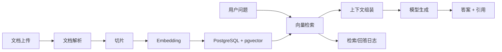

# 第 7 章：RAG 核心：从文档到可信答案

更新时间：2026-07-09
建议学习时间：7-10 天  
适合阶段：已经能完成模型调用、Prompt 管理和 Tool Calling，准备构建企业知识库问答 MVP  
本章产出：一个可运行的基础 RAG 服务，支持文档上传、解析、切片、向量化、检索、生成答案和引用溯源

## 7.1 本章学习目标

学完本章后，你应该能做到：

1. 解释 RAG 的完整链路：加载、解析、切片、向量化、索引、检索、组装上下文、生成答案、返回引用。
2. 用 Python 实现最小 RAG 管线，而不是只调用现成框架。
3. 使用 PostgreSQL + pgvector 保存文档、切片和向量。
4. 为回答返回引用来源，避免模型自由编造出处。
5. 建立最小 RAG 测试集，判断“能回答”是否真的来自检索材料。
6. 知道哪些问题是核心 RAG 无法解决的，需要第 11 章高级 RAG。

本章的核心不是“接一个向量库”，而是建立可检查的数据链路。

## 7.2 本章 MVP 范围

先做一个窄而完整的系统：

| 能力 | 本章要求 | 暂不要求 |
| --- | --- | --- |
| 文档格式 | Markdown、TXT、PDF | 复杂扫描 PDF、图片 OCR |
| 切片 | 按标题/段落 + token 长度兜底 | 父子切片、表格语义恢复 |
| 检索 | 向量 Top-K + 元数据过滤 | 混合检索、rerank |
| 生成 | 基于检索片段回答 | 多轮 Agent 自主检索 |
| 引用 | 返回 chunk 来源 | 引用精确到页码/单元格 |
| 权限 | 文档级权限字段 | 完整租户 RBAC |
| 评估 | 10-20 条手工测试集 | 自动化多指标评估平台 |

MVP 做小一点，才能把链路做扎实。

## 7.3 推荐架构



关键原则：

- 文档解析、切片、检索、生成要能分别测试。
- 引用必须来自检索结果，不允许模型自行生成来源。
- 权限过滤必须发生在检索前或检索时，不是生成后再遮盖。
- 每次回答都要保存检索结果，便于回放和评估。

## 7.4 推荐项目结构

```text
app/
  api/
    rag_routes.py
  rag/
    schemas.py
    loaders.py
    chunker.py
    embeddings.py
    repository.py
    retriever.py
    generator.py
    service.py
  prompts/
    knowledge_qa.md
  observability/
    logging.py
tests/
  rag/
    test_chunker.py
    test_retriever.py
    test_generator.py
evals/
  rag_cases.jsonl
```

每个文件职责：

| 文件 | 职责 |
| --- | --- |
| `loaders.py` | 把文件解析成文本和元数据 |
| `chunker.py` | 把文本切成可检索片段 |
| `embeddings.py` | 调用 embedding 模型 |
| `repository.py` | 读写 documents、chunks、runs |
| `retriever.py` | 根据问题检索相关 chunks |
| `generator.py` | 组装 prompt 并生成答案 |
| `service.py` | 串联上传、索引、问答流程 |

## 7.5 数据库表设计

### documents

```sql
create table documents (
  id text primary key,
  tenant_id text not null,
  title text not null,
  source_type text not null,
  storage_uri text,
  metadata_json jsonb not null default '{}',
  status text not null,
  created_by text not null,
  created_at timestamptz not null default now()
);
```

### document_chunks

```sql
create extension if not exists vector;

create table document_chunks (
  id text primary key,
  document_id text not null references documents(id),
  tenant_id text not null,
  chunk_index integer not null,
  title_path text,
  content text not null,
  token_count integer not null,
  metadata_json jsonb not null default '{}',
  embedding vector(1536),
  created_at timestamptz not null default now()
);

create index document_chunks_embedding_idx
on document_chunks using ivfflat (embedding vector_cosine_ops);

create index document_chunks_tenant_idx
on document_chunks (tenant_id);
```

向量维度必须和 embedding 模型一致。模型更换时，要记录 embedding 模型版本并重新索引。

### rag_runs

```sql
create table rag_runs (
  id text primary key,
  tenant_id text not null,
  user_id text not null,
  question text not null,
  answer text,
  status text not null,
  model text not null,
  latency_ms integer,
  error_code text,
  created_at timestamptz not null default now()
);
```

### retrieval_hits

```sql
create table retrieval_hits (
  id text primary key,
  rag_run_id text not null references rag_runs(id),
  chunk_id text not null references document_chunks(id),
  rank integer not null,
  score double precision not null,
  content_preview text not null,
  created_at timestamptz not null default now()
);
```

## 7.6 文档解析

先支持三类格式：

| 格式 | 推荐库 | 注意点 |
| --- | --- | --- |
| Markdown / TXT | 标准库 | 保留标题结构 |
| PDF | `pypdf` | 扫描件效果差，需要 OCR 才能处理 |
| Word | `python-docx` | 标题、表格、段落要分开处理 |

解析结果统一为：

```python
from pydantic import BaseModel, Field


class ParsedDocument(BaseModel):
    title: str
    text: str
    metadata: dict[str, str] = Field(default_factory=dict)
```

本章不要追求“解析所有格式”。先保证解析后的文本可检查、可切片、可追踪来源。

## 7.7 切片策略

基础切片推荐：

1. 按 Markdown 标题分段。
2. 标题段落过长时按段落继续切。
3. 单段仍过长时按 token 或字符长度兜底。
4. 每个 chunk 保留 `title_path`、`document_id`、`chunk_index`。

切片对象：

```python
from pydantic import BaseModel, Field


class DocumentChunk(BaseModel):
    document_id: str
    chunk_index: int
    title_path: str | None = None
    content: str
    token_count: int
    metadata: dict[str, str] = Field(default_factory=dict)
```

切片验收：

- chunk 不应过长，避免塞满上下文。
- chunk 不应过短，避免失去语义。
- 同一标题下的上下文关系要尽量保留。
- 每个 chunk 能追溯回原文档。

## 7.8 Embedding 与索引

Embedding 层负责把 chunk 转成向量。

注意事项：

- 记录 embedding 模型名称和维度。
- 批量生成 embedding，避免逐条请求导致慢和贵。
- 失败时可重试，但不能重复插入 chunk。
- 文档更新后要能重新索引。

推荐状态流转：

```text
uploaded -> parsing -> chunking -> embedding -> indexed -> failed
```

如果文档状态不是 `indexed`，问答时不应该检索它。

## 7.9 检索器

基础检索只做向量 Top-K：

```sql
select
  id,
  document_id,
  title_path,
  content,
  1 - (embedding <=> :query_embedding) as score
from document_chunks
where tenant_id = :tenant_id
order by embedding <=> :query_embedding
limit :top_k;
```

检索器必须接收：

| 参数 | 说明 |
| --- | --- |
| `tenant_id` | 租户隔离 |
| `user_id` | 后续权限过滤使用 |
| `query` | 用户问题 |
| `top_k` | 返回片段数量 |

不要先查全库再在应用层过滤权限。企业场景里，这会带来权限泄露风险。

## 7.10 上下文组装

检索结果不能无脑塞进 prompt。建议格式：

```text
你是企业知识库问答助手。
请仅基于给定资料回答用户问题。
如果资料中没有答案，请回答“根据当前资料无法确认”。
每个关键结论后面标注引用编号，例如 [1]。

用户问题：
{{question}}

资料：
[1] 来源：{{source_1}}
{{content_1}}

[2] 来源：{{source_2}}
{{content_2}}
```

上下文组装规则：

- 按检索分数排序。
- 过滤低于阈值的片段。
- 控制总 token 数。
- 保留引用编号和来源。
- 不把用户输入混入资料区。

## 7.11 生成答案与引用

输出对象：

```python
class RagCitation(BaseModel):
    id: int
    document_id: str
    chunk_id: str
    title: str
    quote: str


class RagAnswer(BaseModel):
    answer: str
    citations: list[RagCitation]
    confidence: str
    missing_info: str | None = None
```

引用规则：

- `citations` 必须从 retrieval hits 生成。
- `quote` 只能截取 chunk 中真实存在的文本。
- 如果答案没有引用支撑，应该降低 confidence 或说明无法确认。

## 7.12 API 设计

### 上传文档

```text
POST /api/rag/documents
```

返回：

```json
{
  "document_id": "doc_001",
  "status": "uploaded"
}
```

### 索引文档

```text
POST /api/rag/documents/{document_id}/index
```

返回：

```json
{
  "document_id": "doc_001",
  "status": "indexed",
  "chunk_count": 42
}
```

### 提问

```text
POST /api/rag/query
```

请求：

```json
{
  "question": "公司的年假制度是什么？",
  "top_k": 5
}
```

返回：

```json
{
  "answer": "根据资料，员工年假规则为...",
  "citations": [
    {
      "id": 1,
      "document_id": "doc_001",
      "chunk_id": "chk_001",
      "title": "员工休假制度",
      "quote": "员工连续工作满一年后..."
    }
  ],
  "confidence": "high",
  "missing_info": null
}
```

## 7.13 最小评估集

从第 7 章开始就要建立评估意识。创建：

```text
evals/rag_cases.jsonl
```

每行一个用例：

```json
{"id":"case_001","question":"员工满一年后有几天年假？","expected_answer_keywords":["年假","5天"],"expected_sources":["员工休假制度"],"must_refuse":false}
```

最小指标：

| 指标 | 说明 |
| --- | --- |
| retrieval_hit | 预期文档是否进入 Top-K |
| answer_contains_keywords | 答案是否包含关键事实 |
| citation_present | 是否返回引用 |
| refusal_correct | 资料不足时是否拒答 |

本章先不用追求复杂评分，先保证每次改切片、检索、prompt 后能跑同一组问题。

## 7.14 MVP / 进阶 / 生产化验收

### MVP

- 能上传 Markdown/TXT/PDF。
- 能解析并切片。
- 能生成 embedding 并写入 pgvector。
- 能基于文档回答问题。
- 能返回引用。
- 有 10 条评估用例。

### 进阶

- 支持 Word。
- 支持文档删除和重新索引。
- 支持按租户过滤。
- 每次回答保存 retrieval hits。
- 评估脚本能输出通过率。

### 生产化

- 文档解析异步化。
- 支持大文件上传和失败重试。
- 支持用户级权限过滤。
- 支持索引版本管理。
- 支持评估报告和回归趋势。

## 7.15 常见问题

| 问题 | 原因 | 处理 |
| --- | --- | --- |
| 检索不到 | 切片不合理、query 表达不同 | 第 11 章做查询改写和混合检索 |
| 检索到了但答错 | prompt 没有限制、上下文太多 | 加强引用规则，压缩上下文 |
| 引用不准确 | 引用由模型生成 | 引用由后端 retrieval hits 生成 |
| 表格问答差 | 基础切片破坏表格语义 | 第 11 章做表格专门处理 |
| 权限泄露 | 先检索后过滤 | 在 SQL / 检索层加入权限条件 |

## 7.16 本章学习资料

- [Retrieval-Augmented Generation Paper](https://arxiv.org/abs/2005.11401)
- [pgvector](https://github.com/pgvector/pgvector)
- [LlamaIndex Documentation](https://docs.llamaindex.ai/)
- [Haystack Documentation](https://docs.haystack.deepset.ai/)
- [OpenAI API Documentation](https://developers.openai.com/api/docs)

## 7.17 本章复盘模板

```markdown
# 第 7 章复盘

## 我支持了哪些文档格式

## 我的切片策略是什么

## 我的向量库表结构是什么

## 我的 RAG 问答 API 是什么

## 我如何保证引用来自真实检索结果

## 我的 10 条评估用例是什么

## 当前 RAG 效果最差的问题是什么

## 进入第 11 章前我准备优化什么
```
