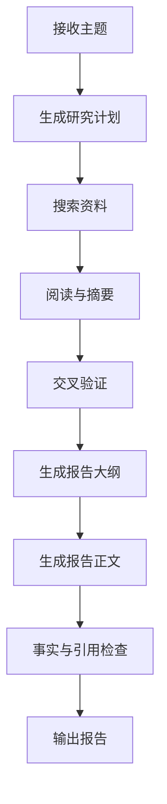

# 第 9 章：Workflow 与 State Machine

更新时间：2026-07-09
建议学习时间：5-7 天  
适合阶段：已经能实现单 Agent，但发现部分任务需要更稳定、可恢复、可审计的流程  
本章产出：一个可恢复的深度研究 Workflow，支持状态持久化、步骤日志、失败重试和人工确认

## 9.1 本章学习目标

学完本章后，你应该能做到：

1. 判断什么时候应该用 Workflow，而不是 Agent 自主循环。
2. 设计任务状态、步骤状态和失败状态。
3. 使用 Python 函数组合或 LangGraph 实现多步骤流程。
4. 为长任务增加 checkpoint、重试、超时和人工确认。
5. 设计幂等 key，避免重复执行危险步骤。
6. 实现一个“研究主题 -> 搜索 -> 阅读 -> 摘要 -> 报告”的工作流。
7. 了解 LangGraph、Temporal、Pydantic AI Durable Execution 与 background mode 的取舍。

本章的核心思想：越接近生产，越要把开放任务拆成可观察、可恢复的步骤。

## 9.2 Workflow 与 Agent 的区别

| 维度 | Workflow | Agent |
| --- | --- | --- |
| 步骤 | 预先定义 | 动态决定 |
| 稳定性 | 高 | 中到低 |
| 可审计 | 强 | 依赖 trace |
| 灵活性 | 中 | 高 |
| 适合 | 审批、报告、批处理、长任务 | 探索、工具选择、开放问题 |
| 风险 | 流程设计复杂 | 循环、失控、成本高 |

判断规则：

- 步骤明确，优先 Workflow。
- 失败成本高，优先 Workflow。
- 需要人工确认，优先 Workflow。
- 任务开放且步骤不固定，再考虑 Agent。

## 9.3 推荐状态模型

任务状态：

```python
from enum import StrEnum


class WorkflowStatus(StrEnum):
    pending = "pending"
    running = "running"
    waiting_for_approval = "waiting_for_approval"
    completed = "completed"
    failed = "failed"
    cancelled = "cancelled"
```

步骤状态：

```python
class StepStatus(StrEnum):
    pending = "pending"
    running = "running"
    completed = "completed"
    failed = "failed"
    skipped = "skipped"
```

每个 workflow run 至少记录：

| 字段 | 说明 |
| --- | --- |
| `run_id` | 工作流运行 ID |
| `workflow_name` | 工作流名称 |
| `status` | 当前状态 |
| `input_json` | 输入参数 |
| `state_json` | 当前状态 |
| `created_by` | 创建人 |
| `created_at` | 创建时间 |
| `updated_at` | 更新时间 |

## 9.4 数据库表设计

### workflow_runs

```sql
create table workflow_runs (
  id text primary key,
  workflow_name text not null,
  tenant_id text not null,
  user_id text not null,
  status text not null,
  input_json jsonb not null,
  state_json jsonb not null default '{}',
  error_code text,
  created_at timestamptz not null default now(),
  updated_at timestamptz not null default now()
);
```

### workflow_steps

```sql
create table workflow_steps (
  id text primary key,
  workflow_run_id text not null references workflow_runs(id),
  step_name text not null,
  step_index integer not null,
  status text not null,
  input_json jsonb not null default '{}',
  output_json jsonb not null default '{}',
  error_code text,
  latency_ms integer,
  created_at timestamptz not null default now(),
  updated_at timestamptz not null default now()
);
```

### approval_requests

```sql
create table approval_requests (
  id text primary key,
  workflow_run_id text not null references workflow_runs(id),
  step_name text not null,
  title text not null,
  summary text not null,
  risk_level text not null,
  status text not null,
  approved_by text,
  approved_at timestamptz,
  created_at timestamptz not null default now()
);
```

## 9.5 深度研究 Workflow

目标：

```text
输入一个研究主题，生成一份带来源的简版研究报告。
```

步骤：



每一步都要有输入、输出、失败处理。

| 步骤 | 输入 | 输出 | 失败处理 |
| --- | --- | --- | --- |
| 生成研究计划 | topic | search_queries | 计划为空则失败 |
| 搜索资料 | search_queries | sources | 搜索失败可重试 |
| 阅读与摘要 | sources | notes | 单源失败可跳过 |
| 交叉验证 | notes | verified_facts | 冲突事实要标记 |
| 生成大纲 | verified_facts | outline | 大纲为空则失败 |
| 生成正文 | outline | draft | 输出过长则分段 |
| 引用检查 | draft + sources | report | 引用缺失则退回 |

## 9.6 LangGraph 适用点

LangGraph 适合：

- 多节点图。
- 条件分支。
- 可恢复执行。
- human-in-the-loop。
- 长任务状态持久化。

本章可以先用普通 Python 函数组合实现，等流程稳定后再迁移 LangGraph。

迁移判断：

| 情况 | 是否需要 LangGraph |
| --- | --- |
| 只有 3 个线性步骤 | 不需要 |
| 有多个分支和回退 | 可以考虑 |
| 需要人工确认节点 | 可以考虑 |
| 需要长时间运行和恢复 | 推荐 |
| 多 Agent 协作图 | 推荐 |

## 9.7 Durable Execution 与 Background Mode

长任务最怕两类问题：

- 模型、搜索、文件解析或外部 API 中途失败。
- 服务重启、网络断开或用户关闭页面导致任务状态丢失。

因此生产系统要把“长任务”拆成可恢复步骤，而不是让一次请求从头跑到尾。

| 方案 | 适合场景 | 备注 |
| --- | --- | --- |
| 数据库状态机 | 课程 MVP、线性流程、团队想完全掌控 | 最容易理解，代码多一些 |
| LangGraph | 多分支、human-in-the-loop、多 Agent 图 | Python Agent 编排友好 |
| Temporal | 企业级长任务、强重试、跨服务编排 | 运维和学习成本更高 |
| Pydantic AI Durable Execution | 类型安全 Agent + 可恢复运行时 | 适合 Pydantic AI 技术栈 |
| Background mode | 平台侧异步长任务执行 | 适合深度研究、长报告等耗时任务 |

课程建议：

1. 第 9 章先做数据库状态机，理解状态和恢复。
2. 复杂分支再引入 LangGraph。
3. 企业长期运行任务再比较 Temporal。
4. 如果主线选择 Pydantic AI，再评估 durable execution。
5. 对外 API 统一返回 `run_id`，前端用任务状态展示进度。

## 9.8 人工确认节点

高风险步骤必须暂停并等待确认。

适合人工确认：

- 发送邮件。
- 提交审批。
- 删除文档。
- 执行 SQL 写操作。
- 对外发布报告。

确认卡片：

```json
{
  "title": "确认发送研究报告",
  "summary": "将向 sales-team@example.com 发送 8 页竞品分析报告。",
  "risk_level": "high",
  "action": "send_email",
  "arguments": {
    "to": "sales-team@example.com",
    "subject": "竞品分析报告"
  }
}
```

用户确认前，工具不得执行。

## 9.9 幂等与重试

长任务一定会失败。失败不可怕，不可恢复才可怕。

### 幂等 key

每个可能产生副作用的步骤都要有幂等 key：

```text
workflow_run_id + step_name + business_object_id
```

例如：

```text
run_001:send_email:report_001
```

### 重试策略

| 错误 | 是否重试 |
| --- | --- |
| 网络超时 | 可以 |
| 限流 | 可以，退避 |
| 参数错误 | 不重试 |
| 权限不足 | 不重试 |
| 人工拒绝 | 不重试 |

## 9.10 Workflow 与 Agent 的结合

推荐方式：

```text
Workflow 控制主流程
Agent 处理局部开放任务
Tool 执行具体动作
```

例子：

- Workflow 决定“搜索 -> 阅读 -> 总结 -> 审核 -> 输出”。
- Agent 在“搜索资料”步骤里选择搜索关键词。
- Tool 执行搜索 API。
- Workflow 保存结果并进入下一步。

这样既保留 Agent 灵活性，又保证主流程可控。

## 9.11 测试场景

至少准备：

| 场景 | 预期 |
| --- | --- |
| 正常研究主题 | 完成报告 |
| 搜索无结果 | 返回资料不足 |
| 某个来源读取失败 | 跳过并记录 |
| 事实冲突 | 报告中标记冲突 |
| 输出过长 | 分段生成 |
| 人工确认拒绝 | 停止在 cancelled |
| 重复提交 | 幂等返回同一 run |
| 工具超时 | 重试后失败 |

## 9.12 MVP / 进阶 / 生产化验收

### MVP

- 有一个线性研究 Workflow。
- 每步有状态记录。
- 支持失败后查看失败步骤。
- 能生成带引用的简版报告。

### 进阶

- 支持人工确认节点。
- 支持有限重试。
- 支持幂等 key。
- 支持从失败步骤恢复。

### 生产化

- 使用 LangGraph 或 Temporal 管理复杂流程。
- 支持任务队列和异步 worker。
- 支持步骤级权限和审计。
- 支持 Workflow 版本管理。
- 支持运行中取消和超时回收。
- 支持 durable execution 或同等的 checkpoint 恢复能力。

## 9.13 常见误区

- 所有复杂任务都交给 Agent 自己规划。
- 长任务不保存中间状态。
- 工具失败后从头重跑。
- 没有幂等设计。
- 人工确认只是前端弹窗，后端没有强制检查。
- Workflow 版本变更后无法解释历史任务。
- 把 background mode 当作可靠性本身，而不设计自己的状态表和审计表。

## 9.14 本章学习资料

- [LangGraph Documentation](https://docs.langchain.com/oss/python/langgraph/overview)
- [Anthropic - Building Effective Agents](https://www.anthropic.com/engineering/building-effective-agents)
- [OpenAI Agents SDK - Handoffs](https://openai.github.io/openai-agents-python/handoffs/)
- [OpenAI Agents SDK - Guardrails](https://openai.github.io/openai-agents-python/guardrails/)
- [OpenAI Background Mode](https://developers.openai.com/api/docs/guides/background)
- [Pydantic AI Durable Execution](https://pydantic.dev/docs/ai/integrations/durable_execution/overview/)
- [Temporal Documentation](https://docs.temporal.io/)

## 9.15 本章复盘模板

```markdown
# 第 9 章复盘

## 我的 Workflow 包含哪些步骤

## 每一步的输入输出是什么

## 哪些步骤可以失败并重试

## 哪些步骤需要人工确认

## 我的状态表如何设计

## 我的幂等 key 是什么

## 哪些局部任务交给 Agent

## 哪些主流程必须由 Workflow 控制
```
