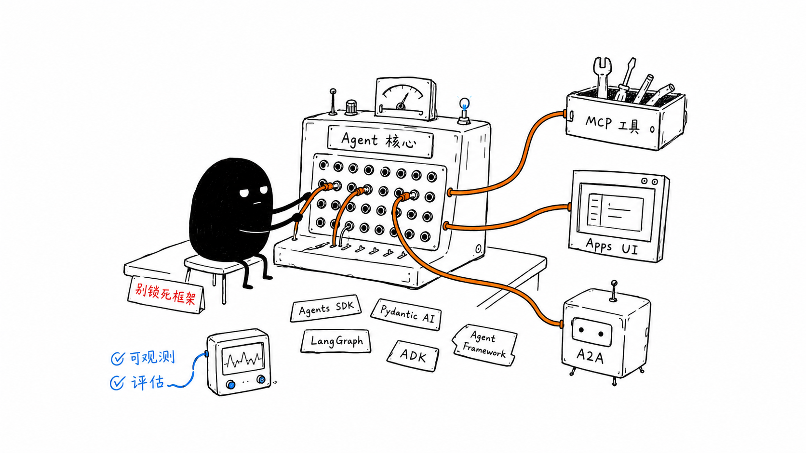

# 第 12 章：多 Agent 设计与互操作

更新时间：2026-07-10
建议学习时间：5-7 天
本章产出：一个先 agents-as-tools、再 handoff、最后可选远程 A2A 的渐进设计；一组框架无关的结构化合同；一份按成熟度和业务需要形成的互操作决策记录。

## 本章定位

多 Agent 的目标是把职责、工具、权限和评估边界变清楚，不是增加会互相聊天的 prompt 数量。先证明一个受控 Agent 无法在清晰边界内完成任务，再考虑 specialist；先在同一进程用 agents-as-tools 或 handoff 验证职责，再考虑远程协议。

参考实现当前提供框架无关的 `RunContext`、`RunLimits`、`BoundedAgentRunner.run()` 和不可变 `AgentResult`，但没有多 Agent runtime、Registry 或 A2A adapter。本章所有组合示例都是基于这些现有合同的**Advanced 设计/实验**，不声称已经落入参考源码，也不要求任何框架专用 SDK。



## 前置知识

- 已完成第 6、8、9、10 章，理解受限 Agent loop、Workflow、trace/eval 和 MCP 信任边界。
- 能阅读 Python `Protocol`、Pydantic 判别联合、异步调用和结构化错误。
- 能区分同进程函数调用、持久化 Workflow、远程 HTTP/RPC 和协议互操作。

## 学习目标

完成本章后，你应该能够：

1. 判断单 Agent + tools、Workflow、agents-as-tools、handoff 和远程 Agent 各自何时适用。
2. 复用可信 `RunContext`、执行预算和 `AgentResult`，不让自由文本携带身份或权限。
3. 先把 specialist 包装为受控工具，再设计明确所有权转移的 handoff。
4. 为 Registry、路由、handoff 深度、取消、超时和 trace 定义平台边界。
5. 解释 MCP 与 A2A 互补：前者接工具/上下文，后者做 Agent 间远程协作。
6. 准确陈述 A2A 1.0 Stable 但 Optional、Google ADK 的 A2A 集成支持 Python/Go/Java 且被上游标为 Experimental，并把 Microsoft Agent Framework 的 Python 1.0 稳定包、beta 集成包和 Go public preview 分开标记。
7. 在不要求框架专用 API 的情况下完成 specialist 和端到端评估。

## 核心知识

### 12.1 拆分门槛

保持单 Agent 的情况：

- 一个 Agent + 少量严格工具已经能完成任务；
- specialist 只有不同 prompt，没有不同职责、权限或评估集；
- 工具、状态、trace、恢复和评估尚未稳定；
- 拆分后只增加自由文本传递和失败点。

考虑拆分的证据：

- 工具/数据权限必须隔离；
- specialist 有独立输入输出合同和评估集；
- 某阶段需要不同模型、延迟或成本预算；
- 所有权转移、人工审批或长任务恢复必须显式化；
- 组织或部署边界要求独立版本和责任人。

判断原则：拆分后必须能减少某种可测复杂度或风险。

### 12.2 复用当前 Agent 合同

参考实现的真实入口不是旧式 `BaseAgent.run(AgentInput)`，而是：

```python
result = await runner.run(
    question,
    context,
    limits,
    session_id=session_id,
)
```

其中 `context: RunContext` 保存可信 `user_id`、`tenant_id`、`request_id` 和 permissions；`limits: RunLimits` 强制 turns、tool calls、output tokens 和 total timeout；`AgentResult` 返回 final content、typed stop reason、messages、model tool-call evidence、tool results、trace ID 和可选 continuation。

多 Agent 层必须保留这些边界：

- 身份和权限从平台生成的 `RunContext` 传递，不能从 Agent 文本复制；
- 子任务预算从父预算分配，不能每个 specialist 重置为无限预算；
- 子结果先校验 `stop_reason`、schema 和权限证据，再进入汇总；
- trace 通过父 run ID / child trace ID 关联，敏感参数仍然脱敏；
- session key 继续按 tenant/user/session 隔离。

### 12.3 第一成熟门：agents-as-tools

agents-as-tools 保留一个 orchestrator 的最终所有权。Specialist 像一个高层工具：接收结构化任务，返回结构化结果，不直接接管用户会话。

框架无关合同可以是：

```python
from typing import Literal, Protocol

from pydantic import BaseModel, ConfigDict, Field

from agent_course.agents.runner import AgentResult
from agent_course.core import RunContext, RunLimits


class SpecialistTask(BaseModel):
    model_config = ConfigDict(extra="forbid")

    objective: str
    source_ids: list[str] = Field(default_factory=list, max_length=20)


class SpecialistResult(BaseModel):
    model_config = ConfigDict(extra="forbid")

    status: Literal["completed", "refused", "failed"]
    summary: str
    citations: list[str] = Field(default_factory=list)
    child_trace_id: str


class Specialist(Protocol):
    async def run(
        self,
        task: SpecialistTask,
        context: RunContext,
        limits: RunLimits,
    ) -> tuple[SpecialistResult, AgentResult]: ...
```

这是设计合同，不在当前参考实现中。Adapter 负责把 `SpecialistTask.objective` 传入现有 runner，并把 `AgentResult` 的停止原因、引用和 trace 转换为严格结果。Orchestrator 只暴露 Registry 允许的 specialist，限制 fan-out、总 child 数、总 token/tool/time budget，并拒绝 specialist 请求扩权。

agents-as-tools 适合可组合子任务、集中汇总和不需要会话所有权转移的场景。它比远程互操作更容易离线测试和调试，应成为第一个多 Agent 实验。

### 12.4 第二成熟门：handoff

handoff 表示当前 Agent 将任务所有权交给另一个 Agent。只有当 specialist 需要直接继续会话、独立追问或使用不同策略时才使用。请求必须结构化：

```python
from typing import Literal

from pydantic import BaseModel, ConfigDict, Field


class HandoffRequest(BaseModel):
    model_config = ConfigDict(extra="forbid")

    target_agent: Literal["knowledge", "research", "report"]
    objective: str
    reason: str
    allowed_context_ids: list[str] = Field(default_factory=list, max_length=20)
    remaining_handoffs: int = Field(ge=0, le=3)
```

平台而不是模型执行 handoff：Registry 检查 target、版本、enabled、风险和调用者是否允许；上下文只按 `allowed_context_ids` 重建；身份不从请求字段读取；预算递减；handoff 链记录 parent/child run；循环、深度耗尽、target 禁用和权限不相交都返回结构化停止。

handoff 不应传递完整隐藏 prompt、全部聊天记录、原始 secrets 或无限工具列表。高风险动作仍交给 Workflow + 权威审批，不能通过 handoff 绕过。

### 12.5 Router 与 Registry

Router 先用规则，再用受限模型分类，低置信度返回 clarify：

```python
from typing import Literal

from pydantic import BaseModel, ConfigDict


class RouteDecision(BaseModel):
    model_config = ConfigDict(extra="forbid")

    route: Literal["knowledge", "research", "report", "workflow", "clarify"]
    reason: str
    confidence: Literal["high", "medium", "low"]
```

Registry 至少记录 agent stable ID、version、owner、description、input/output schema hash、allowed tools/data classes、required permissions、risk、maturity、evaluation version、enabled、timeout 和 deployment endpoint。模型输出的 route 只是建议；平台根据 Registry 和可信权限做最终决定。

生产 Registry 更新需要审核和原子版本切换。运行记录固定实际 agent/config/schema 版本，避免回放时静默使用最新版。

### 12.6 Workflow 与多 Agent 的边界

| 需求 | 首选 |
| --- | --- |
| 同一次运行内调用一个 specialist 并汇总 | agents-as-tools |
| specialist 接管会话并直接追问 | handoff |
| 固定步骤、审批、等待、重试、取消、恢复 | durable Workflow |
| 跨部署/组织发现和调用远程 Agent | 可选 A2A |
| Agent 接订单、搜索、数据库等能力 | MCP 或本地 tools |

这些可以组合：Workflow 的某一步调用 orchestrator；orchestrator 把研究 specialist 当工具；specialist 通过 MCP 查询外部能力。不要用多 Agent 对话模拟持久化状态机。

### 12.7 MCP 与 A2A 是互补层

| 层 | 解决什么 | 不解决什么 |
| --- | --- | --- |
| MCP | Host/Agent 如何接入 Tools、Resources、Prompts | Agent 间任务所有权与远程协作 |
| A2A | 独立 Agent 如何发现能力并交换任务/结果 | 工具接入、业务权限和任务质量 |
| Apps SDK / MCP Apps | 结构化结果如何变成交互 UI | Agent runtime、权限、审计 |

A2A 不替代 MCP。一个远程 Agent 可以用 A2A 接收任务，同时在内部通过 MCP 调用工具。两层分别需要身份、授权、schema、timeout、审计和版本控制，不能因为底层工具已授权就自动授权远程 Agent。

### 12.8 第三成熟门：A2A 1.0 Stable，但仍 Optional

截至[生态成熟度矩阵](../docs/ecosystem-maturity.md)的 2026-07-10 验证日期，A2A Protocol 1.0 的发布规范是 **Stable**。课程仍将它列为 **Optional**，因为成熟度回答“协议是否稳定”，不回答“当前项目是否需要跨 Agent/跨组织互操作”。同进程 agents-as-tools、handoff 或普通受控服务 API 已满足需求时，不应为协议而协议。

采用 A2A 前必须通过这些门：

1. 两端 Agent 的职责、输入输出、身份和错误合同已经稳定。
2. 本地组合和 handoff 评估已通过，远程化解决真实部署/组织问题。
3. Agent Card/能力发现内容按不可信元数据处理，并有 endpoint allowlist。
4. 认证之外还有业务授权、tenant/data policy、consent 和 delegation 范围。
5. 有协议版本、schema compatibility、超时、取消、重试/幂等、审计和端到端 trace。
6. 有不采用 A2A 的 fallback，协议实验失败不阻塞课程 Core。

本章不要求 A2A SDK 或远程服务。可选实验可以只写 adapter 合同、威胁模型和互操作测试计划。

### 12.9 框架与功能成熟度要分别标记

以下标签以矩阵和官方主来源在 2026-07-11 的记录为准。Microsoft Agent Framework 没有一个可以覆盖所有包和语言实现的统一成熟度标签；Google ADK 的 A2A 文档确认支持和语言 quickstart，并明确把该 integration 标为 Experimental：

| 技术 | 当前标签 | 本章用法 |
| --- | --- | --- |
| OpenAI Agents SDK | Stable（核心 runtime） | 可选比较 handoff/agents-as-tools，不是作业依赖 |
| Pydantic AI 2.x | Stable | 可选类型化 Agent 比较；使用已修补的 v2 release，不沿用早期 v2 beta 假设 |
| LangGraph 1.x | Stable | 可选状态图/Workflow 比较 |
| Google ADK Python 1.0 | Stable | 可选框架评估 |
| Google ADK 的 A2A integration | Experimental（上游标签）；支持 Python、Go、Java | 有 exposing/consuming quickstart；仅作隔离的可选课程扩展，不作为必修或 Core 合同 |
| Microsoft Agent Framework Python `agent-framework`、`agent-framework-core`、`agent-framework-openai`、`agent-framework-foundry` 1.0 | Stable（PyPI classifier: Production/Stable） | 可选按包评估；不成为课程合同或作业依赖 |
| Microsoft Agent Framework Python `agent-framework-a2a`、`agent-framework-mem0`、`agent-framework-copilotstudio` `1.0.0b*` | Preview（upstream classifier: Beta） | 仅隔离实验；固定包名/版本并准备 breaking changes |
| Microsoft Agent Framework for Go | Preview（public preview） | 可选比较；当前能力不与 Python 包假定等价 |
| Claude Agent SDK 0.2.x | Preview | 可选 sandboxed 实验 |
| A2A Protocol 1.0 | Stable | 仍是 Optional remote interoperability extension |

“协议 Stable”不能自动赋予某个 framework integration 相同标签；“官方支持”也不等于独立 maturity designation。某些 Python 包 Production/Stable 同样不能推导其他 integration 或 Go 实现同样 Stable。选型记录必须写精确包名、版本、语言、已验证的 upstream classifier（若有）、验证日期和 source，不得给产品家族添加 umbrella maturity。课程合同保持 provider/framework-neutral，框架专用 decorators、handoff API、Agent 类或 A2A SDK 都不能成为 Core 作业要求。

### 12.10 评估：specialist 与端到端都要测

每个 specialist 独立评估：任务成功、工具选择、参数、引用/事实、权限拒绝、stop reason、turn/tool/token/time budget。组合层评估：route 准确、handoff 目标、合同校验、总预算、循环停止、失败传播、最终汇总、parent/child trace 完整性。

端到端成功不能掩盖 specialist 越权或无限 handoff；specialist 单测通过也不能证明 Router/汇总正确。至少包含：错误 route、禁用 Agent、schema drift、权限不相交、child timeout、部分失败、handoff loop、取消传播和恶意远程能力描述。

## 教师演示

1. 用一个 `BoundedAgentRunner` 完成订单任务，说明没有拆分证据时保持单 Agent。
2. 把知识检索 specialist 设计成工具，展示 orchestrator 仍拥有最终答案和预算。
3. 对比 handoff：展示所有权、session、预算和 trace 如何转移而权限不扩大。
4. 画出 remote Agent 内部再调用 MCP tool 的两层链路，指出各自的授权与 timeout。
5. 对照矩阵和官方来源，分别标记 A2A 1.0 Stable、ADK A2A 支持 Python/Go/Java 且为 Experimental、四个 Microsoft Python 1.0 Production/Stable 包、beta integrations 和 Go public preview；演示为什么不能给 framework family 推导统一标签。

## 学员实验

Task 11 将创建 `labs/chapter-12/`；该目录不在本次提交中。本章当前实验是框架无关设计和离线 contract test：

1. 选择一个单 Agent 失败 case，说明为何需要 specialist，而不是只换 prompt 名称。
2. 用 `SpecialistTask`/`SpecialistResult` 写 agents-as-tools adapter 测试计划。
3. 写 `HandoffRequest` 的合法、未知 target、额外字段、深度耗尽和权限不相交 case。
4. 设计 Registry 记录和原子版本升级流程。
5. 为两个 specialist 各写 10 条 case，再写 15 条 Router/端到端 case。
6. 写 MCP/A2A/Apps 分层图和信任边界。
7. Optional：从 Microsoft Agent Framework 选择一个**精确包或 Go 实现**写 maturity record，记录 artifact、version、classifier、source、验证日期和 fallback；只做资料评估，不要求安装或调用框架 API。
8. Optional：写 A2A adoption record，必须包含真实远程需求、maturity、fallback、威胁和不采用方案；不要求框架 SDK。

## 失败注入与排错

| 注入 | 预期结果 | 首查位置 |
| --- | --- | --- |
| Router 低置信度 | `clarify`，不调用 specialist | route policy |
| 模型选择禁用 Agent | Registry 拒绝 | platform dispatch |
| child 请求额外权限 | 权限不扩大并拒绝动作 | trusted context |
| specialist output 多字段 | schema 校验失败 | adapter boundary |
| handoff A -> B -> A | 深度/visited guard 停止 | handoff controller |
| child timeout | 结构化失败并消耗父预算 | budget manager |
| 一个并行 child 失败 | 按明确策略部分失败/取消 | orchestrator |
| 远程 Agent Card 注入指令 | 只作不可信元数据 | A2A registry |
| A2A endpoint schema drift | 隔离 adapter/version | compatibility gate |

排错顺序：route 决策、Registry 版本/权限、输入合同、child run/trace、输出合同、预算/取消、汇总。远程场景再查协议协商、网络、认证与业务授权。

## 自动验证

当前 Agent 合同的 focused tests 完全离线：

```bash
cd reference-implementation
uv run --group dev --extra live pytest \
  tests/test_agent_runner.py tests/test_tools.py tests/test_evals.py -q
```

课程完整回归：

```bash
cd reference-implementation
uv run --group dev --extra live pytest -q
```

这些测试证明当前单 Agent、工具权限、预算、session/tenant 隔离、trace 和 eval 合同；不证明 Registry、agents-as-tools、handoff 或 A2A 已实现。Task 11 lab 需要为结构化 adapter 和组合失败补测试。任何框架/A2A live interop 都必须单独 opt-in，不能进入默认离线 suite。

## 作业与评分

| 项目 | 权重 | 评分证据 |
| --- | --- | --- |
| 拆分理由与边界 | 20% | 单 Agent baseline、职责/权限/评估差异 |
| agents-as-tools | 25% | 严格输入输出、预算、错误和 child trace |
| handoff/Registry | 25% | 所有权、版本、循环、权限、取消和升级 |
| 评估 | 20% | specialist + Router + end-to-end cases |
| 协议/成熟度判断 | 10% | MCP/A2A 分层、标签、Optional 决策与 fallback |

自由文本携带身份、无限 handoff、远程能力描述决定权限、A2A 替代 MCP 或强制框架 SDK，均不能通过。

## Core / Advanced / Production 完成标准

| 等级 | 完成标准 |
| --- | --- |
| Core | 保持单 Agent 或 Workflow；能准确解释 MCP/A2A/Apps 与成熟度；无框架专用依赖。 |
| Advanced | 先实现并测试 agents-as-tools，再按需要实现 handoff；有 Registry、预算、结构化合同和双层评估。 |
| Production | 版本化 Registry、持久 run/handoff、取消/恢复、delegation/consent、总预算、端到端 trace、schema migration 和事故控制；A2A 仅在远程需求成立时采用。 |

## 本章资料

- [生态成熟度矩阵](../docs/ecosystem-maturity.md)
- [OpenAI Agents SDK - Agents as tools](https://openai.github.io/openai-agents-python/tools/#agents-as-tools)
- [OpenAI Agents SDK - Handoffs](https://openai.github.io/openai-agents-python/handoffs/)
- [A2A Protocol 1.0 announcement](https://a2a-protocol.org/latest/announcing-1.0/)
- [A2A latest released specification](https://a2a-protocol.org/dev/specification/)
- [Google ADK A2A support and Python/Go/Java quickstarts](https://adk.dev/a2a/)
- [Google ADK Python 1.0 announcement](https://developers.googleblog.com/en/agents-adk-agent-engine-a2a-enhancements-google-io/)
- [Microsoft Agent Framework Python package guide: released packages versus preview connectors](https://github.com/microsoft/agent-framework/blob/main/python/README.md)
- [Microsoft Python 1.0 Production/Stable package metadata: meta](https://pypi.org/project/agent-framework/1.0.0/)
- [Microsoft Python 1.0 Production/Stable package metadata: core](https://pypi.org/project/agent-framework-core/1.0.0/)
- [Microsoft Python 1.0 Production/Stable package metadata: OpenAI](https://pypi.org/project/agent-framework-openai/1.0.0/)
- [Microsoft Python 1.0 Production/Stable package metadata: Foundry](https://pypi.org/project/agent-framework-foundry/1.0.0/)
- [Microsoft Python beta integration metadata: A2A](https://github.com/microsoft/agent-framework/blob/main/python/packages/a2a/pyproject.toml)
- [Microsoft Python beta integration metadata: Mem0](https://github.com/microsoft/agent-framework/blob/main/python/packages/mem0/pyproject.toml)
- [Microsoft Python beta integration metadata: Copilot Studio](https://github.com/microsoft/agent-framework/blob/main/python/packages/copilotstudio/pyproject.toml)
- [Microsoft Agent Framework overview: Go public preview](https://learn.microsoft.com/en-us/agent-framework/overview/)
- [Model Context Protocol](https://modelcontextprotocol.io/docs/getting-started/intro)
- [Anthropic - Building Effective Agents](https://www.anthropic.com/engineering/building-effective-agents)

## 复盘模板

```markdown
# 第 12 章复盘

## 单 Agent baseline 为什么不足或已经足够

## 第一个 specialist 为什么采用 agents-as-tools

## 哪个场景真的需要 handoff

## 身份、权限、预算和 trace 如何穿过 child run

## Registry 如何固定版本、合同和工具权限

## specialist 与端到端分别如何评估

## MCP 与 A2A 如何互补而不是替代

## A2A Stable 但 Optional 的采用证据是什么

## 框架和框架功能的成熟度如何分别记录
```
