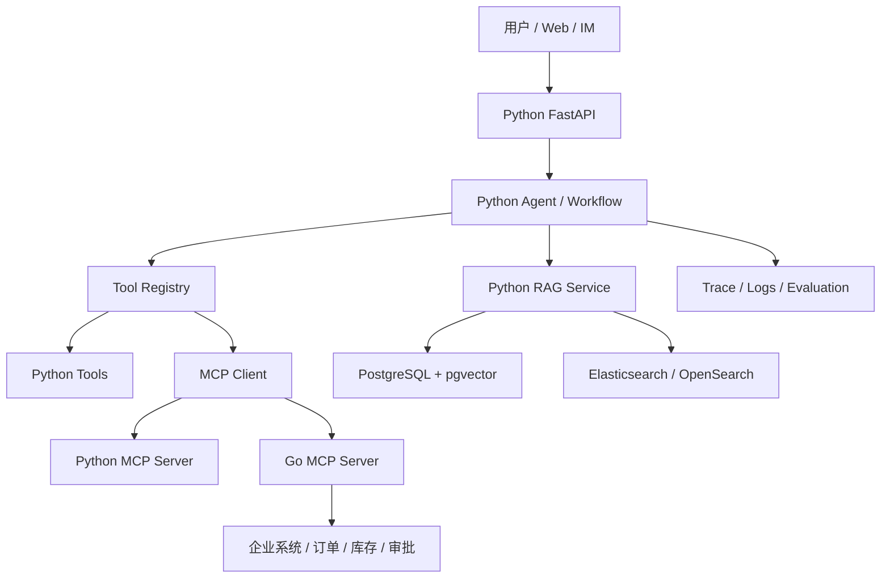

# Python / Go 技术路线可行性说明

更新时间：2026-07-09

## 结论

本学习资料采用 **Python 主线，Go 可选扩展**。

推荐路径：

```text
Python 跑通模型调用、Prompt、Tool Calling、RAG、Agent、Workflow、MCP
  -> 找到稳定边界
  -> 将高并发、强工程边界、企业系统适配模块抽到 Go
```

不建议一开始就用 Go 作为 Agent 学习主线，也不建议一开始就 Python + Go 双主线并行。前者会降低学习效率，后者会让调试和知识迁移成本过高。

2026 年生态变化没有改变这个结论。Google ADK、MCP Go SDK、A2A 等能力让 Go 在企业工具层和互操作层更有价值，但 Python 仍然是学习 Agent/RAG/评估/编排的最高效率主线。

## 为什么主线选择 Python

### 生态可行性

Python 在 AI Agent 学习和原型落地上更成熟：

- OpenAI SDK 和 OpenAI Agents SDK 对 Python 支持完整。
- Pydantic 适合定义结构化输出、工具参数、业务 DTO。
- FastAPI 适合快速提供 HTTP / SSE API。
- LangGraph 适合工作流、状态机和多步骤 Agent。
- LlamaIndex、LangChain、Haystack 在 RAG、文档解析、数据连接器上积累多。
- MCP Python SDK 适合快速实现 MCP Server / Client。
- pytest、RAGAS、DeepEval 等工具方便做回归测试和评估。
- Pydantic AI、Pydantic Evals、Logfire 等工具让类型、评估和观测更容易形成闭环。

### 学习可行性

Agent 学习的难点不是语法，而是：

- 如何设计工具边界。
- 如何控制上下文。
- 如何处理模型不稳定。
- 如何评估 RAG 和 Agent。
- 如何记录工具调用、token、trace 和失败原因。

Python 能让学习者把注意力放在这些核心问题上，而不是把大量时间花在类型样板、构建配置和框架整合上。

### 项目可行性

两个课程项目都适合 Python 起步：

| 项目 | Python 可行点 |
| --- | --- |
| Know-Engine | 文档解析、向量化、RAG、混合检索、引用溯源都有成熟 Python 组件 |
| Dodo-Agent | Agent 编排、工具调用、handoff、trace、Workflow 都有更丰富的 Python 示例 |

## Go 的价值

Go 不适合替代 Python 的学习主线，但很适合作为工程扩展层。

### Go 适合做什么

| 模块 | 为什么适合 Go |
| --- | --- |
| MCP Server | 输入输出边界清晰，适合包装企业内部系统 |
| A2A / ADK 工具侧适配 | Go 适合实现稳定、低资源占用的企业连接器 |
| 工具微服务 | 天气、订单、库存、审批等服务可以独立部署 |
| API 网关 | 高并发、低资源占用、部署简单 |
| 后台 worker | 批处理、定时任务、消息消费适合 Go 并发模型 |
| 权限 / 审计服务 | 业务规则稳定，适合强类型和长期维护 |
| 数据同步服务 | 从企业系统同步数据到知识库或索引 |

### Go 不适合早期做什么

| 模块 | 不推荐原因 |
| --- | --- |
| Agent 编排主线 | 资料、框架、示例丰富度不如 Python |
| RAG 早期实验 | 文档解析、评估、连接器生态不如 Python 丰富 |
| Prompt / Context 实验 | 迭代频繁，Python 更快 |
| 多 Agent 探索 | 需要快速试错，Python 生态更成熟 |

## 三种路线对比

| 路线 | 优点 | 风险 | 适合人群 |
| --- | --- | --- | --- |
| Python Only | 学习最快，生态最完整，适合 MVP | 后期高并发服务可能需要优化 | 初学者、原型团队、课程学习 |
| Go Only | 部署简单，性能好，工程边界强 | Agent/RAG 学习资料和框架少，试错慢 | 已有 Go 团队，需求边界非常清晰 |
| Python + Go | 兼顾 AI 迭代和工程稳定 | 双栈成本高，需要清晰模块边界 | 进阶团队、企业落地、平台化项目 |

课程推荐从 Python Only 起步，项目进入工程化阶段后演进到 Python + Go。

## 推荐架构



### 第一阶段：Python 单体 MVP

目标：快速验证 Agent / RAG 能力。

包含：

- FastAPI API。
- OpenAI SDK / Agents SDK。
- Pydantic schema。
- 本地工具函数。
- PostgreSQL + pgvector。
- 基础日志。

验收：

- 能完成基础问答。
- 能上传文档并问答。
- 能调用 3 个工具。
- 能记录一次完整 Agent run。

### 第二阶段：Python 模块化服务

目标：把 RAG、Tool、Agent、Workflow 分层。

包含：

- `ai_service`：模型调用和 Agent。
- `rag_service`：解析、切片、索引、检索。
- `tool_service`：工具注册、权限、日志。
- `eval_service`：测试集、评分、回归。

验收：

- 每层可以独立测试。
- 工具调用可回放。
- RAG 回答有引用。
- 失败有明确错误码。

### 第三阶段：Go 工具服务 / MCP Server

目标：把稳定工具服务抽到 Go。

适合抽取：

- 订单查询。
- 库存查询。
- 权限查询。
- 审批状态查询。
- 审计日志写入。

验收：

- Go 服务有 OpenAPI 或 MCP tool schema。
- Python Agent 通过 MCP 或 HTTP 调用。
- Go 服务自己做权限、超时、限流、日志。
- Python Agent 不直接访问企业核心数据库。

### 第四阶段：平台化

目标：形成可复用 AI Agent 平台。

包含：

- Agent Registry。
- Tool Registry。
- MCP Server Registry。
- Prompt Registry。
- Evaluation Dataset。
- Trace UI。
- 权限和租户隔离。

验收：

- 新增一个 Agent 不需要改核心框架。
- 新增一个工具必须经过 schema、权限、日志、风险等级配置。
- 每次回答都能追踪 Prompt、检索、工具、token、耗时和错误。

## 学习安排的单一来源

本文件只判断 Python/Go 的工程可行性，不维护第二份周计划。12 周授课顺序以[课程大纲](../teaching/12-week-syllabus.md)为准，16-20 周路径以[自学计划](../teaching/16-20-week-self-study.md)为准；两者共享同一验收标准。

核心路径先完成 Know-Engine 的单 Agent、RAG、Workflow、MCP、评估和治理闭环。高级 RAG、多源路由、多 Agent、A2A 与 Dodo-Agent 只作为 enrichment；它们不会因为技术可行就自动进入 12 周必修周次。

## 风险与应对

| 风险 | 表现 | 应对 |
| --- | --- | --- |
| 框架过多 | 学了很多 API，但没有系统 | 每章只选一个主线实现，其他框架放到比较报告 |
| RAG 效果差 | 检索不到、引用不准 | 先做测试集，再调切片、召回、rerank |
| Agent 不稳定 | 乱调工具、循环调用 | 限制轮数、工具权限、超时、人工确认 |
| Go 过早介入 | 双栈调试困难 | Python MVP 跑通后再抽稳定工具 |
| 缺少评估 | Demo 看起来能跑，无法判断质量 | 第 7 章建立 RAG 基线，并在第 9 章纳入统一回归评估 |
| 权限缺失 | 模型看到或调用了不该访问的数据 | 权限放在后端和工具层，不放在 prompt 里 |

## 决策规则

遇到技术选择时，按下面顺序判断：

1. 能否用 Python 在 1-2 天内验证？
2. 这个模块的输入输出是否稳定？
3. 这个模块是否真的需要高并发或低资源占用？
4. Go 化后是否减少复杂度？
5. Python Agent 是否还能保持清晰的工具边界？

如果 1 是“是”，2-4 不是明确“是”，先用 Python。  
如果 2-4 都是“是”，可以考虑 Go。

## 最终建议

学习阶段：

- Python 主线。
- 少框架，重链路。
- 每章都有可运行产出。
- 每章都有验收标准。

项目阶段：

- Know-Engine 作为 12 周主项目，用 Python 完成确定性 RAG MVP、引用、权限和评估闭环；混合检索只在 Core 通过后作为 enrichment 进入。
- Dodo-Agent 只作为 Know-Engine Core 通过后的进阶 enrichment，从一个 Router 和两个 specialist 起步；不进入核心排期。
- Go 只承接稳定工具、MCP Server、网关和后台 worker。

生产阶段：

- Python Agent 层负责智能编排。
- Go 服务层负责稳定工具和企业系统边界。
- 所有工具调用必须有 schema、权限、日志、超时、限流和回放能力。
